# Finance Portal (SAP) — Arsitektur Sistem
**Versi 2.0 · 2026-06-25 · Odoo 19 CE · Finance Portal DB (terpisah)**

---

## Document Control

| | |
|---|---|
| **Proyek** | Finance Portal on Odoo |
| **Versi** | 2.0 |
| **Tanggal** | 2026-06-25 |
| **Scope** | Odoo 19 CE (Finance Portal DB) + SAP Bridge microservice |
| **Perubahan dari v1** | DB terpisah · Multi-company · Kafka-only · Vendor self-reg · OCR Tesseract |

---

## 1. Architecture Decision Record (ADR)

| # | Keputusan | Pilihan | Alasan |
|---|---|---|---|
| ADR-01 | Peran Odoo | System of Engagement (tanpa GL posting) | SAP tetap System of Record; Odoo hanya form + approval + tracking |
| ADR-02 | Database | **DB baru terpisah** dari existing Odoo DB | Isolasi lifecycle; tidak ganggu operasional existing |
| ADR-03 | Multi-PT Erajaya | **Single Finance Portal DB + `res.company` per PT** | Consolidated dashboard native; shared vendor master; satu SSO |
| ADR-04 | Integrasi SAP | **Kafka-only — Bridge tidak boleh call SAP REST langsung** | Historical constraint: direct SAP connection tidak disarankan |
| ADR-05 | Bridge pattern | Bridge = Kafka consumer/producer + Redis cache + HMAC REST relay | Odoo tidak kenal Kafka; Bridge sebagai satu-satunya integration point |
| ADR-06 | SSO karyawan | Keycloak OIDC via `auth_oauth` | HRIS maintain employee identity |
| ADR-07 | Login vendor | **Odoo native portal: self-registration + invite** | HRIS tidak maintain vendor data; vendor bukan employee |
| ADR-08 | OCR engine | **Tesseract 4 LSTM (primary) + pdfplumber (digital PDF fallback)** | CPU-only (VM tanpa GPU); scanned PDF sebagai format utama |
| ADR-09 | Travel dinas | Read-only mirror dari HRIS | HRIS yang owns travel engine |
| ADR-10 | Async push | `queue_job` (OCA) `with_delay()` | Hindari timeout di Odoo webhook; decouple dari SAP latency |

---

## 2. System Context

> **Finance Portal DB** adalah Odoo tenant baru yang berjalan di samping existing Odoo DB.
> Seluruh komunikasi ke SAP/HRIS **hanya melalui Kafka** — Bridge tidak pernah call SAP REST.

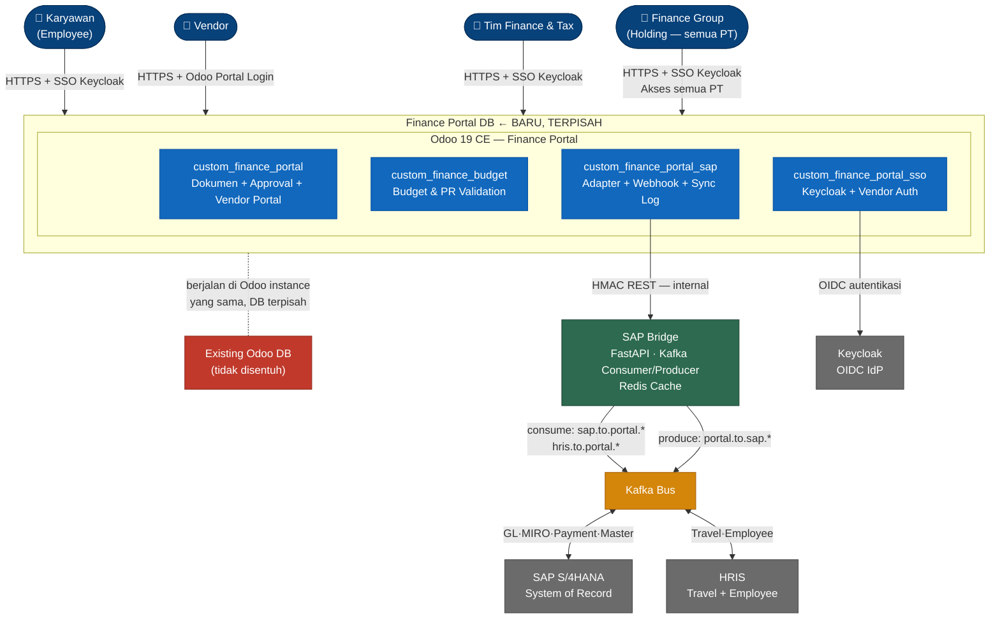

---

## 3. Arsitektur Modul Odoo

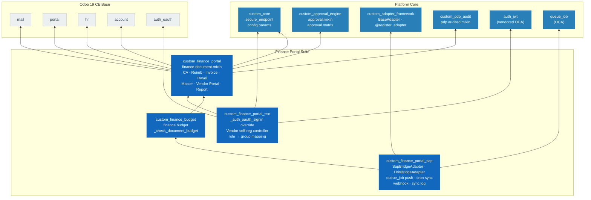

---

## 4. Integrasi — Kafka Only (REVISED)

### 4.1 Prinsip Desain

| Prinsip | Implementasi |
|---|---|
| **No direct SAP connection** | Bridge TIDAK PERNAH buka koneksi HTTP/JDBC ke SAP |
| **Kafka-only ke SAP** | Semua data dari SAP masuk via Kafka topic yang di-produce SAP |
| **Bridge sebagai cache layer** | Bridge consume semua topik SAP → simpan di Redis → Odoo query Bridge |
| **Odoo tidak kenal Kafka** | Odoo hanya bicara REST (HMAC) ke Bridge di Docker internal network |
| **Event-driven untuk kritis** | PR/PO/GR/Payment: event-driven (bukan batch) agar cache selalu fresh |
| **Async push outbound** | Odoo enqueue via `queue_job`; Bridge produce ke Kafka; tidak ada blocking |

### 4.2 Bridge Cache Architecture

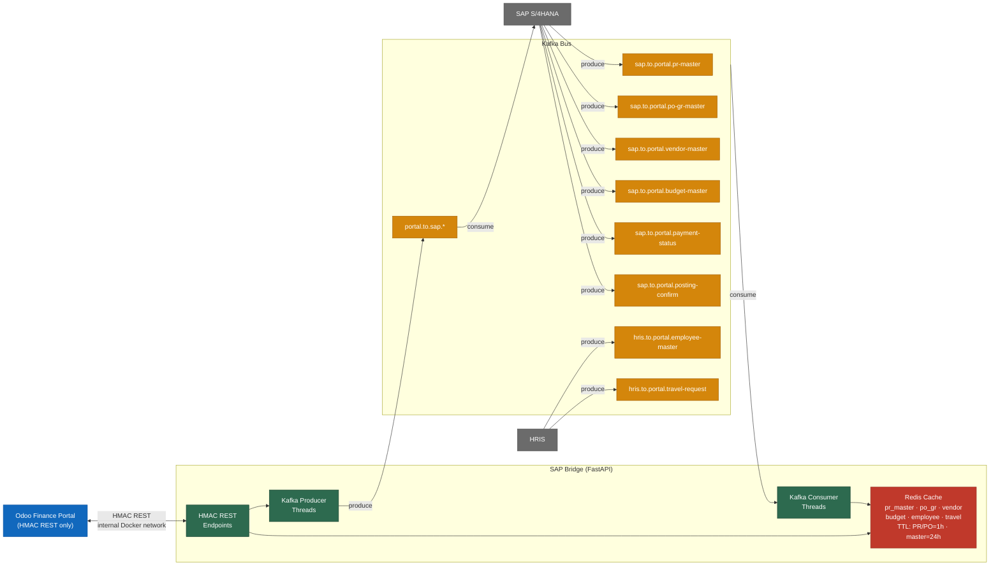

### 4.3 Kafka Topic Map

| # | Kafka Topic | Producer | Consumer | Frekuensi | Keterangan |
|---|---|---|---|---|---|
| 1 | `sap.to.portal.pr-master` | SAP | Bridge | Event-driven | PR create/update/close |
| 2 | `sap.to.portal.po-gr-master` | SAP | Bridge | Event-driven | PO/GR create/update |
| 3 | `sap.to.portal.vendor-master` | SAP | Bridge | Daily + on-change | Supplier master |
| 4 | `sap.to.portal.budget-master` | SAP | Bridge | Daily + on-revision | Budget per divisi |
| 5 | `sap.to.portal.item-category` | SAP | Bridge | Weekly | Item/kategori |
| 6 | `sap.to.portal.bank-master` | SAP | Bridge | Weekly | Bank master |
| 7 | `sap.to.portal.payment-status` | SAP | Bridge | Event-driven | Payment plan + actual |
| 8 | `sap.to.portal.posting-confirm` | SAP | Bridge | Event-driven | GL/MIRO confirmation |
| 9 | `hris.to.portal.employee-master` | HRIS | Bridge | Daily + on-change | Employee + divisi + rekening |
| 10 | `hris.to.portal.travel-request` | HRIS | Bridge | Event-driven | Travel approved/updated |
| 11 | `portal.to.sap.cash-advance` | Bridge | SAP | Event-driven | CA GL posting request |
| 12 | `portal.to.sap.reimbursement` | Bridge | SAP | Event-driven | Reimb GL posting |
| 13 | `portal.to.sap.vendor-invoice` | Bridge | SAP | Event-driven | MIRO request |
| 14 | `portal.to.sap.travel-settlement` | Bridge | SAP | Event-driven | Travel settlement GL |

> Nama topik, retention, dan partition count disepakati tim Kafka klien. Bridge adalah **satu-satunya** sistem yang produce/consume dari sisi portal.

### 4.4 Aliran Outbound (Odoo → SAP via Kafka)

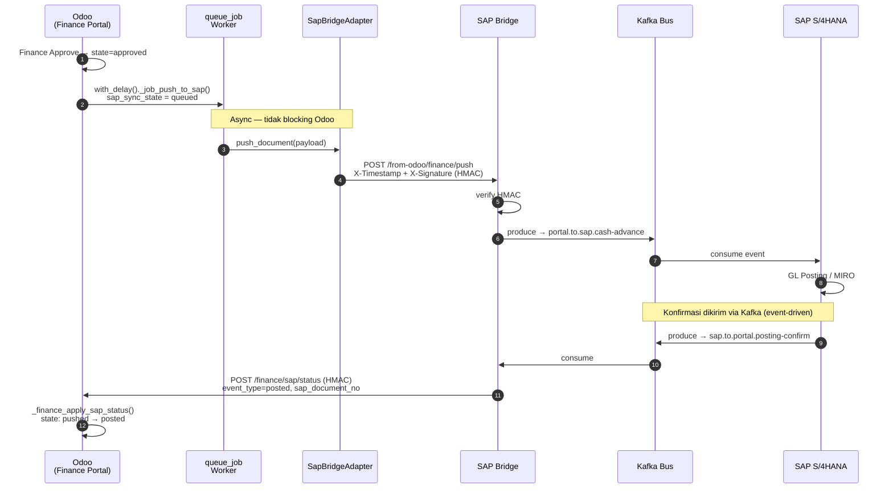

### 4.5 Aliran Inbound — Payment Status (SAP → Odoo)

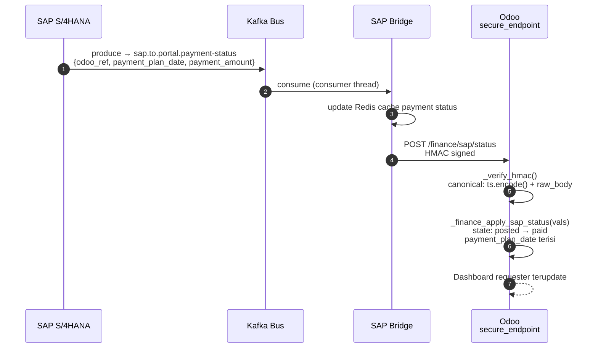

### 4.6 Lookup PR / PO-GR — via Bridge Cache

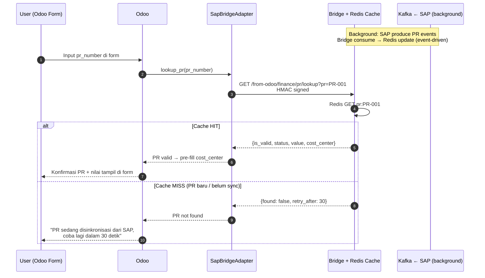

---

## 5. Document Lifecycle — State Machine

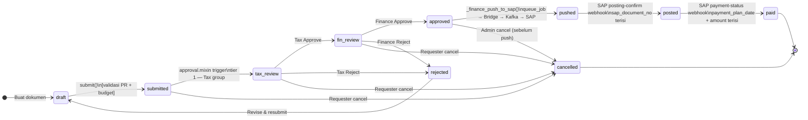

---

## 6. HMAC Security Model

> Canonical message: **`timestamp.encode() + raw_body_bytes`** — byte-identical di ketiga titik.
> Drift ±300 detik; nonce di-cache untuk cegah replay.

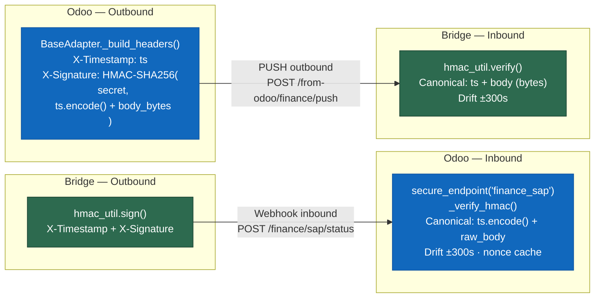

| Arah | Secret (Odoo config param) | Bridge env var |
|---|---|---|
| Odoo → Bridge | `custom_finance_portal_sap.sap_bridge_secret` | `BRIDGE_INBOUND_SECRET` |
| Bridge → Odoo | `custom_core.secure_endpoint.finance_sap.secret` | `BRIDGE_OUTBOUND_SECRET` |

---

## 7. Autentikasi — SSO & Vendor

### 7.1 Employee SSO (Keycloak OIDC)

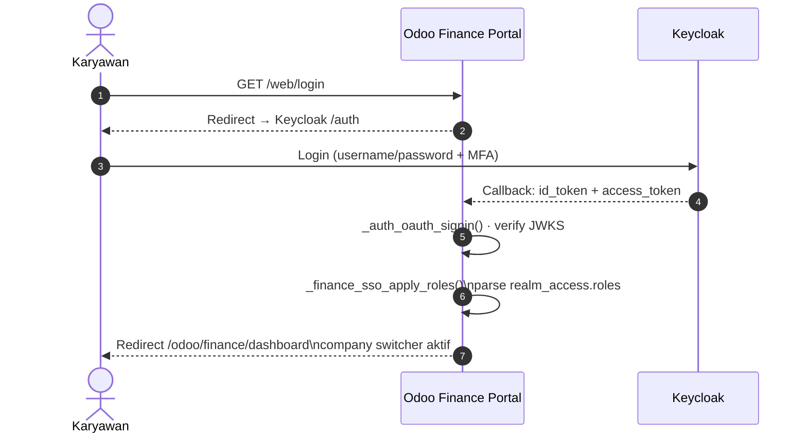

### 7.2 Vendor Self-Registration

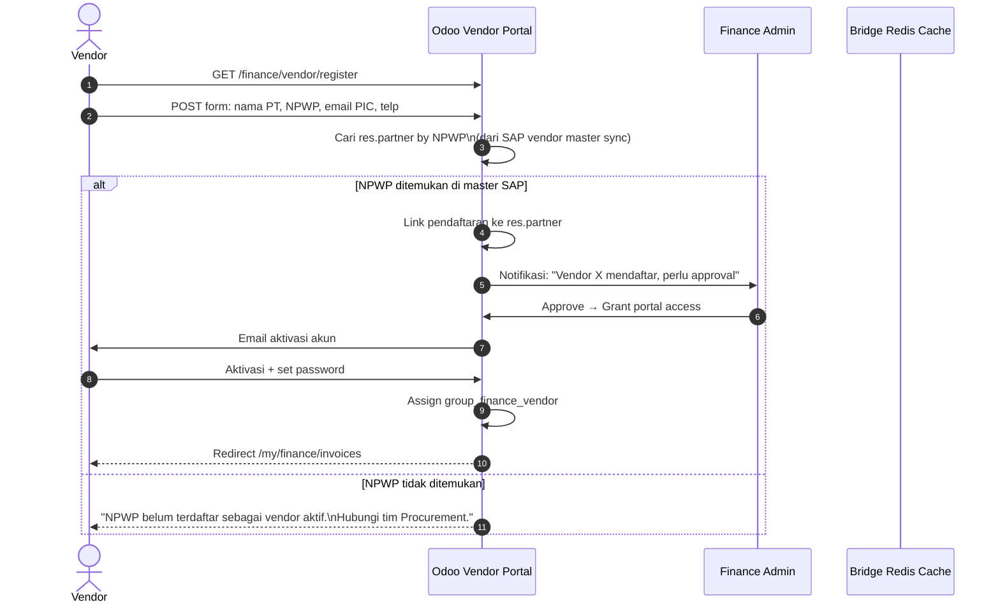

### 7.3 Vendor Invite (dari Finance)

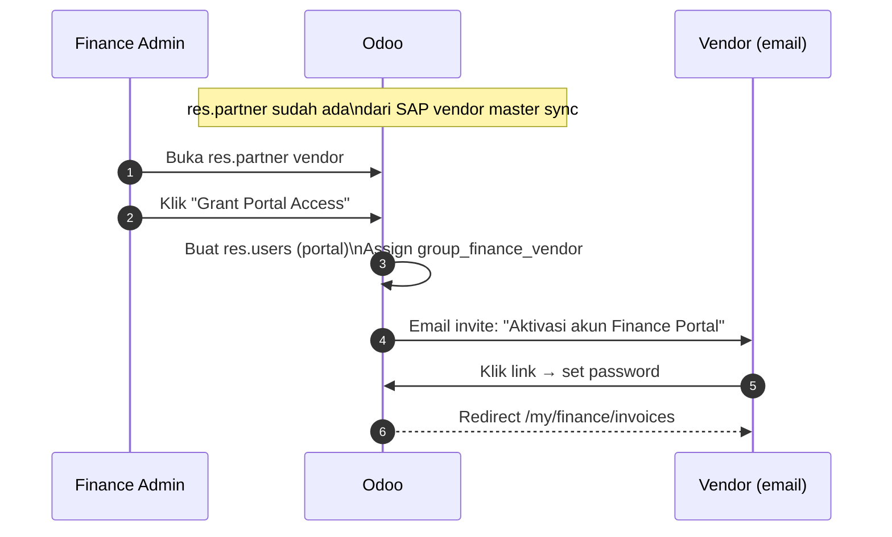

---

## 8. OCR Pipeline

> **Format utama: scanned PDF.** Tesseract adalah path primer; pdfplumber sebagai shortcut untuk digital PDF.
> **Prinsip: pre-fill + wajib konfirmasi vendor** — tidak ada auto-submit berdasarkan OCR.

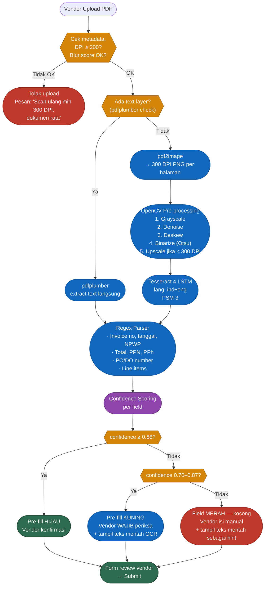

**Akurasi ekspektasi (CPU Tesseract, tanpa GPU):**

| Kualitas Scan | DPI | Field numerik | Tabel/line items |
|---|:---:|:---:|:---:|
| Bersih + datar | ≥ 300 | ~87–90% | ~75–82% |
| Normal, sedikit miring | 200–300 | ~78–84% | ~65–72% |
| Buruk / terlipat | < 200 | ~55–68% | ~40–55% |

**Panduan upload (ditampilkan di UI):**
- ✓ PDF hasil scan, DPI ≥ 300
- ✓ Hitam-putih / grayscale lebih bersih dari berwarna
- ✓ Dokumen rata, tidak terlipat, tidak ada bayangan
- ✗ Foto dari kamera HP tidak disarankan

---

## 9. Multi-Company Architecture

> Satu Finance Portal DB berisi `res.company` untuk setiap PT Erajaya.
> Isolasi data via `company_id` pada semua model dokumen + budget + approval.

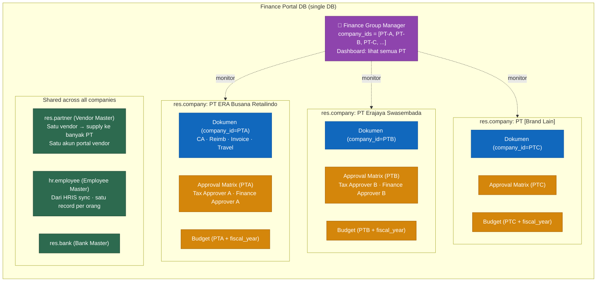

**Perubahan teknis di modul:**

```python
# Semua model dokumen + budget + approval matrix
company_id = fields.Many2one("res.company", required=True,
                              default=lambda self: self.env.company)

# Security rule: user hanya lihat dokumen company yang dia punya akses
[('company_id', 'in', self.env.user.company_ids.ids)]

# SAP outbound payload: sertakan company_code SAP
{
    "company_code": self.company_id.x_sap_company_code,
    ...
}
```

---

## 10. Budget & PR Validation

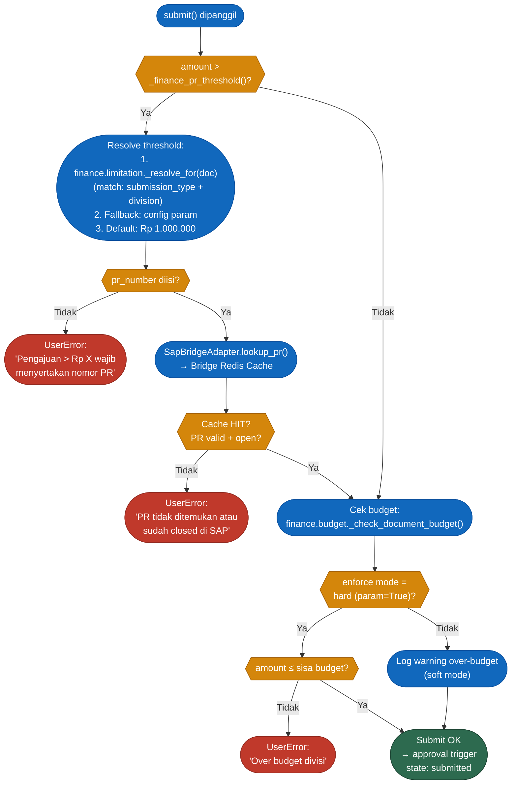

---

## 11. Vendor Portal

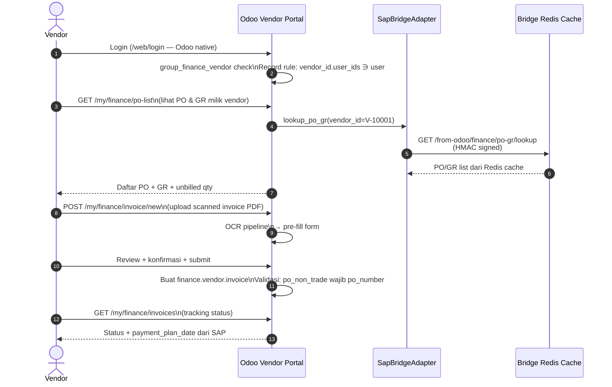

---

## 12. Data Model (ERD Ringkas)

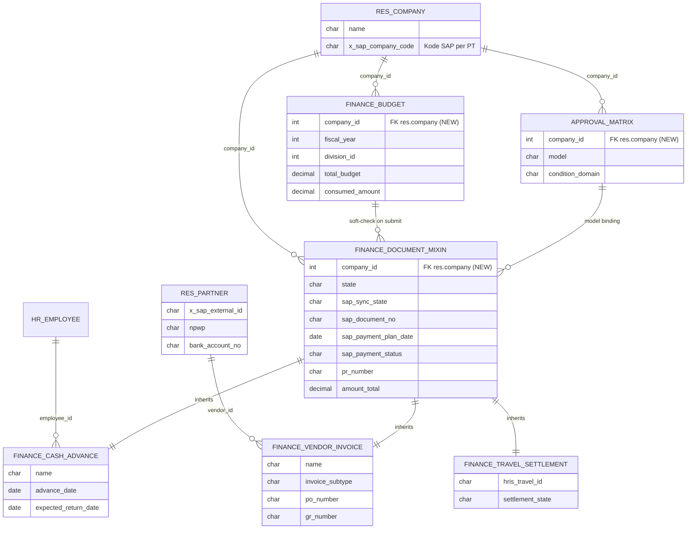

---

## 13. Deployment

### 13.1 Finance Portal DB — Terpisah dari Existing

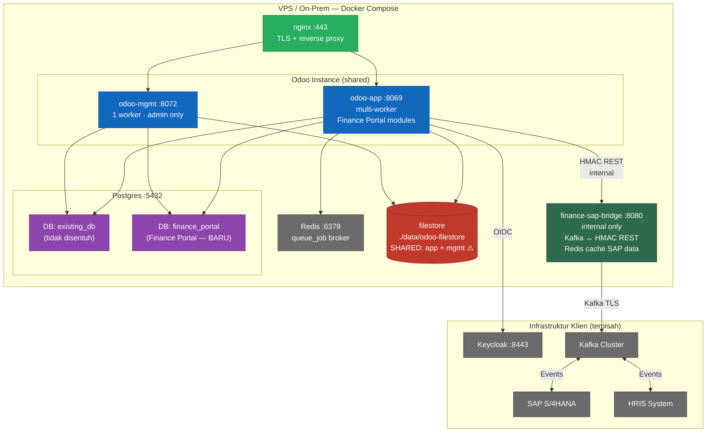

> ⚠️ `odoo-app` dan `odoo-mgmt` **wajib** mount volume `./data/odoo-filestore` yang sama.

### 13.2 DB Routing via nginx

```nginx
# nginx.conf — routing ke DB yang tepat via subdomain/path
server {
    server_name finance.erajaya.com;
    location / {
        proxy_pass http://odoo-app:8069;
        proxy_set_header X-Odoo-dbfilter "^finance_portal$";
    }
}
server {
    server_name erp.erajaya.com;    # existing DB
    location / {
        proxy_pass http://odoo-app:8069;
        proxy_set_header X-Odoo-dbfilter "^existing_db$";
    }
}
```

### 13.3 Urutan Deploy Finance Portal

```bash
# 1. Buat DB baru
make create-db DB=finance_portal

# 2. Install modul
make install MODULE=custom_finance_portal      DB=finance_portal
make install MODULE=custom_finance_budget      DB=finance_portal
make install MODULE=custom_finance_portal_sap  DB=finance_portal
make install MODULE=custom_finance_portal_sso  DB=finance_portal

# 3. Restart wajib (Python tidak re-import dari make update)
docker compose restart odoo-app

# 4. Deploy bridge
docker compose up -d finance-sap-bridge

# 5. Konfigurasi di Odoo (Settings):
#    - Bridge URL + HMAC secret
#    - Keycloak OAuth provider
#    - res.company per PT Erajaya + x_sap_company_code
#    - Approval matrix per company
#    - Aktifkan cron sync master
```

---

## 14. Data yang Dikonsumsi Odoo (via Kafka → Bridge Cache)

> **SEMUA data dari SAP/HRIS masuk ke Odoo melalui Kafka → Bridge Redis cache → Bridge REST.**
> Bridge tidak pernah call SAP REST langsung. Odoo tidak pernah call Kafka langsung.

### 14.1 Master Data dari SAP (cron-push via Kafka)

#### Supplier / Vendor Master — topik: `sap.to.portal.vendor-master`

| Field | Tipe | Wajib | Keterangan |
|---|---|:---:|---|
| `external_id` | String | ✓ | Natural key upsert `x_sap_external_id` → `res.partner` |
| `name` | String | ✓ | Nama vendor |
| `npwp` | String `[PDP]` | ✓ | Validasi pajak; masking non-finance |
| `street`, `city`, `country_code` | String | ✓ | Alamat |
| `bank_account_no` | String `[PDP]` | ✓ | Rekening payment; masking 4 digit terakhir |
| `bank_name` | String | ✓ | Nama bank |
| `currency_code` | String (ISO 4217) | ✓ | Matching dokumen |
| `payment_terms_days` | Integer | — | Informasi SLA |
| `is_active` | Boolean | ✓ | Nonaktifkan vendor yang tidak berlaku |
| `sap_company_codes` | Array[String] | ✓ | PT mana saja yang bisa pakai vendor ini |

#### Division / Cost Center — topik: `sap.to.portal.vendor-master`

| Field | Tipe | Wajib | Keterangan |
|---|---|:---:|---|
| `external_id` | String | ✓ | Natural key → `finance.vertical` |
| `name`, `code` | String | ✓ | Label + kode SAP |
| `company_code` | String | ✓ | Mapping ke `res.company` |
| `is_active` | Boolean | ✓ | Filter dropdown |

#### Cost Budget — topik: `sap.to.portal.budget-master`

| Field | Tipe | Wajib | Keterangan |
|---|---|:---:|---|
| `external_id` | String | ✓ | Natural key → `finance.budget` |
| `division_external_id` | String | ✓ | FK ke `finance.vertical` |
| `fiscal_year` | Integer | ✓ | Period matching |
| `total_budget` | Decimal | ✓ | Ceiling budget check |
| `company_code` | String | ✓ | Mapping ke `res.company` |

### 14.2 Lookup via Bridge Cache

#### PR Lookup — Bridge GET `/from-odoo/finance/pr/lookup`

| Field Response | Wajib | Keterangan |
|---|:---:|---|
| `pr_number` | ✓ | Konfirmasi |
| `is_valid` | ✓ | Tolak submit jika `false` |
| `status` | ✓ | `open`/`partial`/`closed`/`cancelled` |
| `pr_description` | ✓ | Tampil di form sebagai konfirmasi |
| `total_value`, `remaining_value` | ✓ | Ceiling validasi |
| `currency_code` | ✓ | Normalisasi |
| `cost_center_external_id` | ✓ | Auto-fill divisi |

```json
{
  "pr_number": "PR-2025-00123",
  "is_valid": true,
  "status": "open",
  "pr_description": "Pengadaan ATK Q1 2025",
  "total_value": 5000000.00,
  "remaining_value": 5000000.00,
  "currency_code": "IDR",
  "cost_center_external_id": "CC-FINANCE-01"
}
```

#### PO/GR Lookup — Bridge GET `/from-odoo/finance/po-gr/lookup`

| Field Response | Wajib | Keterangan |
|---|:---:|---|
| `po_number`, `po_status` | ✓ | Validasi bisa ditagihkan |
| `vendor_external_id` | ✓ | Validasi vendor = yang login |
| `total_po_value`, `currency_code` | ✓ | Ceiling invoice |
| `items[].po_line`, `.description` | ✓ | Baris invoice |
| `items[].unbilled_quantity` | ✓ | Sisa yang bisa ditagih |
| `items[].gr_number` | — | GR reference |

### 14.3 Inbound Webhook dari SAP

#### Posting Confirmation — topik: `sap.to.portal.posting-confirm`

```json
{
  "odoo_ref": "CA/2025/00042",
  "sap_document_no": "5100000123",
  "sap_posting_date": "2025-01-08",
  "event_type": "posted"
}
```

#### Payment Status — topik: `sap.to.portal.payment-status`

```json
{
  "odoo_ref": "CA/2025/00042",
  "sap_document_no": "5100000123",
  "event_type": "payment_scheduled",
  "payment_plan_date": "2025-01-15",
  "payment_amount": 3500000.00,
  "payment_currency": "IDR"
}
```

### 14.4 Data HRIS — topik: `hris.to.portal.*`

#### Employee Master

| Field | Wajib | PDP | Keterangan |
|---|:---:|:---:|---|
| `employee_id` | ✓ | | Natural key → `hr.employee` |
| `name`, `email` | ✓ | | Login SSO matching |
| `division_external_id`, `cost_center_external_id` | ✓ | | Auto-fill + budget scope |
| `bank_account_no`, `bank_name` | ✓ | ✓ | Rekening payment |
| `nik` | ✓ | ✓ | UU PDP; masking non-privileged |
| `employment_status` | ✓ | | Blokir pengajuan jika `inactive` |

#### Travel Request

| Field | Wajib | Keterangan |
|---|:---:|---|
| `hris_travel_id` | ✓ | Natural key → `finance.travel.settlement` |
| `employee_id` | ✓ | FK |
| `purpose`, `destination_city` | ✓ | Tampil di form |
| `departure_date`, `return_date` | ✓ | Periode |
| `approved_advance` | ✓ | Ceiling realisasi |
| `status` | ✓ | Filter: hanya `approved`/`travelling` |
| `allowance_items[]` | ✓ | Rincian per hari (per_diem, transport, accommodation) |

### 14.5 Readiness Tracker

| # | Data Feed | Kafka Topic | Frekuensi | **Status** | Blocker |
|---|---|---|---|:---:|---|
| 1 | Supplier/Vendor | `sap.to.portal.vendor-master` | Daily+change | `TBD` | Vendor Invoice |
| 2 | Division/Cost Center | `sap.to.portal.vendor-master` | Daily | `TBD` | Budget check |
| 3 | Cost Budget | `sap.to.portal.budget-master` | Daily+revision | `TBD` | Budget enforcement |
| 4 | Item Category | `sap.to.portal.item-category` | Weekly | `TBD` | Dropdown kosong |
| 5 | Approval Matrix | `sap.to.portal.vendor-master` | Daily | `TBD` | W: manual config |
| 6 | Bank Master | `sap.to.portal.bank-master` | Weekly | `TBD` | W: manual input |
| 7 | **PR Master (event-driven)** | `sap.to.portal.pr-master` | **Event** | `TBD` | **PR validation** |
| 8 | **PO/GR Master (event-driven)** | `sap.to.portal.po-gr-master` | **Event** | `TBD` | **Vendor Invoice PO** |
| 9 | Posting Confirmation | `sap.to.portal.posting-confirm` | Event | `TBD` | State → posted |
| 10 | Payment Status | `sap.to.portal.payment-status` | Event | `TBD` | Payment tracking |
| 11 | Employee Master | `hris.to.portal.employee-master` | Daily+change | `TBD` | User onboarding |
| 12 | Travel Request | `hris.to.portal.travel-request` | Event | `TBD` | Travel Settlement |

**Legend:** `✅ Ready` · `⚠️ Partial` · `❌ Not Ready` · `TBD` = diisi tim SAP/HRIS klien saat M1

### 14.6 Outbound Payloads (Odoo → Bridge → Kafka → SAP)

#### Cash Advance GL Posting

```json
{
  "odoo_ref": "CA/2025/00042",
  "doc_type": "cash_advance",
  "company_code": "1000",
  "posting_date": "2025-01-08",
  "employee_id": "EMP-00234",
  "cost_center_external_id": "CC-FINANCE-01",
  "currency_code": "IDR",
  "total_amount": 3500000.00,
  "pr_number": "PR-2025-00010",
  "bank_account_no": "1234567890",
  "bank_name": "BCA",
  "lines": [
    {"item_external_id": "ITEM-001", "description": "Tiket pesawat", "amount": 1000000.00},
    {"item_external_id": "ITEM-002", "description": "Hotel 2 malam", "amount": 1600000.00}
  ],
  "attachments": [{"filename": "surat_tugas.pdf", "content_base64": "..."}]
}
```

#### Vendor Invoice MIRO

```json
{
  "odoo_ref": "INV/2025/00015",
  "doc_type": "vendor_invoice",
  "invoice_subtype": "po_non_trade",
  "company_code": "1000",
  "vendor_external_id": "V-10001",
  "invoice_date": "2025-01-05",
  "vendor_invoice_no": "INV-VENDOR-2024-456",
  "po_number": "PO-2024-00456",
  "currency_code": "IDR",
  "amount_net": 25000000.00,
  "tax_code": "PPh23_2pct",
  "tax_amount": 500000.00,
  "total_amount": 24500000.00,
  "cost_center_external_id": "CC-FINANCE-01",
  "lines": [
    {"po_line": 1, "gr_number": "GR-2024-00789", "description": "Jasa IT", "quantity": 1.0, "unit_price": 25000000.00}
  ],
  "attachments": [
    {"filename": "invoice_vendor.pdf", "content_base64": "..."},
    {"filename": "faktur_pajak.pdf", "content_base64": "..."}
  ]
}
```

---

## 15. PDP Compliance

| Field | Model | Klasifikasi | Perlakuan |
|---|---|---|---|
| `nik` | `hr.employee` | Spesifik (UU PDP Pasal 4) | `pdp_class="specific"` + masking view non-privileged |
| `bank_account_no` | `res.partner`, `hr.employee` | Spesifik | Masking 4 digit terakhir; full hanya `group_finance_officer`+ |
| `npwp` | `res.partner` | Spesifik | Masking 6 digit tengah; full hanya `group_finance_officer`+ |
| Transisi state semua dokumen | `finance.document.mixin` | — | `pdp.audited.mixin` → `INSERT INTO pdp.audit_log` (raw SQL) |
| Log adapter call | `custom.adapter.call.log` | — | `BaseAdapter._sanitize_log()` strip field PDP sebelum logging |

---

## 16. Ringkasan Komponen

| Komponen | Stack | Lokasi | In-Scope Build |
|---|---|---|:---:|
| `custom_finance_portal` | Odoo 19 Python/XML | `addons/ee_gap/custom_finance_portal/` | ✅ |
| `custom_finance_budget` | Odoo 19 Python/XML | `addons/ee_gap/custom_finance_budget/` | ✅ |
| `custom_finance_portal_sap` | Odoo 19 Python/XML | `addons/ee_gap/custom_finance_portal_sap/` | ✅ |
| `custom_finance_portal_sso` | Odoo 19 Python/XML | `addons/ee_gap/custom_finance_portal_sso/` | ✅ |
| `finance-sap-bridge` | FastAPI Python 3.12 + Redis | `services/finance-sap-bridge/` | ✅ scaffold |
| OCR service | pdfplumber + Tesseract + OpenCV | `services/ocr-service/` atau inline bridge | ✅ |
| Keycloak | Keycloak 24+ | Infra klien | ❌ |
| Kafka + Konektor | Confluent / MSK | Infra klien | ❌ |
| SAP S/4HANA + Kafka producer | ABAP / CPI | Tim SAP klien | ❌ |
| HRIS + Kafka producer | Vendor HRIS | Tim HC klien | ❌ |
