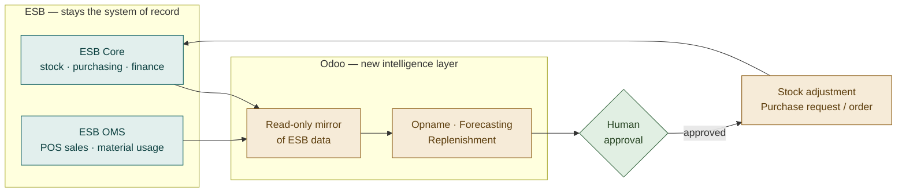
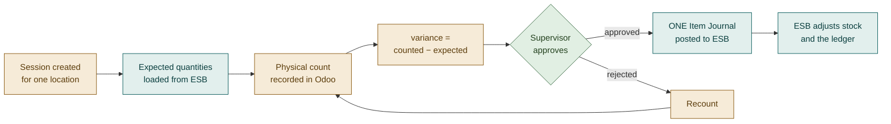
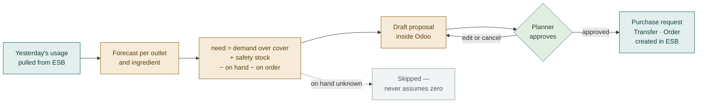
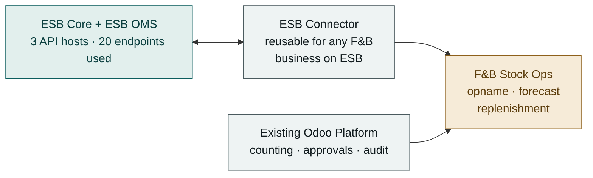
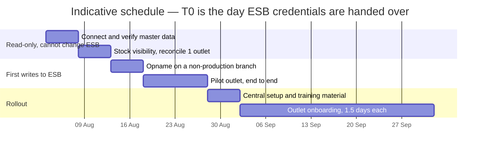

# Why we are here

**Three decisions drive food cost at every outlet:**

*How much stock is actually there · how much will be needed · how much to order.*

ESB Core records the transactions well. It does not help with the decisions.

**The data to answer all three already sits inside ESB.** It is simply not being
turned into decisions.

> **The ask today:** approve the approach, release a dedicated ESB account,
> nominate a pilot outlet.

# The pain today

Every one of these is a decision made without information ESB is already holding.

| | What happens now | What it costs |
|---|---|---|
| **Counting** | Manual and slow; results re-keyed into ESB by hand | Staff hours, keying errors, adjustments posted late or never |
| **Demand** | No forward view per outlet | Ordering runs on feel and last week's number |
| **Ordering** | Reactive, and different for every person doing it | Stock-outs on busy days, waste on quiet ones |
| **Variance reasons** | Inconsistent and often missing | Food-cost analysis nobody fully trusts |

# What we are adding

**ESB is not being replaced.** Outlets keep working exactly as they do today.

| | Capability | What changes for the business |
|---|---|---|
| **1** | **Stock Opname** | Count in Odoo against ESB's own expected quantities. The variance posts back to ESB automatically, already approved. |
| **2** | **Demand Forecasting** | A daily consumption forecast per outlet and ingredient, built from ESB's own sales data, with a visible accuracy score. |
| **3** | **Auto Replenishment** | Suggested order quantities per outlet — raised in ESB **only after a person approves**. |

# How the two systems relate

Odoo reads from ESB, thinks, and writes back only what a person approved.

# Workflow — stock opname

The counter compares against what ESB expects. The supervisor approves. Odoo posts
one adjustment. **Nobody re-keys anything.**

# Workflow — replenishment, and the approval gate

**Nothing crosses into ESB before approval.** The system proposes and shows its
working; a person decides whether money gets spent.

# System architecture

Two modules. The connector knows nothing about food; the business module knows
nothing about ESB's protocol. **That separation makes the connector reusable** for
the next F&B business Erajaya runs on ESB.

# Built to be safe by default

| Control | Effect |
|---|---|
| **Human approval gate** | No adjustment and no order reaches ESB without a named approver |
| **Master kill switch** | One setting stops all writing to ESB instantly — no code change, no restart |
| **Everything ships off** | Each feature enabled deliberately, outlet by outlet |
| **No duplicates** | A retry after a network failure adopts the existing document instead of creating a second |
| **Refuses to guess** | Where ESB has not reported a stock figure, the system declines to propose rather than assume zero |
| **Full audit trail** | Who counted, who approved, what was sent, what ESB replied |

# Where we are today

Everything that can be done without ESB access has been done.

| | |
|---|---|
| **Software build** | **Complete** — 2 modules, 33 data models |
| **Automated tests** | **158 passing**, no ESB credentials required |
| **Documentation** | Management BRD, Technical BRD, FSD, TSD, workflow set |
| **ESB API** | 401 endpoints captured, 20 integrated, specification version-controlled |
| **Validation on ESB staging** | **Blocked — awaiting credentials** |

# Plan to go live

Phases 1–2 cannot change anything inside ESB. The first write happens on one
ingredient, with a variance of one, on a non-production branch.

# Effort — already delivered

*"Equivalent effort" is the conventional-delivery benchmark for this scope, shown as
a costing basis. **This work is complete and carries no further cost.***
QA is embedded in the build — 158 tests were written alongside the code.

| Workstream | BA | Developer | QA | Total |
|---|---|---|---|---|
| Discovery & ESB API analysis | 1.5 | 1.5 | — | 3 |
| Connector module — 3,297 lines | 0.5 | 8.5 | 3.0 | 12 |
| Business module — opname, forecast, replenishment | 1.0 | 9.0 | 4.0 | 14 |
| Document set — 5 documents, 18 diagrams | 4.0 | 1.0 | — | 5 |
| **Total delivered** | **7** | **20** | **7** | **34 md** |

# Effort — remaining, by phase and role

Fixed effort is 17 md; everything beyond scales with outlet count.
Add **15% project management** and **15% contingency** to the subtotal.

| Phase | Activity | BA | Dev | QA | Total |
|---|---|---|---|---|---|
| 1–2 | ESB staging validation and reconciliation | 1.0 | 1.5 | 1.5 | 4 |
| 3 | Pilot — one outlet end to end, incl. training | 3.5 | 2.0 | 2.5 | 8 |
| 4a | Central setup: reasons, rule templates, roles, training material | 3.0 | 1.0 | 1.0 | 5 |
| | **Fixed subtotal** | **7.5** | **4.5** | **5.0** | **17** |
| 4b | **Per outlet** — config, backfill, rules, train, first count | 1.0 | 0.2 | 0.3 | **1.5** |

# Effort scales with outlet count

> **Assumption to confirm:** how many EFN outlets are in scope. This is the single
> largest driver of remaining cost — everything else is fixed.

Per-outlet effort falls after the first five, as the team gains repetition.

| Outlets | BA | Dev | QA | Subtotal | **Total incl. PM + contingency** |
|---|---|---|---|---|---|
| 5 | 12.5 | 5.5 | 6.5 | 24.5 | **≈ 32 md** |
| 10 | 17.5 | 6.5 | 8.0 | 32.0 | **≈ 42 md** |
| 20 | 27.5 | 8.5 | 11.0 | 47.0 | **≈ 61 md** |
| 50 | 57.5 | 14.5 | 20.0 | 92.0 | **≈ 120 md** |

# What the role mix tells us

**The remaining work is rollout, not engineering.**

| At 20 outlets | Mandays | Share |
|---|---|---|
| **Business Analyst / trainer** | 27.5 | **59%** |
| Quality Assurance | 11.0 | 23% |
| Developer | 8.5 | 18% |

# How this should be resourced

- **The critical resource is a business analyst who can train outlet staff**, not a
  developer. The build is complete.

- **QA effort stays low because regression is automated.** 158 tests run on every
  change, so QA time goes to on-site verification rather than re-testing the build.

- **One business analyst can carry about 20 outlets**, at 1 day each across the
  six-week rollout window. Beyond roughly 25 outlets, either a second analyst joins
  or the rollout window extends proportionally.

- **A working day is 8 productive hours.** Erajaya-side staff time for counting and
  approvals is operational, and is not included above.

# Optional — not required for go-live

The current forecast is deliberately simple, so a store manager can reproduce it by
hand. Trust matters more than the last few percent of accuracy.

| Enhancement | Effort | Recommendation |
|---|---|---|
| Net off purchase orders raised directly in ESB | 3 md | Only if the pilot shows double-ordering |
| Indonesian user interface | 2 md | Decide before wide rollout |
| Barcode / mobile counting refinements | 4 md | After pilot feedback |
| Machine-learning forecast method | 8 md | **Not yet** — revisit after 6 months of demand history |

# Top risks

| Risk | Impact | Mitigation |
|---|---|---|
| **The ESB integration account is shared with a person** | Integration breaks intermittently — ESB allows only one session per account | Dedicated account, documented as not-for-human-use. **This is the one thing we need from IT.** |
| ESB credentials delayed | Validation and pilot slip week for week | Build and testing already completed against recorded ESB responses |
| A wrong quantity is approved and ordered | Cost and waste | Approval gate, full derivation shown per line, caps per rule, staged pilot |
| Staff keep counting on paper | No benefit realised | Pilot with one engaged outlet; measure and publicise the time saved |

# Decisions requested today

**1. Approve the approach** — in particular that ESB remains the source of truth,
and that nothing is ordered without human approval.

**2. Release a dedicated ESB integration account** — ideally a static API key.
*This is the critical path. Everything else is ready and waiting.*

**3. Nominate the pilot outlet** and the supervisor who will own approvals.

**4. Confirm the number of outlets in scope** — the one variable driving remaining
cost, and therefore how many business analysts the rollout needs.

**5. Agree the baseline metrics** to capture before the pilot: counting time,
stock-out incidents, closing stock value. *Without a baseline, the benefit cannot be
demonstrated afterwards.*

# Thank you

**Supporting documents**

Management BRD · Technical BRD · Functional Specification · Technical Specification ·
Workflow set

Complete with the full diagram set and the captured ESB API specification.
