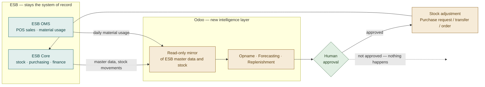

# Business Requirements Document (BRD) — Management Level
## EFN (Erajaya F&B) — Stock Opname, Demand Forecasting & Auto Replenishment on ESB Core

**Audience:** Sponsor, Business Owner, Finance, Operations Management
**Version:** 1.0 · 21 July 2026
**Companion documents:** [BRD Technical](02-BRD-technical.md) · [FSD](03-FSD.md) · [TSD](04-TSD.md)
**Status:** Build complete, pending ESB credentials for staging validation

---

## 1. Executive Summary

EFN's F&B outlets run day-to-day operations on **ESB Core**, an Indonesian F&B ERP.
ESB handles the transactions well but gives the business little help with three
decisions that drive food cost: *how much stock is actually there*, *how much will
be needed*, and *how much to order*.

This project adds those three capabilities in **Odoo**, integrated with ESB by API.
ESB remains the system of record — outlets keep working exactly as they do today.
Odoo adds the intelligence layer on top and writes its conclusions back into ESB as
normal ESB documents, so the finance and supply-chain processes downstream are
unchanged.

**Both software modules are built and tested (158 automated tests passing).** What
remains is ESB credentials, configuration, and a controlled pilot.

### How the two systems relate

Outlets keep working in ESB exactly as they do today. Odoo reads, thinks, and — only
with a person's approval — writes back documents ESB already understands.

## 2. Business Problem

| # | Problem | Business impact |
|---|---|---|
| P1 | Stock counting is manual and slow; results are keyed into ESB by hand | Counting effort, keying errors, adjustments posted late or not at all |
| P2 | No forward view of demand per outlet | Ordering is done from feel and last week's number |
| P3 | Ordering is reactive and per-person | Stock-outs on busy days, waste on quiet ones, inconsistent between outlets |
| P4 | Stock variance reasons are inconsistent | Food-cost analysis is hard to trust |

The common thread: **the data to answer these questions already exists in ESB** —
stock movements, sales, and material usage exploded through recipes. It is simply
not being turned into decisions.

## 3. Business Objectives

- **B1.** Cut the time and error rate of stock opname at outlet level.
- **B2.** Give each outlet a defensible forecast of daily material consumption.
- **B3.** Make replenishment consistent and repeatable across all outlets, without
  removing human judgement from the decision to spend money.
- **B4.** Improve food-cost visibility by making every stock variance carry a reason
  and land in the correct account.
- **B5.** Achieve all of the above **without disrupting ESB** or asking outlet staff
  to abandon the system they know.
- **B6.** Keep the capability reusable — other F&B businesses on ESB should be able
  to adopt it without a rebuild.

## 4. Scope

### In scope

| Capability | What the business gets |
|---|---|
| **Stock Opname** | Counting performed in Odoo against ESB's own expected quantities; the variance is posted back to ESB as a standard Item Journal, already approved by a supervisor |
| **Demand Forecasting** | A daily consumption forecast per outlet and per material, based on ESB's own sales/material-usage data, with a visible accuracy score |
| **Auto Replenishment** | Suggested order quantities per outlet, raised as ESB Purchase Requests, Goods Transfer Requests or Purchase Orders — **only after a person approves** |

### Out of scope (this phase)

- Replacing any part of ESB. ESB remains the source of truth for stock, purchasing
  and finance.
- POS, menu engineering, recipe/BOM maintenance — these stay in ESB.
- Supplier negotiation, pricing and payment.
- Automatic ordering without human approval (see BR-9).

## 5. Stakeholders

| Stakeholder | Interest |
|---|---|
| Sponsor / Business Owner | Food cost, stock accuracy, return on the effort |
| Outlet / Store Manager | Faster counting, fewer stock-outs, orders that make sense |
| Central Supply Chain / Purchasing | Consistent, reviewable demand across outlets |
| Finance / Accounting | Variances land in the right account with a reason; no phantom entries |
| IT / ESB PIC | API access, credentials, no load or data risk to ESB |
| Internal Audit | Every adjustment traceable to a counter and an approver |

## 6. Business Requirements

Prioritised MoSCoW. Traceability to functional requirements is in the
[BRD Technical](02-BRD-technical.md).

### 6.1 Stock Opname

- **BR-1 (Must)** Counting staff see the quantity **ESB believes** is on hand, so a
  count is a comparison, not a blind tally.
- **BR-2 (Must)** The system computes the variance; staff never calculate or key a
  difference by hand.
- **BR-3 (Must)** A supervisor must approve variances before anything is posted.
- **BR-4 (Must)** The approved result is written into ESB automatically as an Item
  Journal — no re-keying.
- **BR-5 (Must)** Every variance carries a reason, and that reason determines the
  account it hits in ESB's ledger.
- **BR-6 (Should)** Staff are warned when the expected quantity may be out of date,
  and can refresh it from ESB before approving.

### 6.2 Demand Forecasting

- **BR-7 (Must)** Produce a daily consumption forecast per outlet and material from
  ESB's own historical data, with no manual data entry.
- **BR-8 (Must)** The forecast must be **explainable** — a store manager should be
  able to understand and reproduce the logic. Accuracy is secondary to trust.
- **BR-9 (Should)** Show a measured accuracy figure per material so weak forecasts
  are visible rather than silently trusted.
- **BR-10 (Could)** Allow the method to be chosen per material, automatically
  selecting whichever is historically most accurate.

### 6.3 Auto Replenishment

- **BR-11 (Must)** Recommend order quantities per outlet using forecast demand,
  supplier lead time, and current ESB stock.
- **BR-12 (Must)** **Nothing is ordered without human approval.** The system proposes;
  a person decides.
- **BR-13 (Must)** Support ordering from a supplier, and transferring from a central
  kitchen or hub outlet.
- **BR-14 (Must)** Respect commercial realities: pack sizes, supplier minimums, and
  maximum order caps.
- **BR-15 (Should)** Show *why* each quantity was proposed — the forecast, the cover
  period, the stock on hand, and what is already on order.
- **BR-16 (Should)** Where the system cannot be sure of the stock on hand, it must
  **decline to propose** rather than guess.

### 6.4 Governance & Control

- **BR-17 (Must)** Every feature ships switched **off** and is enabled deliberately,
  outlet by outlet.
- **BR-18 (Must)** A single control must be able to stop all writing to ESB
  immediately, without a code change.
- **BR-19 (Must)** No duplicate documents may be created in ESB, even if a technical
  failure causes a retry.
- **BR-20 (Must)** Every action is attributable: who counted, who approved, what was
  sent, and what ESB replied.

## 7. Business Rules

- **R1.** ESB Core is the **source of truth for stock**. Odoo never overrides it and
  never holds an authoritative stock figure for an EFN outlet.
- **R2.** A stock adjustment sent to ESB is the **difference**, not the counted total.
- **R3.** If ESB has not reported a stock figure for a material, that is treated as
  **unknown, not zero** — the system will not propose an order against a guess.
- **R4.** Approval is the commitment point. Before approval, nothing exists in ESB.
- **R5.** Odoo creates no stock movements of its own for EFN outlets — doing so would
  create accounting entries for inventory Odoo does not hold.

## 8. Benefits

| Benefit | Nature | How it will be evidenced |
|---|---|---|
| Faster opname, fewer keying errors | Quantitative | Time per count and adjustment rework, before vs. after |
| Fewer stock-outs of key materials | Quantitative | Stock-out incidents per outlet per month |
| Less over-ordering and waste | Quantitative | Closing stock value and waste against sales |
| Consistent ordering across outlets | Qualitative | Variation in ordering behaviour between comparable outlets |
| Trustworthy food-cost analysis | Qualitative | Share of variances carrying a correct reason and account |
| Reusable for other F&B businesses | Strategic | Second deployment requires configuration only, not development |

A baseline for the first three should be captured **before** the pilot starts; without
it the benefit cannot be demonstrated afterwards.

## 9. Assumptions

- A1. EFN can provide a **dedicated ESB user account** for the integration
  (see Risk RS-1 — this is not optional).
- A2. ESB's material-usage data is reliable enough to forecast from; recipes/BOMs in
  ESB are maintained.
- A3. Outlet staff have a device with a browser to count on.
- A4. Outlets have enough historical data in ESB (about two weeks minimum per
  material) for a forecast to be meaningful.
- A5. ESB's API is available to EFN on the required environments.

## 10. Constraints

- **C1.** ESB provides **no bulk stock-on-hand API**. Stock levels are reconstructed
  from ESB's stock-movement report. A material with no recent movement therefore has
  no reported balance — handled by R3 above.
- **C2.** ESB permits **one active session per user account**, so the integration
  account cannot be shared with a human (see RS-1).
- **C3.** ESB's API accepts no duplicate-prevention key, so duplicate protection is
  implemented on the Odoo side (BR-19).
- **C4.** Some ESB endpoints are marked "piloting" — availability must be confirmed
  per company.
- **C5.** Purchase orders raised **directly by people inside ESB** cannot be seen at
  line level through ESB's API and are therefore not deducted from proposed
  quantities. Mitigation: keep the review period aligned to the outlet's real
  ordering rhythm. See [BRD Technical §6](02-BRD-technical.md#6-known-limitations).

## 11. Risks

| ID | Risk | Impact | Likelihood | Mitigation |
|---|---|---|---|---|
| RS-1 | The integration's ESB account is also used by a person, who logs in and evicts the integration's session | High — integration stops working intermittently and confusingly | Medium | Dedicated ESB account, documented as not-for-human-use; system re-authenticates automatically and logs the event |
| RS-2 | ESB credentials delayed | Medium — validation and pilot slip | Medium | Build and testing were completed against recorded ESB responses; only validation is blocked |
| RS-3 | Forecast quality is poor for erratic materials | Medium — proposals ignored, adoption suffers | Medium | Accuracy is measured and displayed; weak forecasts are flagged in the proposal for review |
| RS-4 | A wrong quantity is approved and ordered | High — cost and waste | Low | Human approval gate; derivation shown per line; caps and maximums per rule |
| RS-5 | A wrong stock adjustment posts to ESB's ledger | High — food cost misstated | Low | Supervisor approval, refresh-before-post, reason-driven accounts, staged pilot on one outlet |
| RS-6 | ESB changes its API without notice ("piloting" endpoints) | Medium | Medium | API specification captured and version-controlled; changes surface as diffs |
| RS-7 | Staff continue counting on paper and ignore the tool | Medium — no benefit realised | Medium | Pilot with one engaged outlet; measure and publicise the time saved |

## 12. Delivery Approach & Status

| Phase | Content | Status |
|---|---|---|
| 1. Discovery | ESB API review, architecture decisions | **Complete** |
| 2. Build — connector | ESB integration engine | **Complete**, 70 automated tests passing |
| 3. Build — business features | Opname, forecasting, replenishment | **Complete**, 86 automated tests passing |
| 4. Staging validation | Live ESB staging, read-only first | **Blocked on credentials** |
| 5. Pilot | One outlet, one branch, opname only | Not started |
| 6. Rollout | Outlet by outlet, feature by feature | Not started |

The rollout sequence is deliberately **read before write, and one feature at a time**:
master data first, then stock visibility, then opname, then replenishment. Each step
is independently useful and independently reversible.

Steps 1–3 cannot change anything in ESB. The first write happens at step 4, on a
single material with a variance of one, on a non-production branch.

### 12.1 Effort and resourcing

**Delivered — complete, no further cost.** Shown as a conventional-delivery
benchmark for costing, not as billed time.

| Workstream | BA | Developer | QA | Total |
|---|---|---|---|---|
| Discovery & ESB API analysis | 1.5 | 1.5 | — | 3 |
| Connector module | 0.5 | 8.5 | 3.0 | 12 |
| Business module | 1.0 | 9.0 | 4.0 | 14 |
| Document set | 4.0 | 1.0 | — | 5 |
| **Total** | **7** | **20** | **7** | **34 md** |

**Remaining to go live.** Fixed effort is 17 md; the rest scales with outlet count.

| Phase | Activity | BA | Dev | QA | Total |
|---|---|---|---|---|---|
| 4 | ESB staging validation and reconciliation | 1.0 | 1.5 | 1.5 | 4 |
| 5 | Pilot — one outlet end to end, incl. training | 3.5 | 2.0 | 2.5 | 8 |
| 6a | Central setup: reasons, rule templates, roles, training material | 3.0 | 1.0 | 1.0 | 5 |
| | **Fixed subtotal** | **7.5** | **4.5** | **5.0** | **17** |
| 6b | **Per outlet** — config, backfill, rules, train, first count | 1.0 | 0.2 | 0.3 | **1.5** |

Add **15% project management** and **15% contingency** to the subtotal.

| Outlets | BA | Dev | QA | Subtotal | Total incl. PM + contingency |
|---|---|---|---|---|---|
| 5 | 12.5 | 5.5 | 6.5 | 24.5 | ≈ 32 md |
| 10 | 17.5 | 6.5 | 8.0 | 32.0 | ≈ 42 md |
| 20 | 27.5 | 8.5 | 11.0 | 47.0 | ≈ 61 md |
| 50 | 57.5 | 14.5 | 20.0 | 92.0 | ≈ 120 md |

**The remaining work is rollout, not engineering.** At 20 outlets the business
analyst carries 59% of the effort, QA 23%, development 18%. Three consequences:

- The critical resource is **a business analyst who can train outlet staff**, not a
  developer — the build is complete.
- **QA effort stays low because regression is automated.** 158 tests run on every
  change, so QA time goes to on-site verification rather than re-testing the build.
- **One business analyst can carry about 20 outlets** at 1 md each across the
  six-week rollout window. Beyond roughly 25 outlets, either a second analyst is
  needed or the rollout window extends proportionally.

*Assumptions: a working day is 8 productive hours; outlets are onboarded
sequentially by one team; per-outlet effort is an average — the first two or three
will run longer and later ones shorter. Excludes Erajaya-side staff time for
counting and approvals, which is operational rather than project effort.*

## 13. Decision Required

1. **Approve** the approach in this document, in particular Business Rule R1 (ESB
   remains the source of truth) and BR-12 (no ordering without human approval).
2. **Nominate** the ESB PIC and request a **dedicated integration account** plus
   staging access (see [BRD Technical §7](02-BRD-technical.md#7-open-items-for-the-esb-pic)).
3. **Nominate the pilot outlet** and the supervisor who will own approvals.
4. **Agree the baseline metrics** in §8 to be captured before the pilot.

---

*Prepared for EFN / Erajaya F&B. Companion technical documents describe how these
requirements are met and verified.*
