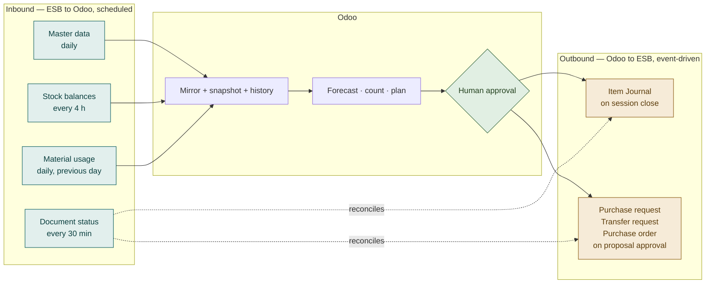

# Business Requirements Document (BRD) — Technical Level
## EFN (Erajaya F&B) — Stock Opname, Demand Forecasting & Auto Replenishment on ESB Core

**Audience:** Solution Architect, Technical Lead, ESB PIC, Integration Team, QA
**Version:** 1.0 · 21 July 2026
**Companion documents:** [BRD Management](01-BRD-management.md) · [FSD](03-FSD.md) · [TSD](04-TSD.md)

This document translates the business requirements (BR-x) into technical
requirements (TR-x), states the integration contract with ESB, and records the
constraints that shaped the design. It stops short of implementation detail —
that is the [TSD](04-TSD.md).

---

## 1. Integration Context

```
┌────────────────────┐        pull: master, stock, sales        ┌────────────────┐
│                    │ ◀────────────────────────────────────────│                │
│   Odoo Platform    │                                          │   ESB Core     │
│  (intelligence)    │        push: item journal, PR/GTR/PO      │  + ESB OMS     │
│                    │ ────────────────────────────────────────▶ │ (system of     │
└────────────────────┘        (only after human approval)        │   record)      │
                                                                 └────────────────┘
```

**Direction of authority.** ESB owns stock, purchasing and finance. Odoo owns
forecasting, count orchestration and replenishment logic. Odoo holds a **read-only
mirror** of ESB state and never asserts a stock figure back except as an explicit,
approved adjustment.

This was a deliberate decision. The alternative — making Odoo the stock master —
would require a full two-way sync and would put Odoo in the path of every outlet
transaction. The mirror model keeps ESB's operational role intact and confines the
blast radius of a defect to documents Odoo creates.

## 2. Source Systems

| System | Role | Documentation |
|---|---|---|
| **ESB Core** | Master data, stock movements, inventory adjustments, purchasing | [`docs/integrations/esb-core-api.md`](../../integrations/esb-core-api.md) |
| **ESB OMS** | POS sales and daily material usage (BOM-exploded) | same reference, §4.5 |
| **Odoo Platform** | Counting UX, forecasting, replenishment, approval workflow | this repository |

The full ESB API specification (363 Core + 38 OMS endpoints) is captured verbatim
under [`docs/integrations/esb/`](../../integrations/esb/) so that a future ESB
revision surfaces as a reviewable diff rather than a production surprise.

## 3. Technical Requirements

### 3.1 Connectivity & Authentication

| ID | Requirement | Satisfies |
|---|---|---|
| **TR-1** | Authenticate against ESB using either JWT login/refresh or a static API key, configurable without code change | BR-17 |
| **TR-2** | Rotate the JWT access token before expiry (1 h) rather than reacting to rejection; use the refresh token (24 h) in preference to re-login | — |
| **TR-3** | Serialise token rotation so concurrent workers cannot log in simultaneously; ESB evicts the previous session on every login | C2, RS-1 |
| **TR-4** | Recover automatically from an externally evicted session with a single transparent re-authentication | RS-1 |
| **TR-5** | Support ESB's **three distinct API hosts** through independent connection configurations | C1 |
| **TR-6** | Treat an ESB response as failed when the envelope reports failure, **regardless of the HTTP status code** | — |
| **TR-7** | Never retry a business validation error; retry only transport and server errors, with backoff and a circuit breaker | — |
| **TR-8** | Store no credential in an application record; credentials are referenced by key and resolved from platform configuration | BR-20 |

> **The single-session constraint (TR-3) is the highest-risk item in this
> integration.** ESB's documentation states that a successful login logs out any
> existing session for the same credentials. This makes a shared account
> operationally unworkable: a store manager logging into the ESB web UI would
> silently break the integration. TR-3 and TR-4 make the system resilient; only a
> **dedicated account** makes it correct.

### 3.2 Master Data Mirror

| ID | Requirement | Satisfies |
|---|---|---|
| **TR-9** | Mirror ESB branches, locations, units, adjustment reasons, document templates, suppliers and products into Odoo | BR-1, BR-5, BR-13 |
| **TR-10** | Key every mirrored record on its ESB identifier, so repeated synchronisation is idempotent | — |
| **TR-11** | Store the ESB **product detail identifier per unit of measure** — this, not the product identifier, is the key ESB transactions require | BR-4, BR-11 |
| **TR-12** | Archive rather than delete records that disappear from ESB, preserving historical references | BR-20 |
| **TR-13** | Never overwrite descriptive data a user has curated in Odoo during a routine synchronisation | — |
| **TR-14** | Do not auto-create Odoo warehouse structures from ESB; mapping to Odoo inventory objects is explicit and deliberate | R5 |

### 3.3 Stock Visibility

| ID | Requirement | Satisfies |
|---|---|---|
| **TR-15** | Derive per-location stock balances from ESB's stock-movement report, taking the chronologically last balance per location and material | C1 |
| **TR-16** | Represent "ESB reported no balance" as **unknown**, distinct from a reported zero, and propagate that distinction to all consumers | BR-16, R3 |
| **TR-17** | Provide an authoritative single-material balance lookup for verification immediately before writing an adjustment | BR-6 |
| **TR-18** | Expose the age of a balance and warn consumers when it exceeds a configurable freshness threshold | BR-6 |

> **Why this is not simply "call the stock API".** ESB exposes no bulk on-hand
> endpoint. The movement report is the only route to whole-location balances, and it
> only returns materials that moved. TR-16 exists because the natural but wrong
> reading of a missing row is "zero" — which would cause the system to post a
> fabricated adjustment or order a full cover for stock the outlet already holds.

### 3.4 Outbound Documents

| ID | Requirement | Satisfies |
|---|---|---|
| **TR-19** | Route every outbound ESB document through a single, auditable dispatch path | BR-20 |
| **TR-20** | Guarantee no duplicate ESB document on retry, despite ESB accepting no idempotency key | BR-19, C3 |
| **TR-21** | Abort rather than post when duplicate-detection cannot be performed — never post blind | BR-19 |
| **TR-22** | Dispatch asynchronously so a slow or unavailable ESB never blocks a user | — |
| **TR-23** | Provide a single configuration switch that suppresses **all** outbound writes | BR-18 |
| **TR-24** | Reconcile the status of sent documents back from ESB (authorised / rejected) | BR-20 |
| **TR-25** | Retry a failed dispatch a bounded number of times, then hold it for human attention rather than discarding it | — |

> **Duplicate prevention without cooperation from ESB (TR-20).** ESB accepts no
> idempotency header, so a create that times out after ESB committed it would be
> re-sent and duplicated — meaning duplicated stock adjustments and duplicated ledger
> entries. The design attaches a generated key to each document's free-text
> reference field and searches ESB for that key before creating. TR-21 is the
> important half: if the *search* fails, the system must not fall back to creating.

### 3.5 Stock Opname

| ID | Requirement | Satisfies |
|---|---|---|
| **TR-26** | Reuse the platform's existing cycle-count capability for the counting workflow rather than building a second one | B6 |
| **TR-27** | Seed expected quantities from the ESB mirror, not from Odoo inventory | BR-1 |
| **TR-28** | Emit exactly **one** ESB adjustment document per counting session, not one per line | — |
| **TR-29** | The adjusted quantity sent to ESB is the **signed variance** (counted − expected) | R2 |
| **TR-30** | Exclude zero-variance, skipped and unapproved lines from the document | BR-3 |
| **TR-31** | Derive each line's reason from configured defaults for stock gain and stock loss; refuse to proceed if unconfigured | BR-5 |
| **TR-32** | Create **no Odoo stock movement** for an ESB-backed count, while preserving the approval and audit record | R5 |

> **TR-29 is the defect this integration is most likely to suffer.** Sending the
> counted quantity instead of the variance would post the outlet's entire stock
> balance as an adjustment. It is called out here, in the FSD, in the code, and has
> a dedicated automated test.
>
> **TR-32 matters to Finance.** Odoo posting its own stock movement for an ESB outlet
> would create an accounting entry for inventory Odoo does not hold — double-counting
> the adjustment ESB is already making.

### 3.6 Demand Forecasting

| ID | Requirement | Satisfies |
|---|---|---|
| **TR-33** | Source demand from ESB OMS daily material usage, which is already exploded through ESB's recipes | BR-7 |
| **TR-34** | Store demand as one record per outlet, material and day; re-ingesting a day overwrites rather than duplicates | BR-7 |
| **TR-35** | Ingest only completed trading days | — |
| **TR-36** | Treat a day with no consumption as a genuine zero when averaging, but exclude leading zeros before a material's first ever movement | BR-8 |
| **TR-37** | Provide explainable statistical methods only; **no machine-learning dependency** in this phase | BR-8 |
| **TR-38** | Default to a day-of-week seasonal method, because F&B demand is dominated by day of week | BR-8 |
| **TR-39** | Measure forecast error by walk-forward backtest and expose it per material | BR-9 |
| **TR-40** | Distinguish "measured as perfect" from "not measurable" when reporting error | BR-10 |
| **TR-41** | Size safety stock from observed demand variability and a configurable service level | BR-11 |
| **TR-42** | Flag forecasts with insufficient history rather than suppressing them | BR-9 |

### 3.7 Replenishment

| ID | Requirement | Satisfies |
|---|---|---|
| **TR-43** | Compute requirement as: forecast demand over (lead time + review period) + safety stock − on hand − on order | BR-11 |
| **TR-44** | Evaluate the forecast day by day across the cover period, not as an average multiplied by days | BR-8 |
| **TR-45** | Skip any material whose on-hand quantity is unknown, recording the reason | BR-16, R3 |
| **TR-46** | Apply supplier minimum before pack rounding, then any maximum cap | BR-14 |
| **TR-47** | Group requirements into one document per outlet, document type and counterparty | BR-13 |
| **TR-48** | Persist the full derivation of each proposed quantity for review | BR-15 |
| **TR-49** | Create proposals in a draft state; generate the ESB document **only on explicit human approval** | BR-12, R4 |
| **TR-50** | Support ESB Purchase Request, Goods Transfer Request and Purchase Order as outputs, each using the appropriate ESB unit of measure | BR-13 |
| **TR-51** | Deduct quantities already requested by Odoo and not yet completed in ESB | BR-11 |
| **TR-52** | Refuse to build a Purchase Order without a price, directing the user to a Purchase Request instead | BR-14 |

### 3.8 Non-functional

| ID | Requirement |
|---|---|
| **TR-53** | Every scheduled process ships disabled and is enabled per deployment |
| **TR-54** | Every integration point is testable without ESB credentials, using recorded ESB responses |
| **TR-55** | With no connection configured, the system degrades to a no-op — it must remain installable and harmless before ESB access exists |
| **TR-56** | All API traffic is logged with timing, outcome and a non-reversible digest of the request |
| **TR-57** | Access to stored credentials and tokens is restricted to an administrator role |
| **TR-58** | Personal-data handling follows the platform's existing UU PDP audit controls |
| **TR-59** | Scope of synchronisation is restrictable to a whitelist of outlets, for staged rollout |

## 4. Data Ownership Matrix

| Data | Master | Odoo holds | Odoo may write to ESB |
|---|---|---|---|
| Branches, locations, units | ESB | Read-only mirror | No |
| Products, product details | ESB | Mirror + local enrichment | No |
| Suppliers | ESB | Read-only mirror | No |
| Adjustment reasons (purposes) | ESB | Mirror + local default flags | No |
| Stock on hand | **ESB** | Derived read-only snapshot | Only as an approved adjustment |
| Stock adjustments | ESB | Originating count + audit | **Yes** (Item Journal) |
| Demand history | ESB OMS | Derived store | No |
| Forecast | **Odoo** | Authoritative | No |
| Replenishment rules & proposals | **Odoo** | Authoritative | **Yes** (PR / GTR / PO) |
| Purchase approval & pricing | ESB | Reference only | No |

## 5. Integration Contract Summary

| Interaction | Direction | Trigger | Frequency |
|---|---|---|---|
| Master data synchronisation | ESB → Odoo | Scheduled | Daily |
| Stock balance snapshot | ESB → Odoo | Scheduled | Every 4 h (configurable) |
| Single-material balance verification | ESB → Odoo | User action | On demand, before posting |
| Daily material usage | ESB OMS → Odoo | Scheduled | Daily, for the previous day |
| Item Journal (stock adjustment) | Odoo → ESB | Session close after approval | Per count |
| Purchase Request / Transfer / Order | Odoo → ESB | Proposal approval | Per approved proposal |
| Document status reconciliation | ESB → Odoo | Scheduled | Every 30 min |



Every inbound flow is read-only and scheduled. Every outbound flow is event-driven
and passes a human. There is no path from a schedule directly to a write in ESB.

Full endpoint-level detail is in the [TSD §3](04-TSD.md#3-esb-api-surface-used).

## 6. Known Limitations

Recorded deliberately, with the reasoning, so they are not rediscovered as defects.

1. **Externally-raised purchase orders are not netted off.** ESB's index endpoints
   return document totals, not line quantities. Netting them would require one
   additional API call per open document per run. Only documents Odoo raised are
   deducted. *Mitigation:* set the review period no shorter than the outlet's real
   ordering rhythm so successive runs do not overlap. *Future:* net them at the cost
   of the extra calls, if the pilot shows it matters.

2. **Stock balances for non-moving materials are unavailable.** A consequence of
   ESB having no bulk on-hand endpoint (C1). Handled by TR-16 rather than guessed.
   *Future:* ask the ESB PIC whether an undocumented bulk balance endpoint exists.

3. **Duplicate prevention depends on ESB preserving the reference text.** The
   mechanism assumes ESB stores the free-text reference verbatim and allows
   filtering on it. This requires confirmation (see §7).

4. **Forecast accuracy on erratic, low-volume materials will be poor.** This is a
   property of the data, not the method. Handled by exposing the error measurement
   and flagging unreliable forecasts rather than hiding them.

5. **Snapshot freshness is bounded by the cron interval.** Between runs, ESB keeps
   transacting. Mitigated by the staleness warning (TR-18) and the pre-post
   verification (TR-17).

## 7. Open Items for the ESB PIC

| # | Question | Why it matters | Blocking? |
|---|---|---|---|
| Q1 | Can EFN have a **dedicated integration account**, or better, a **static API key**? | A static key removes session-eviction risk entirely (C2, RS-1) | **Yes — highest priority** |
| Q2 | Which environments are available (Staging / Staging INT / Production) and what are the credentials? | Required for validation | **Yes** |
| Q3 | Is there a **bulk stock-on-hand endpoint** outside the public documentation? | Would materially simplify stock visibility (C1) | No |
| Q4 | Is `additionalInfo` stored verbatim and filterable on every index endpoint used? | Underpins duplicate prevention (TR-20) | No, but must be confirmed before go-live |
| Q5 | Which "(Piloting)" endpoints are enabled for EFN's company? | Availability and stability of specific calls (C4) | No |
| Q6 | Are there API rate limits? | Undocumented; affects sync scheduling and page sizes | No |
| Q7 | Which ESB `currencyID` should purchase orders use? | Required field on the purchase-order payload | Only for the purchase-order output |

## 8. Acceptance Criteria (technical)

The build is accepted when, on ESB staging:

- **AC-1** Authentication succeeds and survives a deliberate external session
  eviction without manual intervention.
- **AC-2** Master synchronisation runs twice and creates no duplicate records.
- **AC-3** Stock balances for one outlet reconcile against ESB's own Stock Movement
  report for a sample of materials.
- **AC-4** A single-material, single-unit count posts an Item Journal that ESB
  displays with the **correct signed variance** and the intended reason.
- **AC-5** Deliberately repeating that push adopts the existing document rather than
  creating a second one.
- **AC-6** Demand history for one outlet matches ESB's material-usage report for a
  sample of days.
- **AC-7** A replenishment proposal remains invisible to ESB until approved, and on
  approval creates exactly one Purchase Request.
- **AC-8** Disabling the outbound switch prevents every write while leaving reads
  working.

Current status: all of the above are verified against **recorded ESB responses**
(158 automated tests). AC-1 to AC-8 are re-verified against live staging once Q1/Q2
are resolved.

---

*See the [FSD](03-FSD.md) for functional behaviour and the [TSD](04-TSD.md) for
implementation.*
