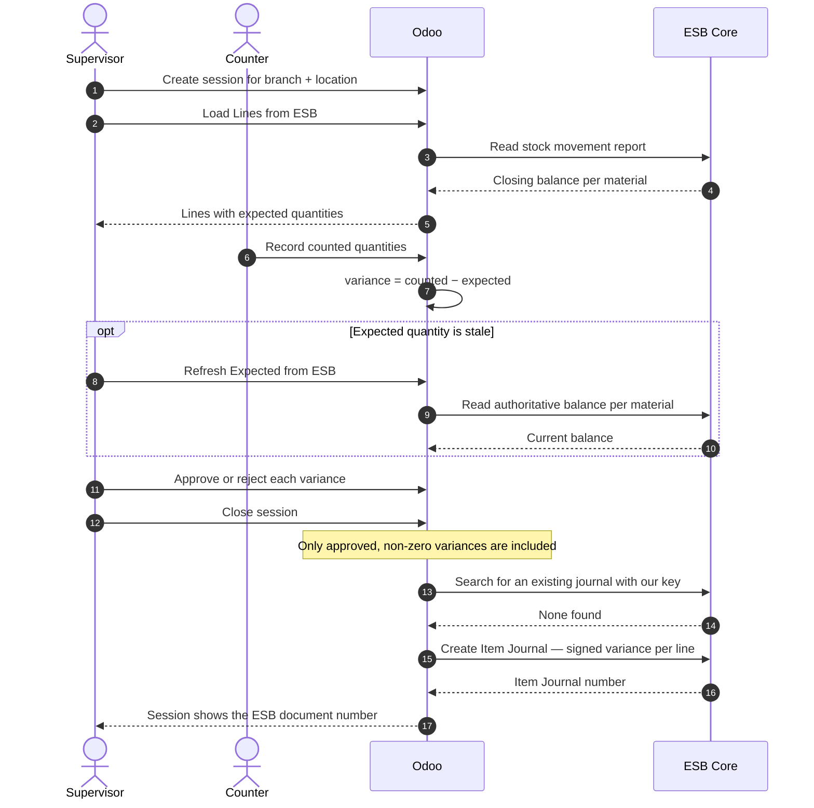
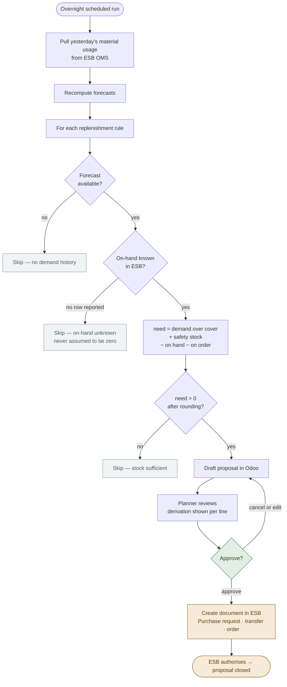

# Functional Specification Document (FSD)
## EFN (Erajaya F&B) — Stock Opname, Demand Forecasting & Auto Replenishment on ESB Core

**Audience:** Product Owner, Business Analyst, QA, Key Users, Trainers
**Version:** 1.0 · 21 July 2026
**Companion documents:** [BRD Management](01-BRD-management.md) · [BRD Technical](02-BRD-technical.md) · [TSD](04-TSD.md)

This document describes **what the system does** from a user's point of view.
Implementation is in the [TSD](04-TSD.md).

---

## 1. Solution Overview

Two Odoo modules deliver the capability:

| Module | Role |
|---|---|
| **ESB Connector** (`custom_esb_connector`) | All communication with ESB. Mirrors master data and stock, and is the single path for documents sent to ESB. No business logic. |
| **F&B Stock Ops** (`custom_fnb_stock_ops`) | The three business capabilities: opname, forecasting, replenishment. |

Counting reuses the platform's existing **Cycle Counting** capability
(`custom_wms_cycle_count`) rather than introducing a second counting tool.

### Navigation

| Menu | Contents |
|---|---|
| **ESB → Operations** | Stock Snapshot, Outbound Documents |
| **ESB → Master Data** | Branches, Locations, Purposes |
| **ESB → Configuration** | Connections, Sync Master Data Now, Sync Log |
| **F&B Planning → Replenishment** | Proposals, Rules, Generate Proposals Now |
| **F&B Planning → Demand** | Forecast, History |
| **Inventory → Cycle Counting** | Plans, Sessions, Lines (existing menu, extended) |

### Roles

| Role | Can |
|---|---|
| **ESB / User** | View mirrored master data, stock snapshot, outbound documents |
| **ESB / Administrator** | Configure connections and credentials, trigger synchronisation, push and cancel documents |
| **Cycle Count / Counter** | Perform counts |
| **Cycle Count / Supervisor** | Approve or reject count variances |
| **F&B Stock Ops / User** | View forecasts and proposals |
| **F&B Stock Ops / Planner** | Maintain rules and **approve proposals** (this is what authorises an ESB document) |

---

## 2. Functional Modules

### 2.1 ESB Connection & Master Data

**F-1 Connection.** An administrator configures up to three ESB connections (ESB
serves three different hosts). Each carries a base URL, an authentication mode
(login-and-refresh, or static API key) and a reference to where the secret is
stored. **The secret itself is never stored on the record.**

**F-2 Test Connection.** A button authenticates and reads the branch list, reporting
how many branches the ESB account can see. This is the first thing to run when
credentials arrive.

**F-3 Master synchronisation.** On a daily schedule (or on demand) the system pulls
from ESB: branches, locations, units, purposes, document templates, suppliers, and
products with their per-unit details. Re-running changes nothing that is already
correct. Records that disappear from ESB are **archived, not deleted**.

**F-4 Sync log.** Every synchronisation run records what was pulled, how many
records were created and updated, how long it took, and any error. A run that
fails for one data type does not prevent the others from completing.

**F-5 Purposes.** ESB's adjustment reasons are mirrored with their account codes.
A planner ticks exactly one as the default for **stock gain** and one for **stock
loss**. These determine which account a variance posts to in ESB's ledger.

> **Configuration prerequisite.** Until F-5 is done, closing a stock count will
> stop with a clear message rather than guessing an account.

### 2.2 Stock Visibility

**F-6 Stock snapshot.** The system maintains a read-only view of what ESB reports
as on hand, per outlet, location and material — including the unit value ESB
carries.

**F-7 Unknown vs. zero.** A material ESB has reported no movement for within the
lookback window has **no snapshot row**. This means *unknown*. The on-screen help
states this explicitly, and downstream features treat it as unknown rather than as
zero.

**F-8 Freshness.** Each row shows when it was taken. Where a snapshot is older than
the configured threshold, dependent screens warn the user.

**F-9 Verification.** A single material's balance can be re-read from ESB on demand,
which is authoritative and current.

### 2.3 Stock Opname

**F-10 Session setup.** A counting session is created and scoped to an **ESB branch
and location**. Only warehouse- and kitchen-type locations are valid targets in ESB;
others can be marked non-countable so they are not offered.

**F-11 Location mapping.** The first time an ESB location is counted, the system
creates a matching Odoo location automatically to anchor the count lines. These sit
under a clearly-named tree, *"ESB Outlets (counting only)"*, and are never used to
move stock.

**F-12 Load lines from ESB.** A button fills the session with one line per material
ESB reports at that location, with the **expected quantity pre-filled from ESB**.
Loading twice does not duplicate lines.

**F-13 Counting.** Counters record the physical quantity per line. The system
computes the variance and the variance percentage. Lines can be skipped, or marked
for recount.

**F-14 Staleness warning.** If any expected quantity came from a stale snapshot, a
warning banner appears with a **Refresh Expected from ESB** button, which re-reads
the authoritative balance for every counted line.

**F-15 Supervisor approval.** A supervisor approves or rejects each variance line.
Only supervisors can do this. Approval is required before anything is sent to ESB.

**F-16 Close and post.** Closing the session creates **one ESB Item Journal** for
the whole count containing only approved, non-zero-variance lines. Each line carries:

| Field | Value |
|---|---|
| Product | The ESB product detail for the material's **stock unit** |
| Quantity | The **signed variance** (counted − expected) |
| Reason | The configured default for gain or loss, per line's direction |
| Unit cost | The unit value from the ESB snapshot |

> **The quantity sent is the difference, not the count.** Counting 7 against an
> expected 10 sends **−3**. This is the single most consequential rule in the
> feature.

**F-17 No Odoo stock movement.** For an ESB-backed session, Odoo records the
approval and the audit trail but creates **no stock movement of its own**. The
adjustment is made by ESB, from the Item Journal. Ordinary (non-ESB) warehouse
counts are unaffected and still move Odoo stock.

**F-18 Nothing to post.** A session where everything counted correctly closes
normally and creates no ESB document at all.

**F-19 Result tracking.** The session shows the ESB document number and its status
once ESB has accepted it.

**F-20 Optional auto-authorisation.** Where configured, the Item Journal is also
authorised in ESB automatically. Default is off — the journal is created and left
for ESB's own approval flow.

### 2.4 Demand Forecasting

**F-21 Demand history.** Daily material consumption per outlet is pulled from ESB
OMS, which has already exploded sales through ESB's recipes. Only completed trading
days are ingested. Re-pulling a day overwrites it.

**F-22 Backfill.** A new outlet can be backfilled with up to 90 days of history
(configurable) in one action.

**F-23 Forecast.** For each outlet and material the system maintains:

| Shown | Meaning |
|---|---|
| Method | How the forecast is calculated |
| Forecast / Day | Expected daily consumption |
| Std Dev | Day-to-day variability, used to size safety stock |
| Days | How much history the forecast is based on |
| MAPE % | Measured average error from a backtest — lower is better |
| Reliable | Whether there is enough history to plan from |

**F-24 Methods.** Three, all explainable:

| Method | Logic | Best for |
|---|---|---|
| **Day-of-Week Seasonal** *(default)* | Average of the same weekday | Most F&B materials — a Saturday is not a Tuesday |
| **Weighted Moving Average** | Recent days weighted more heavily | Materials with a trend |
| **Moving Average** | Plain average | Stable, low-variation materials |

**F-25 Accuracy measurement.** Error is measured by walk-forward backtest: each of
the last 14 days is predicted using only the days before it, and compared to what
actually happened. Materials with too little history report no error rather than a
misleading zero.

**F-26 Pick Best Method.** A button backtests all three methods for a material and
adopts whichever is most accurate.

**F-27 Handling of zeros.** A day with no consumption counts as real demand
information and pulls the average down. Zeros *before* a material's first ever
movement are excluded — those mean "not yet stocked", not "did not sell".

**F-28 Reliability.** A forecast based on fewer than 14 days is marked unreliable.
It still produces proposals, but they are flagged for review rather than hidden.

### 2.5 Auto Replenishment

**F-29 Rules.** A planner defines, per outlet and material:

| Setting | Purpose |
|---|---|
| Stock location | Whose on-hand counts (blank = whole outlet) |
| Lead time (days) | How long supply takes to arrive |
| Review period (days) | How long until the next replenishment run |
| Service level (%) | Target in-stock probability; drives safety stock |
| Min / Max qty | Floor on the target; cap on the order |
| Min order qty | Supplier minimum |
| Order multiple | Case or pack size |
| Output document | Purchase Request, Goods Transfer Request, or Purchase Order |
| Supplier / Source branch | Counterparty, depending on output type |

**F-30 Quantity calculation.**

```
   forecast demand over (lead time + review period)
 + safety stock
 − stock on hand in ESB
 − quantity already on order
 ─────────────────────────────
 = requirement  →  floor at min, round up to pack size, cap at max
```

The forecast is evaluated **day by day** across the cover period, so a cover
starting on a Friday correctly includes the weekend.

**F-31 Skipping.** A rule produces nothing, with a recorded reason, when:

| Reason | Meaning |
|---|---|
| No demand forecast | Nothing to plan from |
| **On-hand unknown in ESB** | ESB reported no balance — the system will not guess |
| Stock already sufficient | Requirement is zero or negative |
| Product not mirrored from ESB | Master synchronisation needed first |

**F-32 Grouping.** Requirements are grouped into one proposal per outlet, output
type and counterparty — so an outlet buying from two suppliers gets two documents,
not one mixed one. The required date follows the longest lead time in the group.

**F-33 Draft first.** Proposals are created as **drafts in Odoo**. At this point
nothing exists in ESB.

**F-34 Derivation visible.** Every proposal line shows how its quantity was reached:
forecast per day, cover days, demand over cover, safety stock, on hand, on order,
raw requirement, and the final rounded quantity. A planner can audit any number.

**F-35 Weak-forecast warning.** A proposal containing any line based on thin history
shows a warning banner and is highlighted in the list.

**F-36 Adjustment.** A planner can edit quantities, prices and notes, or cancel the
proposal entirely, before approving.

**F-37 Approval.** **Approve & Send to ESB** is the commitment point, confirmed by a
dialog. It records who approved and when, and creates the ESB document. Only a
Planner can approve.

**F-38 Output documents.**

| Output | ESB document | Unit used | Notes |
|---|---|---|---|
| Purchase Request | Purchase Request | Stock unit | **Safest** — approval and pricing stay in ESB |
| Goods Transfer Request | Goods Transfer Request | Transfer unit | From a hub or central kitchen |
| Purchase Order | Purchase Order | **Purchase unit** | Requires supplier and a price on every line |

**F-39 Price requirement.** A Purchase Order will not be built if any line lacks a
price. The message names the affected materials and suggests raising a Purchase
Request instead so ESB can price it. Prices default to the ESB base price for the
purchase unit.

**F-40 Completion.** Once ESB authorises the document, the proposal moves to Done
automatically.

### 2.6 Outbound Document Control

**F-41 Outbound register.** Every document sent to ESB is listed with its type,
ESB number, status, attempt count and any error. The payload sent is viewable.

**F-42 Duplicate protection.** Each document carries a generated key. Before
creating anything in ESB the system checks whether a document with that key already
exists; if so it **adopts** it and marks the record accordingly. This makes retries
safe after a timeout or a crash.

**F-43 Failure handling.** A rejected document records ESB's exact error message.
After repeated failures it stops retrying and waits for a person, who can correct
and re-queue it. Nothing is silently discarded.

**F-44 Master switch.** A single configuration parameter suppresses **all** outbound
writes. With it off, documents queue and wait; reads continue working normally.

---

## 3. Key Business Rules

| # | Rule |
|---|---|
| BL-1 | ESB Core is the source of truth for stock. Odoo never asserts a stock figure except as an approved adjustment. |
| BL-2 | An adjustment sent to ESB is the **signed variance**, never the counted quantity. |
| BL-3 | Absence of an ESB balance means **unknown**, never zero. Replenishment skips; opname warns. |
| BL-4 | No ESB document is created without a human approval — a supervisor for counts, a planner for orders. |
| BL-5 | Odoo creates no stock movement for an ESB-backed count. |
| BL-6 | One counting session produces at most one ESB Item Journal. |
| BL-7 | Zero-variance, skipped and unapproved lines never reach ESB. |
| BL-8 | Every variance carries a reason, and the reason determines the account. |
| BL-9 | Supplier minimum is applied before pack rounding, then the maximum cap. |
| BL-10 | Every feature ships disabled and is enabled deliberately. |

---

## 4. Primary User Journeys

### J1 — Weekly stock opname at an outlet



1. Supervisor creates a session for the outlet's kitchen location.
2. **Load Lines from ESB** — the session fills with expected quantities.
3. **Start**; counters record physical quantities on a tablet.
4. If the staleness banner appears → **Refresh Expected from ESB**.
5. **Review**; supervisor approves or rejects each variance.
6. **Close** → one Item Journal appears in ESB with the signed variances.
7. Session shows the ESB document number; ESB's own approval flow finishes it.

### J2 — Weekly replenishment for an outlet



**Nothing crosses into ESB above the "Approve" line.** Everything before it is a
proposal inside Odoo that can be edited or discarded without consequence.

1. Overnight: demand pulled, forecasts recomputed, proposals generated as drafts.
2. Planner opens **F&B Planning → Proposals**, filters *Awaiting Approval*.
3. Reviews quantities; opens *How the quantity was derived* on anything surprising.
4. Adjusts or cancels lines as needed.
5. **Approve & Send to ESB** → a Purchase Request appears in ESB.
6. Purchasing continues in ESB as usual; the proposal closes when ESB authorises it.

### J3 — Onboarding a new outlet

1. Administrator adds the outlet's branch code to the scope whitelist.
2. Runs master synchronisation; confirms branch, locations and products appear.
3. Marks countable locations and maps them to Odoo locations.
4. Backfills 90 days of demand history; recomputes forecasts.
5. Reviews reliability, using **Pick Best Method** where error is high.
6. Creates replenishment rules for the outlet's key materials.
7. Runs a first opname before enabling replenishment, so the starting balance is
   trustworthy.

### J4 — Bringing the integration live (first time)

1. Configure connections; store the credential; **Test Connection**.
2. Enable master synchronisation only. Verify counts against ESB's UI.
3. Enable the stock snapshot for **one** outlet. Reconcile a sample of materials.
4. Configure default gain/loss purposes.
5. Enable outbound writes. Run **one** count of **one** material with a variance
   of 1 on a non-production branch. Verify in ESB.
6. Repeat that push deliberately; confirm it adopts rather than duplicates.
7. Only then enable replenishment, starting with Purchase Request output.

---

## 5. Non-functional Behaviour (functional view)

- **Degradation.** With no ESB connection configured, scheduled tasks record
  "skipped" and do nothing. Screens remain usable; the system stays installable and
  harmless before ESB access exists.
- **Responsiveness.** Documents are sent to ESB in the background; a user is never
  left waiting on ESB.
- **Recovery.** If ESB rejects a token mid-operation, the system re-authenticates
  once and continues without user involvement.
- **Auditability.** Every API call is logged with timing and outcome; every document
  records who approved it and what was sent.
- **Scope control.** Synchronisation can be restricted to a whitelist of outlets for
  staged rollout.

---

## 6. Acceptance Tests (representative)

These correspond to automated tests already passing against recorded ESB responses.

| # | Given | When | Then |
|---|---|---|---|
| AT-1 | ESB expects 10 of a material | 7 are counted and approved | The Item Journal carries **−3**, not 7 |
| AT-2 | A count with a stock gain | Session closed | The line uses the **gain** purpose; a loss uses the loss purpose |
| AT-3 | No default purpose configured | Session closed | A clear error naming the missing configuration; nothing sent |
| AT-4 | Two materials counted with variances | Session closed | **One** Item Journal with two lines |
| AT-5 | One material counted exactly right | Session closed | No ESB document created at all |
| AT-6 | A line is skipped | Session closed | The skipped line does not appear in the document |
| AT-7 | An ESB-backed count is approved | Adjustment posted | Audit record kept; **no Odoo stock movement** |
| AT-8 | An ordinary warehouse count is approved | Adjustment posted | An Odoo stock movement **is** created |
| AT-9 | The outbound switch is off | Session closed | Nothing sent; the document waits, not lost |
| AT-10 | A document was already created in ESB | The push is retried | The existing document is adopted; no duplicate |
| AT-11 | Duplicate-check call fails | Push attempted | Push **aborts** rather than risking a duplicate |
| AT-12 | ESB has no balance for a material | Proposals generated | Line skipped as *on-hand unknown* |
| AT-13 | ESB reports a balance of exactly 0 | Proposals generated | Treated as a real zero; a full cover is proposed |
| AT-14 | Weekend demand is 10× weekday | Forecast computed | Day-of-week method predicts each correctly; a 3-day cover from Friday includes both weekend days |
| AT-15 | 50 units needed, pack size 12 | Proposal generated | 60 proposed |
| AT-16 | Supplier minimum 10, pack size 4, need 3 | Rounding applied | 12 proposed |
| AT-17 | A proposal is generated | Nothing else done | State is Draft; **nothing exists in ESB** |
| AT-18 | A proposal is approved | Approval confirmed | Exactly one Purchase Request created in ESB |
| AT-19 | A proposal was approved last run | Next run evaluates the same rule | The approved quantity is deducted; no double order |
| AT-20 | A Purchase Order line has no price | Approval attempted | Refused, naming the material and suggesting a Purchase Request |

---

*See the [TSD](04-TSD.md) for how these behaviours are implemented and verified.*
