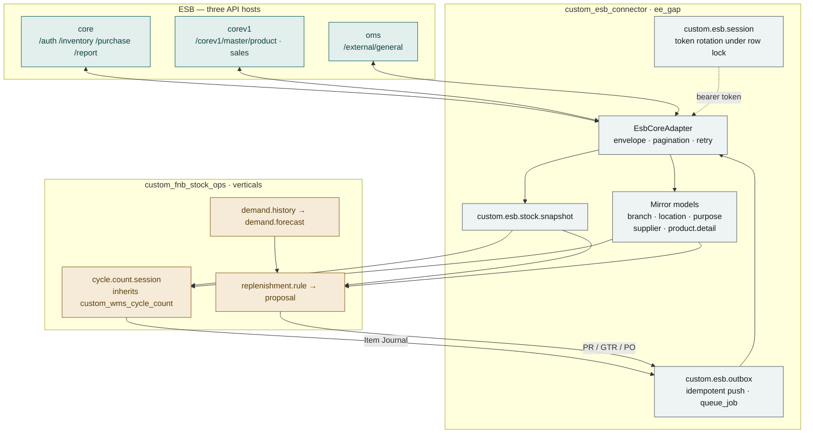
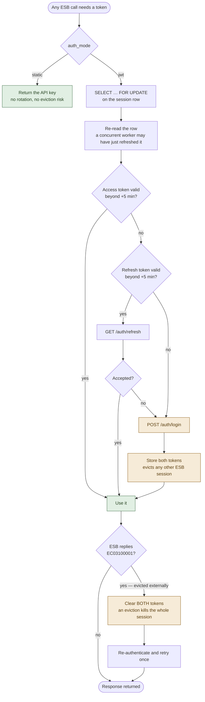
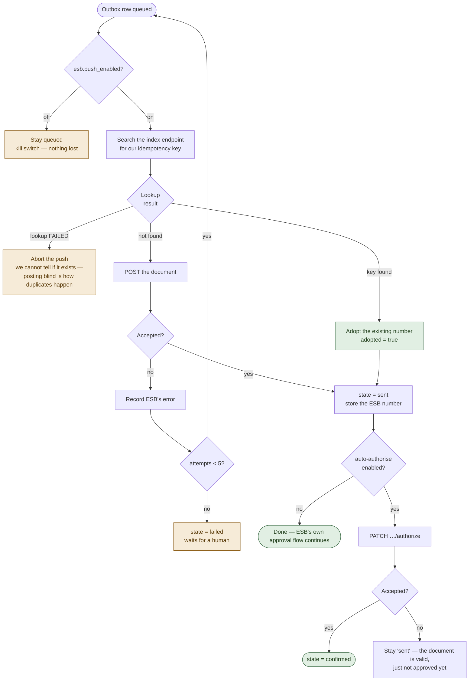

# Technical Specification Document (TSD)
## EFN (Erajaya F&B) — Stock Opname, Demand Forecasting & Auto Replenishment on ESB Core

**Audience:** Developers, Solution Architect, DevOps, QA Automation
**Version:** 1.0 · 21 July 2026
**Companion documents:** [BRD Management](01-BRD-management.md) · [BRD Technical](02-BRD-technical.md) · [FSD](03-FSD.md)
**Code:** `addons/ee_gap/custom_esb_connector`, `addons/verticals/custom_fnb_stock_ops`
**API reference:** [`docs/integrations/esb-core-api.md`](../../integrations/esb-core-api.md)

---

## 1. Architecture




### Module tiering

Per [`docs/architecture.md`](../../architecture.md) §Module tiers, a shared
integration **engine** belongs in `ee_gap`, never in `_tenants`. ESB is used across
Indonesian F&B, so the connector is reusable; only the business logic is vertical.

| Module | Tier | Version | Depends on |
|---|---|---|---|
| `custom_esb_connector` | `ee_gap` | 19.0.0.1.0 | `custom_core`, `custom_adapter_framework`, `custom_pdp_audit`, `queue_job`, `stock`, `uom` |
| `custom_fnb_stock_ops` | `verticals` | 19.0.0.1.0 | `custom_core`, `custom_esb_connector`, `custom_wms_cycle_count`, `queue_job` |

Both are registered in the `fnb` industry pack
(`custom_hub_console/models/industry_pack.py::_SEED_PACK_MODULES`).

### Reuse

The connector is built on the platform's existing
[`custom_adapter_framework`](../../../addons/core/custom_adapter_framework/MODULE_KNOWLEDGE.md),
inheriting retry with exponential backoff, the circuit breaker, and the append-only
`custom.adapter.call.log`. The pull/push shape follows `custom_finance_portal_sap`.
Counting reuses `custom_wms_cycle_count` outright.

---

## 2. Components

### 2.1 `EsbCoreAdapter` (`models/esb_adapter.py`)

Subclasses `BaseAdapter`. Registered three times — `esb_core`, `esb_corev1`,
`esb_oms` — one per ESB host, sharing one implementation and one token.

Four ESB-specific overrides:

| Override | Why |
|---|---|
| `_get_secret()` | Returns the live token from `custom.esb.session` rather than a static parameter |
| `_handle_response()` | Unwraps ESB's envelope; `ok` requires HTTP 2xx **and** `result.status == "ok"` |
| `get()` / `iter_rows()` | `BaseAdapter.call()` sends only a body; every ESB read is query-param driven |
| `call()` | One transparent re-login when ESB returns `EC03100001` |

**Envelope-failure mapping.** An envelope failure is rewritten to a synthetic 4xx
status (`401` for auth, `422` otherwise) before returning to `BaseAdapter`. This is
deliberate: `BaseAdapter` returns 4xx immediately without retrying or tripping the
breaker, which is exactly right for a validation error. The original HTTP status is
preserved in `headers["X-Esb-Http-Status"]`.

**Pagination.** `iter_rows()` stops on a short page rather than trusting ESB's
`next` URL, which is emitted even for empty result sets and double-appends the query
string. Page size is capped at 100 (ESB's stock-movement limit). `MAX_PAGES = 500`
is a runaway backstop.

**Result shapes.** `_rows()` normalises both envelope shapes: `result` as a bare list
(`/branch`, `/location`, `/units`) and `result.data` as a paged list. `{"count": 0,
"data": null}` yields `[]`.

### 2.2 `custom.esb.session` (`models/esb_session.py`)

Holds the JWT access token (1 h) and refresh token (24 h), or returns a static API
key when `auth_mode = static`.

```python
_ensure_token():
    if static:  return credential
    _lock()                                   # SELECT ... FOR UPDATE + re-read
    if access_token valid beyond +5min:  return it
    if refresh_token valid beyond +5min: try refresh
    login()
```

**The row lock is the critical detail.** ESB evicts any existing session on login.
Without serialisation, two workers finding an expired token would both log in and
evict each other. The lock makes the second worker re-read and find a fresh token.



`_invalidate_token()` clears **both** tokens: an eviction kills the whole ESB
session, so keeping the refresh token would only buy a guaranteed-to-fail round trip.

Credentials are never stored on the record — `credential_ref` names an
`ir.config_parameter` key. `access_token` / `refresh_token` are readable only by
`group_esb_admin`.

### 2.3 Master mirror (`models/esb_master.py`, `esb_master_sync.py`)

Mirror models rather than force-feeding `stock.warehouse` / `stock.location`:
auto-creating Odoo warehouses on a cron would generate sequences, routes and picking
types for entities Odoo does not operate. Where an Odoo counterpart is genuinely
needed (counting), the mirror carries an optional link created deliberately.

| Model | Mirrors |
|---|---|
| `custom.esb.branch` | Outlets, optional `warehouse_id` link |
| `custom.esb.location` | Locations, optional `location_id` link, `countable` flag |
| `custom.esb.purpose` | Adjustment reasons + `is_default_gain` / `is_default_loss` |
| `custom.esb.document.template` | Request templates |
| `custom.esb.supplier` | Suppliers incl. credit term |
| `custom.esb.product.detail` | One row per `productDetailID` (product × unit) |

Products *are* mirrored onto `product.product` via `x_esb_*` fields — the repo
convention for fields on core models, matching `x_sap_external_id` in
`custom_finance_portal_sap`. `x_esb_product_detail_id` denormalises the **stock
unit's** detail for fast lookup; `product._esb_detail_id(kind)` resolves
purchase/transfer/base units from `custom.esb.product.detail`.

Feeds are declared in `MASTER_FEEDS` (order matters: branches before locations,
products before details). `_upsert()` is keyed on the ESB identifier. A failing feed
logs and continues; the others still run.

### 2.4 `custom.esb.stock.snapshot` (`models/esb_stock_snapshot.py`)

ESB has **no bulk on-hand endpoint**. `refresh_branch()` pages
`/report/stock-movement` for a window and reduces the rows to closing balances:

```python
key = (location, productDetailID)
sort_key = (documentDate, createdDate)      # the report is NOT sorted
keep the row with the greatest sort_key      # its qtyBalance is the closing balance
```

The location is resolved by **name** (the report gives `location`, not `locationID`).
Rows whose `productDetailID` is not mirrored are skipped rather than inventing a
product.

`qty_for()` returns `None` when there is no row. **Callers must not coerce that to
0.0** — a material that did not move has an unknown balance, and treating it as zero
would post a fabricated adjustment or order a full cover for stock already held.

`refresh_one()` reads `/product/stock-location` for an authoritative single-material
balance. `_stale_before()` derives the freshness cut-off from
`esb.snapshot_stale_hours`.

### 2.5 `custom.esb.outbox` (`models/esb_outbox.py`)

The single path for every outbound document.

```
draft → queued → sent → confirmed
              ↘ failed (after MAX_ATTEMPTS = 5)
```

`DOC_SPEC` maps each `doc_type` to `(create path, index path, result key)`.
Dispatch is asynchronous via `queue_job` on a dedicated `root.esb` channel.

**Idempotency without an idempotency header.** ESB accepts no such header, so a
create that times out after ESB committed would duplicate on retry:

1. `create()` generates `ODOO-<hex>` and stamps it into the payload's
   `additionalInfo`.
2. `_push()` calls `_find_existing()` — queries the index endpoint filtered on that
   key, and re-verifies the exact key is present (ESB filters as a substring).
3. If found → adopt the number, set `adopted = True`, **do not create**.
4. If `_find_existing()` **raises** → abort. Posting blind is precisely how
   duplicates are created.



`esb.push_enabled` is checked first and gates every write. `_post_send()` optionally
authorises; an authorise failure leaves the document `sent` (it exists and is valid,
just unapproved) rather than `failed`.

### 2.6 Opname bridge (`custom_fnb_stock_ops/models/cycle_count_*.py`)

Extends `custom_wms_cycle_count` rather than forking it.

**`custom.cycle.count.session`** gains `esb_branch_id`, `esb_location_id`,
`is_esb_backed`, `esb_outbox_id`, `esb_stale_snapshot`, plus:

- `action_generate_lines_from_esb()` — seeds `expected_qty` from the snapshot;
  creates the Odoo location on demand via `custom.esb.location`.
- `action_refresh_expected_from_esb()` — re-reads `/product/stock-location` per
  counted line before posting.
- `action_close()` — `super()`, then `_esb_emit_item_journal()` for ESB sessions
  that have not already emitted one.

```python
# _esb_journal_payload — the line that matters
"qty": line.variance_qty,       # counted − expected. NEVER line.counted_qty.
```

`_esb_variance_lines()` filters to `status == "approved" and variance_qty` —
excluding skipped, rejected and zero-variance lines. `_esb_purpose_for()` selects
the gain/loss default and raises a `UserError` naming the missing configuration if
unset. `hpp` comes from the snapshot's `unit_value`.

**`custom.cycle.count.adjustment.action_post()`** is overridden to mark ESB-backed
adjustments posted **without** creating a `stock.move`, while non-ESB adjustments
fall through to `super()`. Odoo does not own this stock; a move would fabricate a
movement and, on a valued product, a journal entry.

### 2.7 Demand & forecast (`models/fnb_demand.py`, `fnb_forecast.py`)

`custom.fnb.demand.history` — one row per (branch, product, date), unique-constrained.
Sourced from `/corev1/sales/get-daily-sales-material-usage` with
`flagUnit=stockUnit`, so history and snapshot share a unit and need no conversion.
The feed is per menu-material, so a material appearing under several dishes is
**summed**. `series()` zero-fills missing days — a quiet day is real demand
information.

`custom.fnb.demand.forecast` — three pure-Python methods, no ML dependency:

| Method | Implementation |
|---|---|
| `seasonal_dow` *(default)* | Mean of the same weekday; falls back to overall mean |
| `weighted_ma` | Linearly weighted, most recent day heaviest |
| `moving_average` | `statistics.fmean` |

`_predict_horizon()` sums **day by day**, not `daily × days` — under the seasonal
method a 3-day cover from Friday is not three average days.

`_recompute_one()` drops **leading** zeros before a material's first ever movement
("not yet stocked" ≠ "did not sell") but keeps zeros afterwards.

`_backtest()` returns **`None`, not `0.0`**, when error is unmeasurable. A perfect
forecast legitimately scores 0.0; conflating the two made `action_compare_methods()`
discard exactly the best method. This was found by the test suite.

`safety_stock()` = `z × σ × √(lead time)` — square root because daily deviations
partly cancel over a longer cover. `z` from a lookup table; a full inverse-normal
would imply precision the data does not support.

### 2.8 Replenishment (`models/fnb_replenishment_*.py`)

`custom.fnb.replenishment.rule` — modelled on `custom.to.rule`'s shape but a separate
model: the TO engine moves Odoo `stock.location` stock, which is the wrong target.
`round_qty()` applies **minimum before pack rounding**, then the cap — a minimum of
10 with a pack of 4 must give 12, not 10.

`custom.fnb.replenishment.proposal` — `_evaluate_rule()` returns
`(line_vals, skip_reason)`, exactly one set:

```python
if not product.x_esb_product_detail_id:      return None, "no_product_detail"
if not forecast or not forecast.computed_at: return None, "no_forecast"
on_hand = _on_hand(...)
if on_hand is None:                          return None, "unknown_on_hand"   # ← not 0.0
raw_need = max(demand + safety, min_qty) - on_hand - on_order
qty = rule.round_qty(raw_need)
if qty <= 0:                                 return None, "sufficient"
```

Grouped by `(branch, target_doc, supplier, source_branch, source_location)`.
`action_approve()` is the gate — it writes the approver, then calls `_push_to_esb()`.

Three payload builders. Note ESB's inconsistency, honoured exactly:

| Output | Detail unit | Quirk |
|---|---|---|
| `purchase_request` | stock | `requestProcessID` 2=Purchase / 3=Transfer |
| `goods_transfer_request` | transfer | `requestQty: 0` when unlinked to a PR |
| `purchase_order` | **purchase** | **`ProductDetailID`** — capital P, this endpoint only |

`_on_order()` sums lines of proposals in `approved`/`pushed` state. See
[§9 Known trade-offs](#9-known-trade-offs).

---

## 3. ESB API Surface Used

| Purpose | Method & path | Host |
|---|---|---|
| Login / refresh | `POST /auth/login`, `GET /auth/refresh` | core |
| Branches, locations, units | `GET /branch`, `/location`, `/units` | core |
| Purposes, templates, suppliers | `GET /purpose`, `/document-template`, `/supplier` | core |
| Product master + details | `GET /corev1/master/product` | corev1 |
| Stock balances | `GET /report/stock-movement` | core |
| Single-material balance | `GET /product/stock-location` | core |
| Stock adjustment | `POST /inventory/item-journal`, `PATCH /{n}/authorize`, `GET` index & view | core |
| Purchase request | `POST /purchase/purchase-request` + index | core |
| Goods transfer request | `POST /inventory/goods-transfer-request` + index | core |
| Purchase order | `POST /purchase/purchase-order` + index | core |
| Daily material usage | `GET /corev1/sales/get-daily-sales-material-usage` | corev1 |

Base URLs per environment: [`esb-core-api.md` §1](../../integrations/esb-core-api.md).

---

## 4. Data Model Summary

| Model | Key fields | Constraints |
|---|---|---|
| `custom.esb.session` | `adapter_config_id`, tokens, expiries, `auth_mode` | unique per adapter config |
| `custom.esb.branch` | `esb_branch_id`, `code`, `warehouse_id` | unique (esb_branch_id, company) |
| `custom.esb.location` | `esb_location_id`, `branch_id`, `location_id`, `countable` | unique (esb_location_id, branch) |
| `custom.esb.product.detail` | `esb_product_detail_id`, `product_id`, unit flags | unique esb_product_detail_id |
| `custom.esb.stock.snapshot` | `branch/location/product`, `qty`, `unit_value`, `as_of` | unique (branch, location, product) |
| `custom.esb.outbox` | `doc_type`, `payload` (Json), `idempotency_key`, `state`, `esb_doc_num`, `adopted` | unique idempotency_key |
| `custom.fnb.demand.history` | `branch/product/date`, `qty` | unique (branch, product, date) |
| `custom.fnb.demand.forecast` | `method`, `daily_qty`, `demand_stdev`, `mape`, `reliable` | unique (branch, product) |
| `custom.fnb.replenishment.rule` | cover, service level, rounding, `target_doc` | unique (branch, product) |
| `custom.fnb.replenishment.proposal` (+ `.line`) | `state`, `target_doc`, derivation fields | — |
| `product.product` *(inherit)* | `x_esb_product_id`, `x_esb_product_code`, `x_esb_product_detail_id` | — |

> Odoo 19 **silently ignores `_sql_constraints`**. All constraints use
> `models.Constraint` — see [`odoo19-sql-constraints-ignored`].

---

## 5. Security

- Groups: `group_esb_user` / `group_esb_admin`, `group_fnb_user` / `group_fnb_planner`,
  defined under `res.groups.privilege` (Odoo 19 form).
- **Approval authority is the security boundary**: `group_fnb_planner` on the
  Approve button, `group_cycle_count_supervisor` on line approval.
- Tokens and credential references are readable only by `group_esb_admin`
  (field-level `groups=`).
- No secret is stored in a model field — `credential_ref` names an
  `ir.config_parameter` key.
- All models inherit `pdp.audited.mixin` (UU PDP audit trail).
- `custom.adapter.call.log` is append-only and stores a SHA-256 digest of the
  request body, never the body itself.

---

## 6. Configuration

All `ir.config_parameter`, the repo's dominant convention. **Every switch defaults
to off**; all seven `ir.cron` records ship `active=False`.

| Key | Default | Effect |
|---|---|---|
| `esb.master_sync_enabled` | `0` | Daily master sync |
| `esb.snapshot_enabled` | `0` | Stock snapshot cron |
| `esb.snapshot_lookback_days` | `90` | Movement window |
| `esb.snapshot_stale_hours` | `24` | Freshness warning threshold |
| **`esb.push_enabled`** | `0` | **Kill switch for every outbound write** |
| `esb.auto_authorize_item_journal` | `0` | Authorise journals automatically |
| `esb.branch_whitelist` | *(empty)* | Restrict scope to listed branch codes |
| `custom_esb_connector.esb_password` | *(empty)* | ESB password or static API key |
| `fnb.demand_sync_enabled` | `0` | Daily OMS usage pull |
| `fnb.forecast_enabled` | `0` | Nightly forecast recompute |
| `fnb.replenishment_enabled` | `0` | Proposal generation |
| `fnb.demand_backfill_days` | `90` | Backfill depth |
| `fnb.esb_currency_id` | `1` | ESB `currencyID` on purchase orders |

Three `custom.adapter.config` rows are seeded **disabled**, pointing at ESB staging.

---

## 7. Deployment & Operations

### Install

```bash
make install MODULE=custom_esb_connector DB=<db>
make install MODULE=custom_fnb_stock_ops DB=<db>
```

`custom_fnb_stock_ops` pulls in `custom_wms_cycle_count` and the connector.

> **Deployment note.** `/opt/odoo-platform/addons` is what the container mounts;
> `/home/odoo-erp/odoo-platform` is the development checkout. Both must be synced —
> see [`odoo-platform-checkouts`].

### Go-live sequence

Strictly read-before-write, one feature at a time:

1. Configure the three adapter configs; set the credential; **Test Connection**.
2. `esb.master_sync_enabled = 1` → run → verify counts against ESB's UI.
3. `esb.snapshot_enabled = 1` with `esb.branch_whitelist` set to one branch →
   reconcile a sample against ESB's Stock Movement report.
4. Configure `is_default_gain` / `is_default_loss` purposes.
5. `esb.push_enabled = 1` → one count, one material, variance of 1, non-production
   branch → verify in ESB → repeat deliberately to prove adoption over duplication.
6. `fnb.demand_sync_enabled = 1`, backfill, `fnb.forecast_enabled = 1`.
7. `fnb.replenishment_enabled = 1`, starting with `purchase_request` output only.

### Monitoring

| Signal | Where |
|---|---|
| Sync outcomes per feed | **ESB → Configuration → Sync Log** |
| Individual API calls, latency, failures | `custom.adapter.call.log` |
| Stuck or failed documents | **ESB → Outbound Documents**, filter *Failed* |
| Circuit breaker state | `custom.adapter.config.status = circuit_open` |
| Session health | `custom.esb.session.last_error`, `login_count` |

An unexpectedly climbing `login_count` is the signature of session eviction —
someone is using the integration's ESB account.

### Rollback

Set `esb.push_enabled = 0`. Writes stop immediately; queued documents wait. No code
change or restart required. Uninstalling is not required to make the system inert.

---

## 8. Testing

**158 automated tests, all passing**, on a disposable `rnd_esb` database.

| Suite | Tests | Covers |
|---|---|---|
| `custom_esb_connector` | 70 | Envelope handling, pagination, token lifecycle, master upsert, snapshot reduction, outbox idempotency |
| `custom_fnb_stock_ops` | 86 | Opname payloads, demand ingest, forecast maths, replenishment arithmetic and gate |
| `custom_wms_cycle_count` | 2 | Pre-existing, still passing after the `stock.move` fix |

```bash
odoo -d <db> -u custom_esb_connector,custom_fnb_stock_ops \
     --test-enable --test-tags /custom_esb_connector,/custom_fnb_stock_ops \
     --stop-after-init
```

**No ESB credentials required.** `MockEsbTransport` (`tests/common.py`) patches
`requests.request` and replays JSON fixtures transcribed **verbatim from ESB's own
documented `Success-Response` examples**. Keeping them literal is the point: when
ESB revises its API, the fixtures are what get re-captured and diffed.

Tests that assert on the actual HTTP call must drive `outbox.action_push_now()`
explicitly, since dispatch is a `queue_job`.

Representative assertions: expected 10 / counted 7 produces `qty: -3`; a retried
push adopts rather than duplicates; a failed duplicate-check aborts; `qty_for()`
returns `None` not `0.0`; `_backtest` distinguishes perfect from unmeasurable.

---

## 9. Known Trade-offs

1. **`on_order` nets only Odoo-raised documents.** ESB's index endpoints return
   document totals, not line quantities; netting externally-raised POs would cost
   one View call per open document per run. Mitigation: keep `review_period_days`
   aligned to the outlet's real ordering rhythm.

2. **Mirror models instead of native Odoo warehouses.** Chosen so a cron never
   generates sequences, routes and picking types for entities Odoo does not operate.
   Cost: an explicit mapping step before an ESB location can be counted.

3. **Snapshot derived from a movement report.** Forced by ESB's missing bulk
   endpoint. Costs a full page-through per branch and leaves non-moving materials
   unknown — surfaced honestly rather than defaulted.

4. **Statistical forecasting, not ML.** Explainability was ranked above accuracy
   (BR-8). `method` is a Selection, so a heavier model can be added later without
   touching consumers, which read only `daily_qty` and `safety_stock()`.

5. **Idempotency via `additionalInfo`.** A workaround for ESB accepting no
   idempotency key. Depends on ESB storing the text verbatim and filtering on it —
   open item Q4.

6. **Synchronous authorise on the item journal.** Kept simple; an authorise failure
   leaves the document `sent` for a human rather than retrying.

---

## 10. Odoo 19 API Drift Encountered

Recorded because it will recur on any similar module — see
[`odoo19-api-drift-stock-users`] and [`odoo19-sql-constraints-ignored`].

| Drift | Effect |
|---|---|
| `stock.move.name` removed | `ValueError: Invalid field 'name'` — use `reference` / `description_picking` |
| `stock.location.comment` removed | No free-text field on a location |
| `res.users.groups_id` → `group_ids` | `AttributeError` in tests |
| `string=` invalid as an xpath inheritance selector | Anchor on `//field[@name='…']` |
| `<search string=…>`, `<group expand=…>` fail RNG validation | Use bare `<search>` / `<group>` |
| A **callable** field selection cannot be `dict()`-ed | `TypeError: 'function' object is not iterable` |
| `_sql_constraints` silently ignored | Use `models.Constraint` |

### Fixes applied to shared modules

- **`custom_wms_cycle_count/models/cycle_count_adjustment.py`** — created
  `stock.move` with `name`, which Odoo 19 removed. **Every cycle-count adjustment
  was failing**, ESB or not. Now uses `reference` + `description_picking`.
- **`custom.cycle.count.session` sequence** — the module ships a placeholder
  sequence file, so every session was named the literal `CC/NEW`. That name lands in
  the ESB journal's `additionalInfo`, where it must identify one count. The sequence
  is supplied by `custom_fnb_stock_ops/data/ir_sequence_data.xml`.

> Both are shared-module changes: they reach other tenants only on
> `-u custom_wms_cycle_count`.

---

## 11. Acceptance (technical)

| # | Criterion | Status |
|---|---|---|
| T-1 | Both modules install cleanly on Odoo 19 | ✅ verified on `rnd_esb` |
| T-2 | 158 automated tests pass without ESB credentials | ✅ |
| T-3 | Installable and inert with no adapter configured | ✅ crons log *skipped* |
| T-4 | All switches default off; all crons ship disabled | ✅ |
| T-5 | Envelope failure on HTTP 200 treated as failure, not retried | ✅ |
| T-6 | Token rotation serialised; eviction recovers automatically | ✅ |
| T-7 | Retried push adopts rather than duplicates | ✅ |
| T-8 | Signed variance, not counted quantity | ✅ dedicated test |
| T-9 | No Odoo stock move for ESB counts; non-ESB counts unaffected | ✅ both tested |
| T-10 | Live staging round trip | ⏳ blocked on credentials (Q1/Q2) |

---

*Module-level documentation:
[`custom_esb_connector/MODULE_KNOWLEDGE.md`](../../../addons/ee_gap/custom_esb_connector/MODULE_KNOWLEDGE.md) ·
[`custom_fnb_stock_ops/MODULE_KNOWLEDGE.md`](../../../addons/verticals/custom_fnb_stock_ops/MODULE_KNOWLEDGE.md)*
