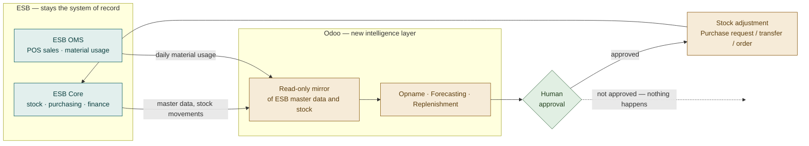
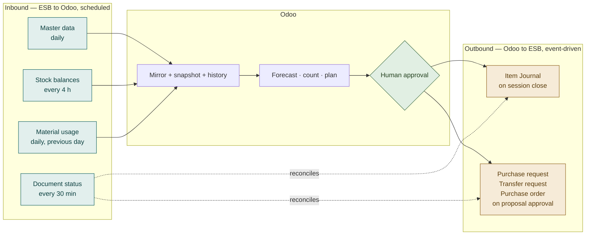
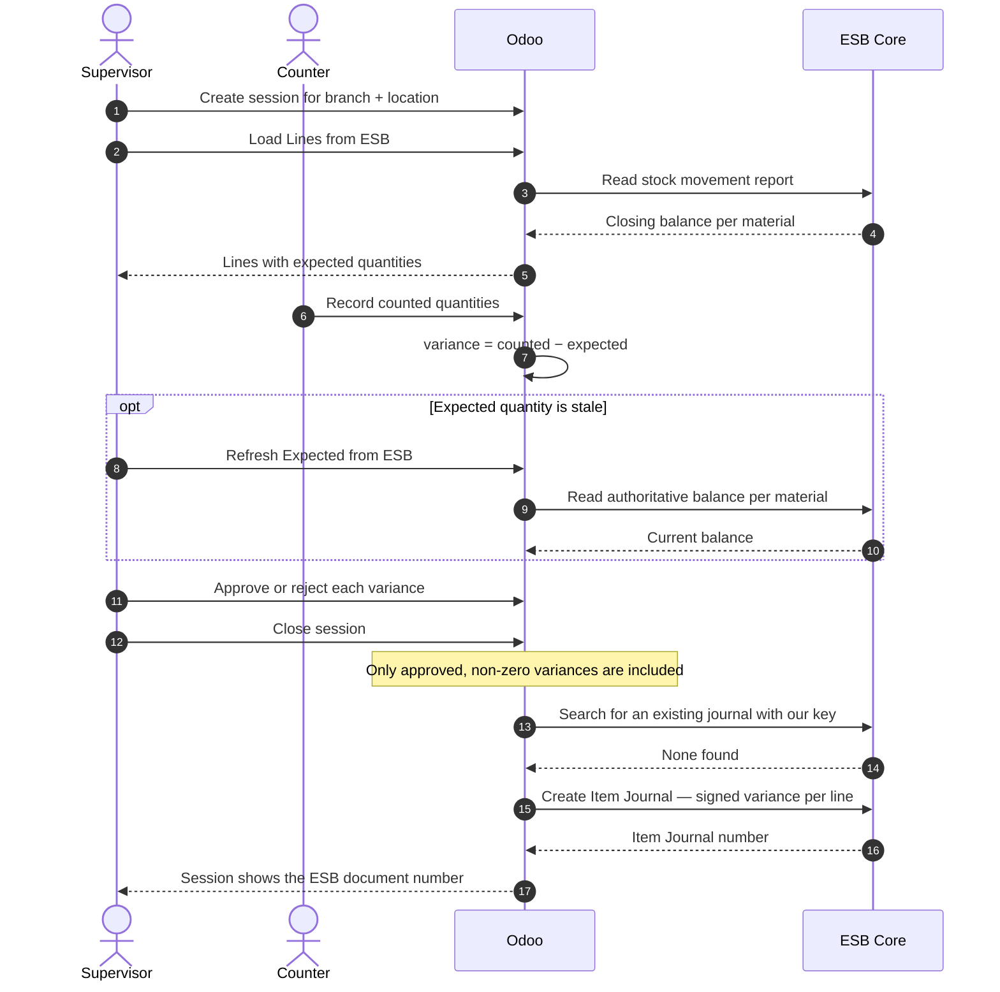
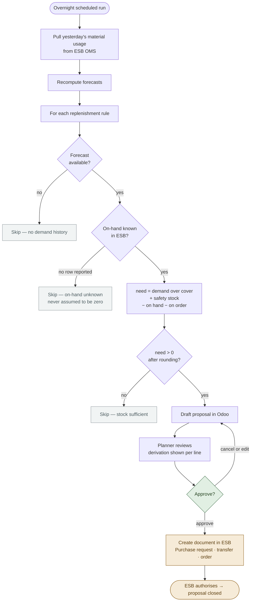
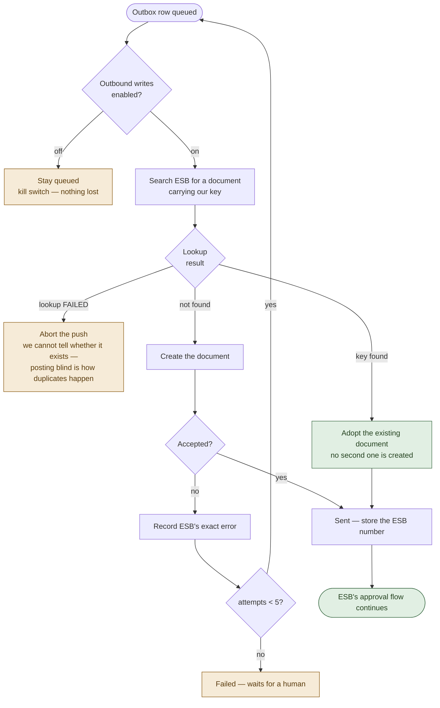
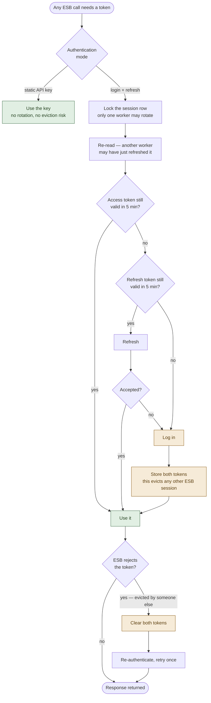
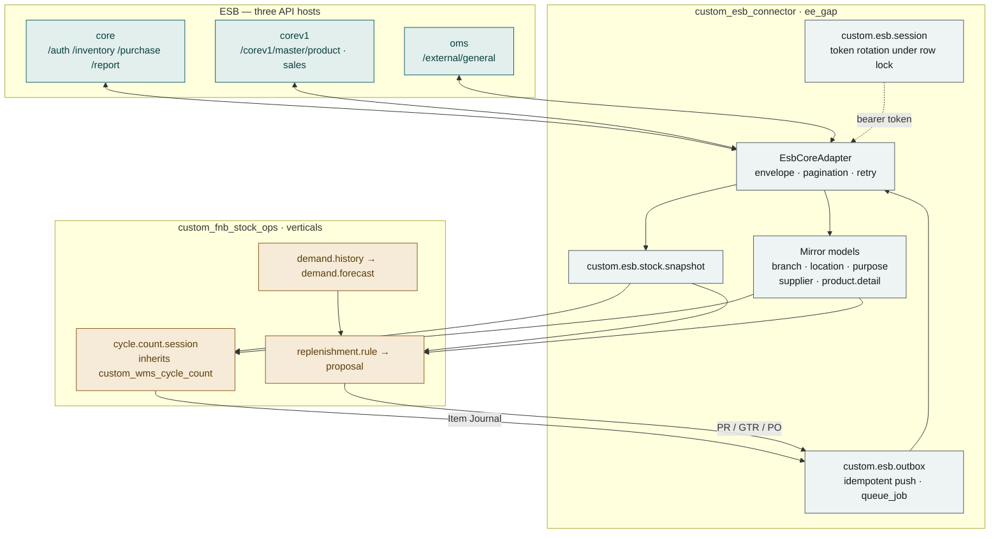
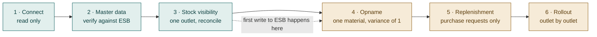
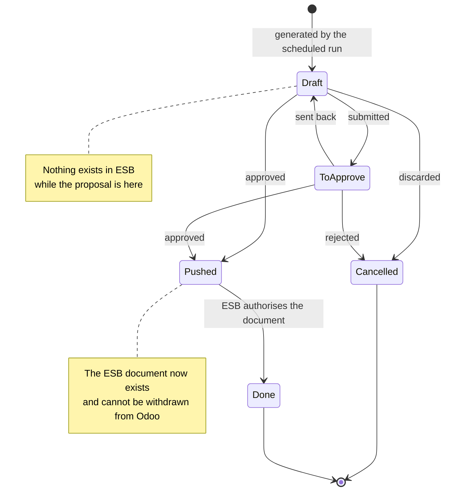

# Workflows & Diagrams
## EFN (Erajaya F&B) — Odoo ↔ ESB Core Integration

**Audience:** everyone — this is the visual index to the specification set
**Version:** 1.0 · 22 July 2026
**Companion documents:** [BRD Management](01-BRD-management.md) · [BRD Technical](02-BRD-technical.md) · [FSD](03-FSD.md) · [TSD](04-TSD.md)

Every diagram below also appears in context in the document it belongs to. This page
collects them so the integration can be understood end to end in one sitting.

---

## 1. The relationship between the two systems

The single most important thing to understand: **ESB stays in charge of stock.**
Odoo reads from it, thinks, and writes back only what a person has approved.

---

## 2. What moves, in which direction, and how often

Inbound is scheduled and read-only. Outbound is event-driven and always passes a
person. **There is no path from a schedule directly to a write in ESB.**

---

## 3. Stock opname, end to end

> **The quantity sent is the difference, not the count.** Counting 7 against an
> expected 10 sends **−3**. Sending 7 would post the outlet's whole stock balance as
> an adjustment.

---

## 4. Demand to replenishment, with the approval gate

Note the two deliberate refusals: no forecast means no proposal, and an **unknown**
on-hand quantity means the system declines rather than guesses.

---

## 5. How duplicate documents are prevented

ESB accepts no idempotency key, so a create that times out *after* ESB committed it
would be duplicated on retry — duplicated stock adjustments and duplicated ledger
entries. This is the guard.

---

## 6. Staying authenticated to ESB

ESB permits **one active session per account** — logging in anywhere evicts the
previous session. This is why the integration needs an account of its own, and why
token rotation is serialised.

> A steadily climbing login count is the signature of someone using the
> integration's ESB account. It is the first thing to check if the integration
> starts failing intermittently.

---

## 7. Software architecture

The connector knows nothing about food. The vertical module knows nothing about
HTTP. That separation is what makes the connector reusable for the next F&B customer
running on ESB.

---

## 8. Go-live sequence

Steps 1–3 cannot change anything in ESB. Each step is independently useful and
independently reversible; a single switch stops all writing without a code change.

---

## 9. State of a replenishment proposal

---

*For the reasoning behind each of these flows, see the
[BRD Technical](02-BRD-technical.md) and [TSD](04-TSD.md).*
