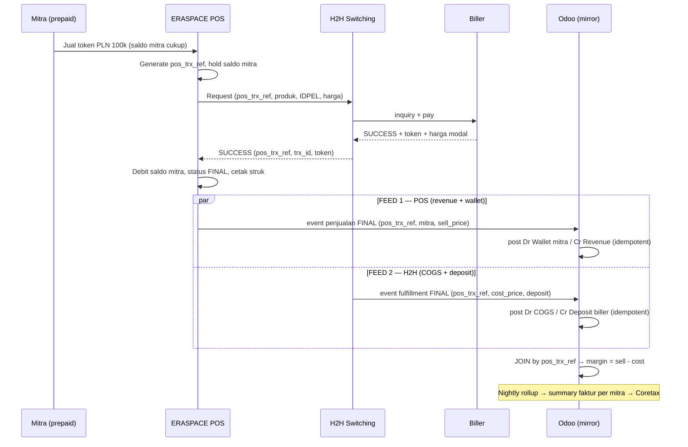

# Arsitektur PPOB — ERASPACE POS → H2H → Odoo (Mirror-Only Finance & Accounting)

**Konteks bisnis:** Erajaya Value-Added Services (VAS) — PPOB / bill-payment & top-up, model **mitra prepaid**
**Owner:** Product Owner VAS · Platform Team
**Status:** Design / architecture baseline
**Tanggal:** 2026-07-16
**Terkait kode:** `addons/verticals/custom_ppob_*`, `docs/presentation-erajaya-vas.md`, `docs/coretax.md`

---

## 0. Keputusan Bisnis yang Sudah Dikonfirmasi

Dokumen ini dibekukan pada tiga keputusan berikut (2026-07-16):

1. **ERASPACE POS adalah aplikasi standalone milik Eraspace — TIDAK menggunakan Odoo.**
   Mitra bertransaksi di ERASPACE POS. Odoo **hanya menerima mirror** data transaksinya.
2. **Model kanal = MITRA PREPAID.** Mitra top-up saldo dulu, lalu berjualan. **Saldo
   mitra bersifat authoritative di ERASPACE POS**, bukan di Odoo.
3. **Dua feed terpisah** masuk ke Odoo: **POS feed** (penjualan + top-up + mutasi
   saldo mitra) dan **H2H feed** (fulfillment biller + harga modal + deposit).
   Odoo **men-join** keduanya untuk margin, pajak, dan rekonsiliasi.

---

## 1. Ringkasan Eksekutif

Bisnis PPOB VAS dijalankan dengan pembagian peran **tiga sistem**:

1. **ERASPACE POS** — aplikasi standalone (bukan Odoo) tempat **mitra prepaid**
   bertransaksi. **System of record untuk penjualan & saldo mitra**: harga jual ke
   mitra, penurunan saldo (drawdown), top-up saldo, identitas mitra/outlet.
2. **H2H (Host-to-Host switching / biller aggregator)** — mesin eksekusi transaksi
   PPOB: inquiry & pay ke biller, status ke biller, dan **saldo deposit** per biller.
   **System of record untuk fulfillment & settlement biller** (harga modal, trx id,
   serial/token, status final).
3. **Odoo** — **hanya mirroring** dua feed di atas untuk melanjutkan **Finance &
   Accounting**: jurnal/GL, saldo liability mitra, revenue & COGS/margin, PPN
   (e-Faktur/Coretax) via summary faktur per mitra, PPh, AP deposit biller,
   rekonsiliasi, dan pelaporan. **Odoo BUKAN transaction engine.**

> **Prinsip inti:** Odoo adalah *downstream ledger* yang **non-authoritative** atas
> saldo mitra, inventory biller, dan status transaksi. Odoo menerima dua feed
> **terminal** (POS + H2H), men-join-nya, lalu memproyeksikan ke jurnal, faktur, dan
> laporan. Odoo **tidak pernah** memanggil biller, tidak menahan/mengubah saldo
> mitra, dan tidak mengeksekusi pembelian.

Model **mitra-prepaid** ini **selaras penuh** dengan desain asli suite `custom_ppob_*`
(wallet per mitra, price tier, VA top-up, summary faktur per mitra). Perbedaannya
dengan mode *native*: **engine (wallet/bucket/dispatch) berjalan di ERASPACE POS +
H2H**, dan Odoo menjalankan **model yang sama dalam mode mirror**. Pola mirror sudah
punya preseden di `custom_ppob_oracle_bridge` (guard `mirror_source`, ingest cron,
GL posting saat terminal, idempotensi `UNIQUE`).

---

## 2. Ruang Lingkup (In / Out of Scope untuk Odoo)

| Kapabilitas | Pemilik | Odoo? |
|---|---|:--:|
| UI transaksi mitra / checkout | ERASPACE POS | ❌ |
| **Saldo mitra prepaid** (otoritas, drawdown, hold) | ERASPACE POS | ❌ (mirror read-only sbg liability) |
| Top-up saldo mitra (inisiasi & otorisasi) | ERASPACE POS + bank VA | ⚠️ mirror + jurnal |
| Inquiry & pembelian ke biller | H2H | ❌ |
| Saldo deposit per biller | H2H | ❌ (mirror read-only + AP topup) |
| Status transaksi & reversal ke biller | H2H | ❌ |
| Katalog produk & mapping SKU biller | H2H (master) → Odoo (mirror mapping) | ⚠️ mirror |
| **Mirror + join 2 feed** (POS ↔ H2H) | Odoo | ✅ |
| **Jurnal / GL** (wallet mitra, revenue, COGS, margin) | Odoo | ✅ |
| **Saldo liability mitra** (neraca) | Odoo | ✅ |
| **PPN & e-Faktur / Coretax** (PMK-63 margin, NSFP, summary per mitra) | Odoo | ✅ |
| **PPh 23** komisi/rebate mitra (bila ada) | Odoo | ✅ |
| **AP ke biller / H2H** (vendor bill topup deposit, PMK 131) | Odoo | ✅ |
| **Rekonsiliasi** POS ↔ H2H ↔ Bank ↔ GL | Odoo | ✅ |
| **Laporan keuangan** (TB/P&L/BS, laba per produk/mitra) | Odoo | ✅ |

**Konsekuensi desain:** engine native Odoo di-*bypass* (wallet atomic-debit,
bucket atomic-drawdown, dispatch/adapter-pay). Model datanya **dipakai ulang sebagai
wadah mirror** dan sub-ledger GL (lihat §8).

---

## 3. Prinsip Arsitektur

1. **Odoo downstream & non-authoritative.** Saldo mitra milik ERASPACE POS; deposit
   & eksekusi milik H2H. Odoo hanya memproyeksikan hasilnya ke akuntansi.
2. **Ingest terminal-only.** Odoo mengonsumsi event yang **sudah final**. Tidak ada
   state machine dispatch/pay yang dijalankan Odoo.
3. **Dua feed, satu korelasi.** POS feed dan H2H feed masuk **independen** dan
   di-*post* independen, lalu di-**join** lewat *correlation key* bersama
   (`pos_trx_ref`) untuk menghitung margin & menegakkan rekonsiliasi (§6.2).
4. **Idempotent by construction.** Tiap event membawa **external reference** unik;
   idempotensi keras = `UNIQUE` di DB (pola `custom.ppob.va.topup UNIQUE(bank_ref)`).
5. **Gross revenue per transaksi, PPN di summary faktur.** Revenue dibukukan gross;
   PPN (PMK-63 margin / DPP nilai lain) diakui pada **summary faktur harian per
   mitra** (`custom_ppob_rollup`).
6. **Mirror-guard atas saldo.** Wallet & deposit Odoo berjalan `mirror_source`
   (read-only); hanya cron/endpoint mirror yang boleh menulis — mencegah desync
   dengan sumber otoritatif (pola `_check_oracle_mirror_guard`).
7. **Reconcile-first.** Kebenaran ditegakkan lewat rekonsiliasi (POS ↔ H2H ↔ Bank +
   snapshot saldo), bukan kepercayaan pada satu feed.
8. **Additive, per-tenant, DB-per-tenant.** Bridge ingest = modul terpisah, kredensial
   per tenant via `custom.adapter.config` / `ir.config_parameter`.

---

## 4. System Landscape (Context Diagram)

```
        Mitra prepaid (agen/outlet)  ──►  end customer
                     │  transaksi PPOB di aplikasi ERASPACE POS
                     ▼
        ┌────────────────────────────┐
        │   ERASPACE POS (standalone)│  ← SoR: PENJUALAN + SALDO MITRA (authoritative)
        │   saldo mitra prepaid      │     (harga jual mitra, drawdown, top-up,
        │   drawdown · top-up        │      identitas mitra/outlet, receipt)
        └───────┬──────────────┬─────┘
                │              │  request transaksi PPOB (produk, MSISDN/IDPEL)
                │              ▼
                │   ┌────────────────────────────┐
                │   │   H2H / Switching Biller   │  ← SoR: FULFILLMENT + DEPOSIT BILLER
                │   │  inquiry · pay · status    │     (harga modal, trx id, status
                │   │  saldo deposit per biller  │      final, serial/token, deposit)
                │   └──────────────┬─────────────┘
                │ (FEED 1: POS)    │ (FEED 2: H2H)
                │ penjualan +      │ fulfillment biller +
                │ top-up + saldo   │ harga modal + deposit + settlement
                ▼                  ▼
        ┌──────────────────────────────────────────────────────────────┐
        │                          ODOO 19  (mirror-only ledger)        │
        │                                                               │
        │   POS ingest ──► mitra wallet mirror + revenue (Cr)           │
        │   H2H ingest ──► COGS + deposit biller (mirror)               │
        │        │  join by pos_trx_ref → margin                        │
        │        ▼                                                       │
        │   Daily Rollup ─► summary faktur per mitra ─► e-Faktur/Coretax │
        │   AP biller (vendor bill topup deposit, PMK 131)              │
        │   Rekonsiliasi 3-arah + snapshot saldo ─► laporan keuangan    │
        └──────────────────────────────────────────────────────────────┘
```

Arah data **satu arah** (POS/H2H → Odoo). Odoo tidak pernah menulis balik ke ERASPACE
POS maupun H2H.

---

## 5. Boundary of Responsibility

| Domain | ERASPACE POS | H2H | Odoo (mirror) |
|---|---|---|---|
| Harga **jual** ke mitra | **owner** | — | mirror (revenue) |
| **Saldo mitra prepaid** (otoritas) | **owner** | — | mirror read-only → **liability GL** |
| Top-up saldo mitra | **owner** (inisiasi) | — | mirror + jurnal (Dr bank, Cr wallet) |
| Harga **modal**/biller | — | **owner** | mirror (COGS) |
| Saldo **deposit** biller | — | **owner** | mirror read-only + AP topup |
| Status final transaksi | terima | **owner** | mirror (dasar posting) |
| Reversal/refund | **owner** (refund mitra) | **owner** (reversal biller) | mirror (jurnal balik) |
| Identitas mitra/outlet | **owner** | — | mirror (dimensi analitik) |
| Faktur pajak / NSFP (per mitra) | — | — | **owner** (Coretax) |
| Buku besar & laporan | — | — | **owner** |

---

## 6. Data Flow End-to-End (Dua Feed + Join)

### 6.1 Sequence (happy path)



### 6.2 Model Join Dua Feed (inti desain)

Karena feed terpisah dan bisa datang **tidak berurutan / dengan jeda**, Odoo tidak
menunggu keduanya untuk mem-*post*. Tiap feed **di-post independen & idempotent**,
lalu dikorelasikan:

- **Correlation key = `pos_trx_ref`.** ERASPACE POS membuatnya dan **meneruskannya ke
  H2H**; H2H meng-echo di feed-nya. Wajib ada di kedua feed. `external_ref` masing-masing
  = `pos_trx_ref` + suffix sumber (`:pos` / `:h2h`) → tetap unik per feed untuk
  idempotensi, tapi share korelasi.
- **Match state** per transaksi (model join `custom.ppob.eraspace.txn`):
  - `pos_only` — POS masuk, H2H belum → revenue & wallet sudah ke-post, COGS pending.
  - `h2h_only` — H2H masuk, POS belum → COGS & deposit sudah ke-post, revenue pending.
  - `matched` — keduanya masuk → margin dihitung, transaksi lengkap.
  - `mismatch` — sudah lewat threshold tapi salah satu tak kunjung datang, **atau**
    status kedua feed beda (mis. POS `success` tapi H2H `failed`) → masuk **exception
    queue** (tidak auto-resolve).
- **Ketidaksesuaian status** ditangani lewat event, bukan keputusan Odoo: bila H2H
  `failed` sementara POS `success`, ERASPACE POS wajib mengirim **event refund**
  (saldo mitra dikembalikan di POS) yang Odoo mirror sebagai jurnal balik. Odoo tidak
  pernah refund saldo mitra secara sepihak.
- **Timing GL:** revenue diakui dari POS feed; COGS dari H2H feed. Untuk transaksi
  `pos_only` yang menggantung terlalu lama → alert (potensi feed H2H drop / fulfillment
  gagal tak ter-refund). Ini kontrol rekonsiliasi, bukan blocking posting.

### 6.3 Top-up saldo mitra (POS feed)

Mitra mengisi saldo (via bank VA) → ERASPACE POS meng-authorize & mengirim event
top-up → Odoo mirror sebagai kenaikan liability. Reuse `custom_ppob_va` (idempoten
`UNIQUE(bank_ref)`, HMAC callback) — namun **otoritas saldo tetap di ERASPACE POS**;
Odoo hanya menjurnal & (opsional) menyimpan saldo cermin.

---

## 7. Model Akuntansi (GL)

### 7.1 Top-up saldo mitra (POS feed)

```
  Dr  Bank / VA Clearing                 X
        Cr  Utang Saldo Mitra (liability)      X      ← saldo prepaid = kewajiban kita
```
(Top-up umumnya bukan objek PPN; PPN diakui saat penjualan. `custom_ppob_va`
mendukung split output-tax opsional bila diperlukan.)

### 7.2 Penjualan sukses — DUA jurnal dari DUA feed

Contoh: token PLN, harga jual mitra Rp 101.500, harga modal biller Rp 100.000.

**FEED 1 (POS) — revenue + drawdown saldo mitra:**
```
  Dr  Utang Saldo Mitra (liability ↓)    101.500
        Cr  Pendapatan PPOB (gross)             101.500
```

**FEED 2 (H2H) — COGS + deposit biller:**
```
  Dr  Beban Pokok / COGS PPOB            100.000
        Cr  Deposit Biller (H2H)               100.000
```

**Margin (join by `pos_trx_ref`)** = 101.500 − 100.000 = **1.500** (dihitung Odoo,
bukan dari feed). PPN **tidak** diakui di sini — ditunda ke summary faktur (§7.4).

### 7.3 Gagal / refund

- **H2H `failed`, POS `success`:** ERASPACE POS refund saldo mitra → Odoo mirror
  event refund → jurnal balik FEED 1 (Dr Revenue, Cr Utang Saldo Mitra). Bila COGS
  sempat ter-post lalu di-reverse biller, H2H kirim event reversal → balik FEED 2.
- **Keduanya `failed`:** tidak ada revenue/COGS; hanya hold yang dilepas (informasional).

### 7.4 PPN & e-Faktur (summary faktur per mitra)

Reuse `custom_ppob_rollup`: cron malam menggabungkan transaksi sukses menjadi **satu
`sale.order` + summary `account.move` per mitra per hari**, `vat_mode` dari
`custom.ppob.product.class` (PMK-63 margin / DPP nilai lain / gross / exempt), posting
ke jurnal ber-flag `x_custom_report_excluded` (agar tidak double-count di TB/P&L/BS),
lalu di-export via `custom_coretax` (NSFP PER-11/PJ/2025).

### 7.5 Deposit biller (H2H) — sisi AP

Saldo deposit biller dimiliki H2H, tapi **pengisiannya** transaksi kas/AP nyata →
vendor bill di Odoo (reuse wizard DP-100% + Pelunasan, PMK 131/2024 di
`custom_ppob_provider`). Akun `Deposit Biller` diturunkan oleh penjualan (§7.2) dan
dinaikkan oleh topup → saldo buku wajib rekon dengan saldo riil H2H (§9).

### 7.6 Komisi / rebate mitra (opsional)

Bila ada rebate/insentif di luar price tier (mis. `provider_to_us` rebate dari biller,
`us_to_mitra` insentif ke mitra), reuse `custom_ppob_commission` + **PPh 23** via
`custom_pph_witholding` (2% ber-NPWP / 4% tanpa). Bila margin sepenuhnya lewat price
tier, modul ini boleh tidak di-enable.

---

## 8. Domain Model di Odoo (reuse / bypass / baru)

### 8.1 Matriks reuse suite `custom_ppob_*`

| Modul | Peran di mode mirror (mitra-prepaid) | Status |
|---|---|---|
| `custom_ppob_core` | Product class (`vat_mode`), katalog, **price tier mitra**, **COA scaffolding + role→account mapping**, sequences, partner mitra/biller, security groups | ✅ **REUSE penuh** |
| `custom_ppob_wallet` | **Wallet per mitra sebagai sub-ledger liability**, mode `mirror_source` (read-only guard; hanya feed yang menulis). Atomic-debit engine **bypass** | ✅ **REUSE (mirror)** |
| `custom_ppob_va` | Top-up saldo mitra via bank VA (idempoten `UNIQUE(bank_ref)`, HMAC) — **jurnal top-up** | ✅ **REUSE** |
| `custom_ppob_sale` | **Model** `custom.ppob.transaction` sebagai wadah mirror POS; **dispatch/adapter/reaper bypass** | ⚠️ **REUSE model, bypass engine** |
| `custom_ppob_provider` | Biller master + **SKU map** (kode biller→produk) + **vendor-bill topup deposit** (AP). Bucket atomic-drawdown **bypass** (H2H owns deposit) | ⚠️ **REUSE master+AP, bypass drawdown** |
| `custom_ppob_rollup` | **Summary faktur per mitra → e-Faktur/Coretax** | ✅ **REUSE penuh** |
| `custom_ppob_commission` | Rebate/insentif + PPh 23 | ⚠️ opsional |
| `custom_ppob_oracle_bridge` | Jalur Oracle EVShop — tidak dipakai (digantikan bridge ERASPACE) | ❌ |
| **`custom_ppob_eraspace_bridge`** *(baru)* | Ingest **2 feed** (POS+H2H), model join, mirror guard, GL projector, rekonsiliasi | 🆕 **BUILD** |
| `custom_coretax` / bupot | Export e-Faktur (NSFP) + bupot PPh | ✅ REUSE |
| `custom_accounting_reports` | TB/P&L/BS + flag `x_custom_report_excluded` | ✅ REUSE |

### 8.2 Modul baru: `custom_ppob_eraspace_bridge`

Analog `custom_ppob_oracle_bridge`, tapi upstream = **ERASPACE POS + H2H** dan
menangani **dua feed + join**.

**Depends:** `custom_ppob_sale`, `custom_ppob_wallet`, `custom_ppob_va`,
`custom_ppob_provider`, `custom_ppob_rollup`, `custom_core` (secure-endpoint HMAC),
`custom_accounting_full`.

**Komponen:**

- **Ingestion surface** — dua endpoint/koneksi terpisah (per tenant):
  - `POST /api/ppob/eraspace/pos` — feed penjualan + top-up + mutasi saldo mitra.
  - `POST /api/ppob/eraspace/h2h` — feed fulfillment biller + cost + deposit + settlement.
  - Auth **HMAC-SHA256** (timestamp+body) + Redis nonce replay guard + IP allowlist +
    clock-skew (reuse `custom_core`, pola controller VA).
  - Alternatif pull/file (SFTP/object storage/API) via cron high-watermark cursor
    (pola `PARAM_INBOUND_CURSOR`).
- **Model join** `custom.ppob.eraspace.txn` — `pos_trx_ref` (indexed), `pos_ref`,
  `h2h_ref`, `match_state` (pos_only/h2h_only/matched/mismatch), `sell_price`,
  `cost_price`, `margin` (computed), `mitra_id`, `product_id`, `state`. Extend
  `custom.ppob.transaction` (`inbound_source='eraspace_pos'`) sebagai wadah detail.
- **Idempotensi** — `UNIQUE(external_ref)` per feed (`pos_trx_ref:pos` / `:h2h`).
- **GL projector** — post jurnal §7 per feed saat ingest terminal (tanpa dispatch).
- **Mirror guard** — wallet & deposit `mirror_source='eraspace'`; blok mutasi native.
- **Reconciliation** — `custom.ppob.eraspace.settlement` (import EOD/settlement H2H +
  snapshot saldo mitra dari POS) + rule cocok ke transaksi & bank statement (extend
  `custom.reconcile.rule`, pola `va_match`).
- **Exception queue** — `custom.ppob.eraspace.ingest.skipped` (SKU/mitra unmapped,
  status mismatch, pos_only menggantung) — tidak drop diam-diam, alert ops.
- **Backfill wizard** — re-ingest rentang tanggal (recovery/onboarding mitra).

### 8.3 Kontrak Data — DUA feed

**FEED 1 — POS (penjualan + saldo mitra):**

| Field | Guna |
|---|---|
| `pos_trx_ref` | **correlation key** + idempotency (`:pos`) |
| `event_type` (`sale` / `topup` / `refund`) | tipe jurnal |
| `mitra_ref` | map → partner mitra + wallet |
| `product_code` | map → produk / `vat_mode` |
| `customer_no` (MSISDN/IDPEL, masked) | referensi (PDP) |
| `sell_price` | revenue + drawdown wallet |
| `wallet_balance_after` | snapshot rekon saldo mitra |
| `status` (terminal) | dasar posting |
| `outlet_ref`, `txn_time` | dimensi + tanggal akuntansi |
| `signature`, `timestamp`, `nonce` | HMAC |

**FEED 2 — H2H (fulfillment biller):**

| Field | Guna |
|---|---|
| `pos_trx_ref` | **correlation key** ke FEED 1 + idempotency (`:h2h`) |
| `h2h_trx_id` | referensi biller (audit) |
| `biller_code` / `product_code` | map → biller + SKU map |
| `cost_price` / `biller_amount` | COGS + deposit drawdown |
| `serial` / `token` | bukti fulfillment |
| `deposit_balance_after` | snapshot rekon deposit biller |
| `status` (terminal) | dasar posting / mismatch |
| `txn_time` | tanggal akuntansi |
| `signature`, `timestamp`, `nonce` | HMAC |

---

## 9. Rekonsiliasi

Empat kontrol independen:

1. **POS ↔ H2H (join `pos_trx_ref`).** Setiap `sale` POS harus punya pasangan H2H
   `success`. `pos_only`/`h2h_only`/`mismatch` → exception queue.
2. **Snapshot saldo mitra.** `wallet_balance_after` POS = saldo cermin wallet Odoo per
   mitra (deteksi feed drop / event hilang di jalur POS).
3. **Snapshot deposit biller.** `deposit_balance_after` H2H = saldo buku deposit Odoo
   per biller (deteksi selisih harga modal / topup tak tercatat).
4. **Bank/PSP.** Dana top-up mitra masuk = VA clearing (reuse `va_match`); dana topup
   deposit keluar = vendor bill biller.

Item tak-match tidak pernah auto-post; masuk dashboard rekonsiliasi + alert.

---

## 10. Idempotency, Error Handling, Reprocessing

- **Idempotensi keras:** `UNIQUE(external_ref)` per feed. Retry/duplikat → upsert baris
  sama, tidak double-post.
- **Out-of-order / late:** join by `pos_trx_ref` menampung feed yang datang belakangan;
  refund/reversal mereferensi `pos_trx_ref` asal.
- **Unmapped / status mismatch:** → `ingest.skipped` + alert; reprocess setelah master
  dilengkapi atau event koreksi datang.
- **Backfill:** wizard re-ingest rentang tanggal per feed.
- **Gap detection:** cron rekonsiliasi menandai `pos_only` menggantung & selisih saldo
  snapshot harian.

---

## 11. Keamanan & Multi-Tenant

- **DB-per-tenant**; kredensial POS/H2H per tenant via `custom.adapter.config` /
  `ir.config_parameter` (tidak ada shared secret).
- **Auth ingest:** HMAC-SHA256 + Redis nonce anti-replay + IP allowlist + clock-skew
  (reuse `custom_core` secure-endpoint), per-feed secret berbeda.
- **PDP / UU PDP:** MSISDN/IDPEL & data mitra = PII → masking field-level, retensi &
  audit hash-chain (reuse `custom_pdp_*`).
- **RBAC:** role API-integration khusus endpoint ingest; ops/manager untuk rekonsiliasi.
- **Immutable audit:** raw event tersimpan (`raw_response`) + audit trail append-only.

---

## 12. Non-Functional

| Aspek | Catatan |
|---|---|
| Throughput | Sizing per volume transaksi harian × jumlah mitra; ingest idempotent aman untuk retry burst |
| Latensi / posting | Post GL via **queue job** untuk volume tinggi (hindari proxy timeout — lih. memory *long-validate proxy timeout*) |
| Retensi | Raw event + settlement disimpan untuk audit pajak (retensi DJP) |
| Monitoring | Reuse observability plane: ingest rate per feed, join lag (`pos_only` age), skipped depth, recon break value; alert Alertmanager |
| Recovery | Backfill wizard + settlement/snapshot sebagai source rekonstruksi |

---

## 13. Perbedaan Kunci vs Native & vs Oracle Bridge

| Aspek | Native Odoo | Oracle Bridge | **ERASPACE + H2H (dokumen ini)** |
|---|---|---|---|
| Pemilik saldo mitra | Odoo wallet | Oracle MSG019T | **ERASPACE POS** |
| Pemilik deposit biller | Odoo bucket | Oracle | **H2H** |
| Eksekusi pay biller | Odoo adapter | Oracle SP | **H2H** |
| Odoo polling status | ya (reaper) | ya (cron) | **tidak** (terima final) |
| Titik jual | Odoo/API mitra | EVShop client | **ERASPACE POS (standalone)** |
| Jumlah feed | — | 1 (Oracle) | **2 (POS + H2H), di-join** |
| Sisi debit penjualan | Wallet mitra (native) | mirror | **Wallet mitra (mirror)** |
| Peran Odoo | engine + ledger | mirror + GL terminal | **mirror 2-feed + GL terminal** |

---

## 14. Keputusan Terbuka (masih perlu konfirmasi)

Sudah **CLOSED** (2026-07-16): feed = 2 terpisah; kanal = mitra prepaid; ERASPACE POS
= aplikasi standalone (bukan Odoo). Yang masih terbuka:

1. **Correlation key.** Konfirmasi bahwa ERASPACE POS **meneruskan `pos_trx_ref` ke
   H2H** dan H2H meng-echo di feed-nya. Jika tidak, perlu tabel mapping alternatif
   (mis. `h2h_trx_id` ↔ `pos_trx_ref` dari feed POS).
2. **Transport per feed.** Push HTTP real-time vs pull/file batch — boleh beda antar
   feed (mis. POS push, H2H settlement file). *(Rekomendasi: POS push, H2H hybrid.)*
3. **Entitas & mitra.** Satu company + dimensi analitik mitra, atau multi-company?
   Menentukan struktur COA & faktur.
4. **`vat_mode` per kategori** (pulsa/token/tagihan) & penerbit faktur per mitra untuk
   `custom_ppob_rollup`.
5. **Saldo cermin.** Apakah Odoo menyimpan running balance wallet/deposit (butuh
   snapshot reguler) atau cukup menjurnal mutasi + rekon periodik? *(Rekomendasi:
   simpan cermin + rekon snapshot harian.)*
6. **Top-up mitra.** Jalur VA langsung ke bank (Odoo terima callback) atau ERASPACE
   POS yang broker dan Odoo terima via POS feed? Menentukan apakah `custom_ppob_va`
   endpoint atau POS-feed `event_type=topup`.
7. **SLA feed & window refund.** Threshold `pos_only` menggantung sebelum dianggap
   mismatch; batas waktu refund mitra.

---

## 15. Roadmap Implementasi

**Fase 0 — Kontrak & mapping (design freeze)**
- Finalisasi 2 kontrak feed (§8.3) + correlation key (§14.1), mapping SKU biller→produk,
  mapping mitra→partner/wallet, `vat_mode` per kategori.

**Fase 1 — Bridge ingest 2-feed (MVP)**
- Build `custom_ppob_eraspace_bridge`: 2 endpoint HMAC, upsert idempotent per feed,
  model join `pos_trx_ref`, GL projector (wallet/revenue dari POS; COGS/deposit dari
  H2H), mirror guard. Reuse COA & product class `custom_ppob_core`.

**Fase 2 — Saldo, top-up, rekonsiliasi & AP biller**
- Mirror saldo mitra (wallet) + deposit biller; top-up (VA/POS feed); rekonsiliasi
  4-kontrol (§9); vendor-bill topup deposit (PMK 131); exception queue + dashboard.

**Fase 3 — Pajak & pelaporan**
- `custom_ppob_rollup` (summary faktur per mitra) → `custom_coretax` (NSFP); laporan
  keuangan `custom_accounting_reports`; laba per produk/mitra.

**Fase 4 — Hardening & scale**
- Queue job posting, backfill wizard, monitoring (join lag/skipped/recon break), load
  test, runbook ops.

---

## 16. Ringkasan Satu Kalimat

**Mitra prepaid bertransaksi di ERASPACE POS (aplikasi standalone) dan H2H
mengeksekusi ke biller; Odoo hanya mencerminkan DUA feed final mereka — POS
(revenue + drawdown saldo mitra) dan H2H (COGS + deposit) — men-join-nya lewat
`pos_trx_ref` menjadi jurnal, saldo liability mitra, summary faktur per mitra, dan
laporan, sebagai *downstream ledger* idempotent yang direkonsiliasi, memakai ulang
suite `custom_ppob_*` dalam mode mirror dengan satu modul bridge baru
(`custom_ppob_eraspace_bridge`).**

---

*Referensi kode: `addons/verticals/custom_ppob_core/MODULE_KNOWLEDGE.md`,
`addons/verticals/custom_ppob_oracle_bridge/` (pola mirror), `custom_ppob_wallet`
(mirror_source guard), `custom_ppob_rollup` (summary faktur), `docs/coretax.md`.*
