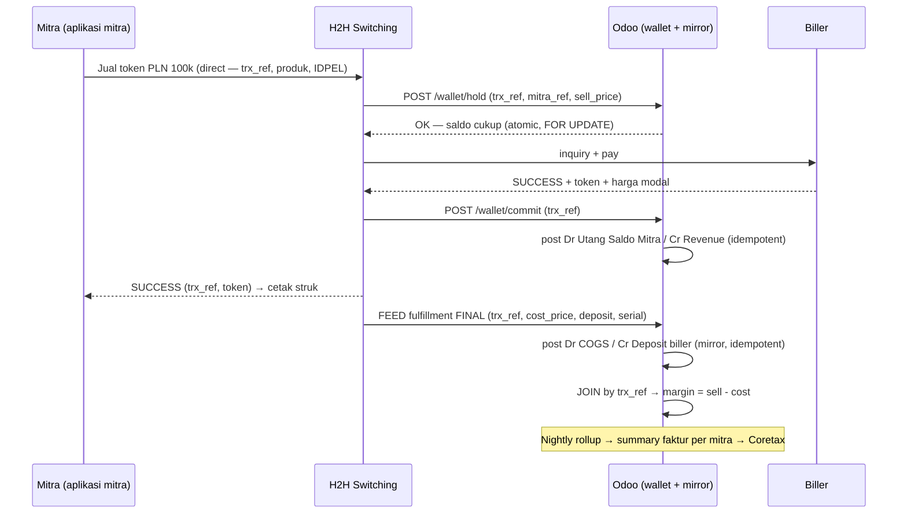

# Arsitektur PPOB — Mitra → H2H → Biller · Saldo Mitra: Azecs → Odoo (Fase 1)

**Konteks bisnis:** Erajaya Value-Added Services (VAS) — PPOB / bill-payment & top-up, model **mitra prepaid**
**Owner:** Product Owner VAS · Platform Team
**Status:** Design / architecture baseline (revisi konsep 2026-07-23)
**Tanggal:** 2026-07-23 (rev. dari 2026-07-16)
**Terkait kode:** `addons/verticals/custom_ppob_*`, `docs/presentation-erajaya-vas.md`, `docs/coretax.md`
**Kelanjutan:** [`ppob-eraspace-odoo-target-architecture.md`](./ppob-eraspace-odoo-target-architecture.md) (Fase 2: Odoo gantikan H2H)

---

## 0. Keputusan Bisnis (revisi 2026-07-23)

Revisi ini mengoreksi tiga premis dokumen sebelumnya:

1. **Penjualan mitra LANGSUNG ke H2H.** Aplikasi mitra/outlet memanggil H2H
   switcher tanpa perantara — **ERASPACE POS berada di luar jalur transaksi PPOB**
   (tidak meneruskan penjualan, tidak memproses saldo, bukan system of record).
2. **Saldo mitra prepaid existing dikelola aplikasi Azecs.** Model kanal tetap
   **MITRA PREPAID** (top-up dulu, lalu berjualan) — tetapi otoritas saldo ada di
   **Azecs**, bukan ERASPACE POS.
3. **Fase 1: otoritas saldo mitra pindah ke Odoo** (`custom_ppob_wallet` mode
   **native/atomic** — bukan mirror). H2H men-debit saldo lewat **API wallet Odoo
   yang sinkron** (hold/commit/release), sementara sisi biller (fulfillment, harga
   modal, deposit) tetap milik H2H dan masuk ke Odoo sebagai **feed mirror** yang
   di-join per transaksi.

> Konsekuensi: berbeda dari desain "mirror-only" lama, sejak Fase 1 **Odoo sudah di
> jalur kritis penjualan** untuk debit saldo mitra. Feed "POS" pada desain lama
> **tidak ada** — digantikan API wallet sinkron.

---

## 1. Ringkasan Eksekutif

Bisnis PPOB VAS berjalan dengan pembagian peran berikut:

1. **Aplikasi mitra/outlet** — titik jual mitra prepaid; memanggil H2H **langsung**
   (ERASPACE POS di luar jalur PPOB).
2. **Azecs** *(existing, digantikan di Fase 1)* — pemegang **saldo mitra prepaid**:
   drawdown, hold, top-up. Fase 1 memindahkan otoritas ini ke **Odoo wallet**.
3. **H2H (Host-to-Host switching / biller aggregator)** — mesin eksekusi transaksi
   PPOB: inquiry & pay ke biller, status, dan **saldo deposit** per biller.
   **System of record untuk fulfillment & settlement biller.**
4. **Odoo** — di Fase 1 memegang **dua peran sekaligus**:
   - **Wallet authoritative** — saldo mitra prepaid (sub-ledger liability, atomic
     hold/debit, API sinkron untuk H2H, top-up VA langsung).
   - **Mirror ledger sisi biller** — menerima feed fulfillment H2H (harga modal,
     deposit, serial/token), men-join dengan debit wallet per `trx_ref`, lalu
     memproyeksikan margin, PPN (summary faktur per mitra → Coretax), PPh,
     AP deposit biller, rekonsiliasi, dan pelaporan.

> **Prinsip inti (Fase 1):** Odoo **authoritative untuk saldo mitra**, tetap
> **non-authoritative untuk eksekusi biller** — Odoo tidak memanggil biller, tidak
> memilih biller, dan tidak memutuskan status transaksi. Status final datang dari
> H2H; Odoo menegakkan kebenaran lewat join + rekonsiliasi.

Model **mitra-prepaid** selaras penuh dengan desain asli suite `custom_ppob_*`:
wallet per mitra kini dipakai **native** (atomic, ceiling), sementara pola mirror
untuk sisi biller mengikuti preseden `custom_ppob_oracle_bridge` (guard
`mirror_source`, GL posting saat terminal, idempotensi `UNIQUE`).

---

## 2. Ruang Lingkup (In / Out of Scope untuk Odoo — Fase 1)

| Kapabilitas | Pemilik | Odoo? |
|---|---|:--:|
| UI transaksi mitra / checkout | Aplikasi mitra (existing, luar Odoo) | ❌ |
| **Saldo mitra prepaid** (otoritas, drawdown, hold) | **Odoo wallet** (dari Azecs) | ✅ **native atomic** |
| Top-up saldo mitra (VA bank) | Odoo (`custom_ppob_va`) | ✅ |
| Inquiry & pembelian ke biller | H2H | ❌ |
| Saldo deposit per biller | H2H | ❌ (mirror read-only + AP topup) |
| Status transaksi & reversal ke biller | H2H | ❌ |
| Katalog produk & mapping SKU biller | H2H (master) → Odoo (mirror mapping) | ⚠️ mirror |
| **API wallet sinkron** (hold/commit/release untuk H2H) | Odoo | ✅ |
| **Ingest + join feed fulfillment H2H** | Odoo | ✅ |
| **Jurnal / GL** (wallet mitra, revenue, COGS, margin) | Odoo | ✅ |
| **PPN & e-Faktur / Coretax** (PMK-63 margin, NSFP, summary per mitra) | Odoo | ✅ |
| **PPh 23** komisi/rebate mitra (bila ada) | Odoo | ✅ |
| **AP ke biller / H2H** (vendor bill topup deposit, PMK 131) | Odoo | ✅ |
| **Rekonsiliasi** wallet ↔ H2H ↔ Bank ↔ GL | Odoo | ✅ |
| **Laporan keuangan** (TB/P&L/BS, laba per produk/mitra) | Odoo | ✅ |

**Konsekuensi desain:** wallet engine native **diaktifkan** (atomic debit/hold +
ceiling); yang masih di-*bypass* hanya bucket drawdown + dispatch/adapter-pay
(milik H2H sampai Fase 2).

---

## 3. Prinsip Arsitektur

1. **Split otoritas.** Saldo mitra milik **Odoo** (sejak Fase 1); eksekusi & deposit
   biller milik **H2H** (sampai Fase 2). Tidak ada data yang punya dua tuan.
2. **Wallet sinkron, fulfillment async.** Debit saldo = API sinkron dua langkah
   (hold → commit/release). Sisi biller = feed terminal-only yang di-join belakangan.
3. **Satu korelasi.** `trx_ref` dibuat aplikasi mitra/H2H dan dibawa di semua panggilan
   (hold, commit, feed) → join wallet ↔ fulfillment untuk margin & rekonsiliasi.
4. **Idempotent by construction.** `UNIQUE(trx_ref, step)` untuk API wallet;
   `UNIQUE(external_ref)` untuk feed. Retry aman.
5. **Gross revenue per transaksi, PPN di summary faktur.** Revenue dibukukan saat
   wallet commit; PPN diakui pada **summary faktur harian per mitra**
   (`custom_ppob_rollup`).
6. **Mirror-guard hanya untuk sisi biller.** Deposit biller Odoo `mirror_source`
   (read-only); wallet **tidak lagi** mirror-guard — ia authoritative dengan atomic
   helpers.
7. **Reconcile-first.** Kebenaran ditegakkan lewat rekonsiliasi (wallet ↔ H2H ↔
   Bank + snapshot deposit), bukan kepercayaan pada satu feed.
8. **Additive, per-tenant, DB-per-tenant.** Bridge = modul terpisah, kredensial per
   tenant via `custom.adapter.config` / `ir.config_parameter`.

---

## 4. System Landscape (Context Diagram — Fase 1)

```
        Mitra prepaid (agen/outlet)  ──►  end customer
                     │  request PPOB (trx_ref, produk, MSISDN/IDPEL)
                     │  LANGSUNG ke H2H — tanpa perantara
                     ▼
        ┌────────────────────────────┐         ┌──────────────────────────┐
        │   H2H / Switching Biller   │ ──────► │   Biller / Aggregator    │
        │  inquiry · pay · status    │ ◄────── │  (Digiflazz · IAK · dst) │
        │  saldo deposit per biller  │         └──────────────────────────┘
        └───┬───────────────┬────────┘
            │ API wallet    │ FEED fulfillment (async, terminal)
            │ (sinkron)     │ harga modal + deposit + serial + status
            │ hold/commit/  │
            │ release       ▼
        ┌───▼──────────────────────────────────────────────────────────┐
        │                    ODOO 19 (Fase 1)                          │
        │                                                              │
        │  WALLET mitra (AUTHORITATIVE — dari Azecs)                   │
        │    hold → commit debit ──► Dr Utang Saldo Mitra / Cr Revenue │
        │    top-up VA langsung (custom_ppob_va)                       │
        │  H2H ingest ──► COGS + deposit biller (mirror)               │
        │       │  join by trx_ref → margin                            │
        │       ▼                                                      │
        │  Daily Rollup ─► summary faktur per mitra ─► e-Faktur/Coretax│
        │  AP biller (vendor bill topup deposit, PMK 131)              │
        │  Rekonsiliasi + snapshot deposit ─► laporan keuangan         │
        └──────────────────────────────────────────────────────────────┘

        [ Azecs — pemegang saldo existing: digantikan Odoo wallet di Fase 1
          (opening balance + dual-run + rekon paritas snapshot) ]
```

Arah data: API wallet **dua arah sinkron** (H2H ↔ Odoo); feed fulfillment **satu
arah** (H2H → Odoo). Odoo tidak pernah memanggil biller di Fase 1.

---

## 5. Boundary of Responsibility (Fase 1)

| Domain | Aplikasi mitra | H2H | Odoo |
|---|---|---|---|
| UI jual + struk mitra | **owner** | — | — |
| Harga **jual** ke mitra | — | **owner** (price feed) | mirror (revenue saat commit) |
| **Saldo mitra prepaid** (otoritas) | — | pemakai (via API) | **owner (wallet native)** |
| Top-up saldo mitra | — | — | **owner** (`custom_ppob_va`) |
| Harga **modal**/biller | — | **owner** | mirror (COGS) |
| Saldo **deposit** biller | — | **owner** | mirror read-only + AP topup |
| Status final transaksi | tampil | **owner** | terima (dasar posting COGS) |
| Reversal/refund | — | **owner** (sisi biller) | wallet credit (via API) + jurnal balik |
| Identitas mitra/outlet | — | — | **owner** (partner + wallet) |
| Faktur pajak / NSFP (per mitra) | — | — | **owner** (Coretax) |
| Buku besar & laporan | — | — | **owner** |

---

## 6. Data Flow End-to-End (API Wallet + Feed, Join)

### 6.1 Sequence (happy path)



**Gagal di biller:** H2H → `POST /wallet/release` (hold dilepas, tanpa jurnal).
**Gagal setelah commit** (reversal biller): H2H → `POST /wallet/credit` (jurnal
balik revenue) + event reversal di feed (balik COGS/deposit).

### 6.2 Model Join (inti desain)

Wallet commit dan feed fulfillment datang **terpisah dan bisa berjeda**. Odoo tidak
menunggu keduanya untuk mem-post; tiap sisi di-post **independen & idempotent**,
lalu dikorelasikan:

- **Correlation key = `trx_ref`.** Dibuat di aplikasi mitra/H2H, dibawa di hold/commit dan
  di-echo di feed. `external_ref` feed = `trx_ref:h2h` → unik untuk idempotensi.
- **Match state** per transaksi (model join `custom.ppob.eraspace.txn`):
  - `wallet_only` — commit wallet masuk, feed H2H belum → revenue sudah ke-post,
    COGS pending.
  - `h2h_only` — feed masuk, commit tidak ada → **anomali keras** (eksekusi tanpa
    debit saldo) → exception queue prioritas.
  - `matched` — keduanya masuk → margin dihitung, transaksi lengkap.
  - `mismatch` — lewat threshold salah satu tak kunjung datang, atau status beda
    (commit sukses tapi feed `failed` tanpa credit) → **exception queue**.
- **Ketidaksesuaian status** ditangani lewat event wallet (credit/release) yang
  diinisiasi H2H — Odoo tidak pernah membalik saldo sepihak di Fase 1.
- **Timing GL:** revenue saat wallet commit; COGS saat feed. `wallet_only`
  menggantung terlalu lama → alert (potensi feed drop / fulfillment tak terlapor).

### 6.3 Top-up saldo mitra

Karena wallet sudah di Odoo, top-up berjalan **langsung di Odoo** via
`custom_ppob_va` (bank VA callback HMAC, idempoten `UNIQUE(bank_ref)`):
Dr Bank/VA Clearing / Cr Utang Saldo Mitra — tanpa perantara Azecs.

---

## 7. Model Akuntansi (GL — Fase 1)

### 7.1 Top-up saldo mitra (VA langsung)

```
  Dr  Bank / VA Clearing                 X
        Cr  Utang Saldo Mitra (liability)      X      ← saldo prepaid = kewajiban kita
```

### 7.2 Penjualan sukses — dua sisi, dua pemicu

Contoh: token PLN, harga jual mitra Rp 101.500, harga modal biller Rp 100.000.

**Wallet commit (native, sinkron):**
```
  Dr  Utang Saldo Mitra (liability ↓)    101.500
        Cr  Pendapatan PPOB (gross)             101.500
```

**Feed H2H (mirror, async):**
```
  Dr  Beban Pokok / COGS PPOB            100.000
        Cr  Deposit Biller (cermin)            100.000
```

**Margin (join by `trx_ref`)** = 1.500 — dihitung Odoo, bukan dari feed. PPN
ditunda ke summary faktur (§7.4).

### 7.3 Gagal / refund

- **Gagal sebelum commit:** `wallet/release` — tidak ada jurnal.
- **Reversal setelah commit:** `wallet/credit` → Dr Revenue / Cr Utang Saldo Mitra;
  event reversal feed → balik COGS/deposit.

### 7.4 PPN & e-Faktur (summary faktur per mitra)

Reuse `custom_ppob_rollup`: cron malam menggabungkan transaksi sukses menjadi satu
`sale.order` + summary `account.move` per mitra per hari, `vat_mode` dari
`custom.ppob.product.class` (PMK-63 margin / DPP nilai lain / gross / exempt),
posting ke jurnal ber-flag `x_custom_report_excluded`, export via `custom_coretax`
(NSFP PER-11/PJ/2025).

### 7.5 Deposit biller (H2H) — sisi AP

Saldo deposit biller dimiliki H2H, tapi **pengisiannya** transaksi kas/AP nyata →
vendor bill di Odoo (reuse wizard DP-100% + Pelunasan, PMK 131/2024 di
`custom_ppob_provider`). Saldo buku wajib rekon dengan saldo riil H2H (§9).

### 7.6 Komisi / rebate mitra (opsional)

Bila ada rebate/insentif di luar price tier, reuse `custom_ppob_commission` +
**PPh 23** via `custom_pph_witholding` (2% ber-NPWP / 4% tanpa).

---

## 8. Domain Model di Odoo (reuse / bypass / baru)

### 8.1 Matriks reuse suite `custom_ppob_*` (Fase 1)

| Modul | Peran di Fase 1 | Status |
|---|---|---|
| `custom_ppob_core` | Product class (`vat_mode`), katalog, **price tier mitra**, COA scaffolding + role→account mapping, sequences, partner mitra/biller, security groups | ✅ **REUSE penuh** |
| `custom_ppob_wallet` | **Wallet per mitra AUTHORITATIVE** — atomic hold/debit/credit + ceiling; sub-ledger liability | ✅ **AKTIF NATIVE** (bukan mirror) |
| `custom_ppob_va` | Top-up saldo mitra via bank VA — jalur langsung | ✅ **REUSE penuh** |
| `custom_ppob_sale` | Model `custom.ppob.transaction` sebagai wadah fulfillment H2H; dispatch/adapter/reaper **bypass** | ⚠️ REUSE model, bypass engine |
| `custom_ppob_provider` | Biller master + SKU map + **vendor-bill topup deposit** (AP). Bucket atomic-drawdown **bypass** (H2H owns deposit) | ⚠️ REUSE master+AP, bypass drawdown |
| `custom_ppob_rollup` | Summary faktur per mitra → e-Faktur/Coretax | ✅ REUSE penuh |
| `custom_ppob_commission` | Rebate/insentif + PPh 23 | ⚠️ opsional |
| `custom_ppob_oracle_bridge` | Jalur Oracle EVShop — tidak dipakai | ❌ |
| **`custom_ppob_eraspace_bridge`** | **API wallet sinkron (hold/commit/release/credit) + ingest feed H2H + model join + GL projector + rekonsiliasi** | 🆕 **REWORK** (lihat catatan) |
| `custom_coretax` / bupot | Export e-Faktur (NSFP) + bupot PPh | ✅ REUSE |
| `custom_accounting_reports` | TB/P&L/BS + flag `x_custom_report_excluded` | ✅ REUSE |

> **Catatan dampak kode:** bridge yang sudah dibangun (51/51 test) mengimplementasikan
> **pola 2-feed (POS + H2H)** dari konsep lama. Revisi ini menggantikan feed POS
> dengan **API wallet sinkron** dan mengubah wallet dari `eraspace_mirror` menjadi
> **native** — komponen ingest H2H, model join, GL projector COGS/deposit, exception
> queue, dan backfill tetap terpakai; endpoint feed POS + mirror-guard wallet perlu
> di-rework.

### 8.2 Modul: `custom_ppob_eraspace_bridge` (surface Fase 1)

**Depends:** `custom_ppob_sale`, `custom_ppob_wallet`, `custom_ppob_va`,
`custom_ppob_provider`, `custom_ppob_rollup`, `custom_core` (secure-endpoint HMAC),
`custom_accounting_full`.

**Komponen:**

- **API wallet (sinkron, dipanggil H2H):**
  - `POST /api/ppob/eraspace/wallet/hold` — cek + tahan saldo (atomic, FOR UPDATE).
  - `POST /api/ppob/eraspace/wallet/commit` — commit debit + jurnal revenue.
  - `POST /api/ppob/eraspace/wallet/release` — lepas hold (gagal).
  - `POST /api/ppob/eraspace/wallet/credit` — refund/koreksi + jurnal balik.
  - `GET  /api/ppob/eraspace/wallet/balance` — snapshot saldo (rekon).
  - Idempoten `UNIQUE(trx_ref, step)`; auth HMAC-SHA256 + nonce + IP allowlist.
- **Ingest feed fulfillment H2H (async):**
  - `POST /api/ppob/eraspace/h2h` — fulfillment biller + cost + deposit + settlement.
  - Alternatif pull/file (SFTP/object storage) via cron high-watermark cursor.
- **Model join** `custom.ppob.eraspace.txn` — `trx_ref` (indexed), `match_state`
  (`wallet_only`/`h2h_only`/`matched`/`mismatch`), `sell_price`, `cost_price`,
  `margin` (computed), `mitra_id`, `product_id`.
- **GL projector** — revenue saat commit (native); COGS/deposit saat feed (mirror).
- **Mirror guard** — hanya deposit biller (`mirror_source`); wallet native.
- **Reconciliation** — `custom.ppob.eraspace.settlement` (EOD H2H + snapshot
  deposit) + rule cocok ke transaksi & bank statement.
- **Exception queue** — `custom.ppob.eraspace.ingest.skipped` (SKU/mitra unmapped,
  `h2h_only`, mismatch status) — tidak drop diam-diam, alert ops.
- **Backfill wizard** — re-ingest rentang tanggal (recovery/onboarding mitra).

### 8.3 Kontrak Data

**API wallet (sinkron):**

| Field | Guna |
|---|---|
| `trx_ref` | **correlation key** + idempotency per step |
| `mitra_ref` | map → partner mitra + wallet |
| `amount` (`sell_price`) | hold/commit → revenue + drawdown wallet |
| `product_code` (opsional di hold) | validasi + dimensi |
| `signature`, `timestamp`, `nonce` | HMAC |

**FEED fulfillment H2H (async):**

| Field | Guna |
|---|---|
| `trx_ref` | correlation key ke wallet + idempotency (`:h2h`) |
| `h2h_trx_id` | referensi biller (audit) |
| `biller_code` / `product_code` | map → biller + SKU map |
| `cost_price` / `biller_amount` | COGS + deposit drawdown (cermin) |
| `serial` / `token` | bukti fulfillment |
| `deposit_balance_after` | snapshot rekon deposit biller |
| `status` (terminal) | dasar posting / mismatch |
| `txn_time` | tanggal akuntansi |
| `signature`, `timestamp`, `nonce` | HMAC |

---

## 9. Rekonsiliasi

Empat kontrol independen:

1. **Wallet ↔ H2H (join `trx_ref`).** Setiap commit wallet harus punya pasangan feed
   `success`; `h2h_only` (eksekusi tanpa debit) = anomali prioritas.
2. **Hold menggantung.** Hold tanpa commit/release melewati SLA → alert + auto-release
   berjadwal (dengan audit).
3. **Snapshot deposit biller.** `deposit_balance_after` H2H = saldo buku deposit Odoo
   per biller (deteksi selisih harga modal / topup tak tercatat).
4. **Bank/PSP.** Dana top-up mitra masuk = VA clearing (reuse `va_match`); dana topup
   deposit keluar = vendor bill biller.

Item tak-match tidak pernah auto-post; masuk dashboard rekonsiliasi + alert.

---

## 10. Idempotency, Error Handling, Reprocessing

- **Idempotensi keras:** `UNIQUE(trx_ref, step)` di API wallet; `UNIQUE(external_ref)`
  di feed. Retry/duplikat → respons sama, tidak double-post.
- **Out-of-order / late:** join by `trx_ref` menampung feed yang datang belakangan;
  credit/reversal mereferensi `trx_ref` asal.
- **Unmapped / mismatch:** → `ingest.skipped` + alert; reprocess setelah master
  dilengkapi atau event koreksi datang.
- **Backfill:** wizard re-ingest rentang tanggal per sisi.
- **Gap detection:** cron rekonsiliasi menandai `wallet_only` menggantung, hold
  kadaluarsa, dan selisih snapshot deposit harian.

---

## 11. Keamanan & Multi-Tenant

- **DB-per-tenant**; kredensial H2H per tenant via `custom.adapter.config` /
  `ir.config_parameter` (tidak ada shared secret).
- **Auth:** HMAC-SHA256 + Redis nonce anti-replay + IP allowlist + clock-skew
  (reuse `custom_core` secure-endpoint); secret API wallet ≠ secret feed.
- **PDP / UU PDP:** MSISDN/IDPEL & data mitra = PII → masking field-level, retensi &
  audit hash-chain (reuse `custom_pdp_*`).
- **RBAC:** role API-integration khusus endpoint wallet/feed; ops/manager untuk
  rekonsiliasi.
- **Immutable audit:** raw event tersimpan (`raw_response`) + audit trail append-only.

---

## 12. Non-Functional

| Aspek | Catatan |
|---|---|
| **Latensi API wallet** | Kini di jalur kritis penjualan H2H — atomic helpers ringan (row-lock), target p95 sub-detik; sizing DB & pool per volume puncak |
| Throughput | Ingest idempotent aman untuk retry burst; posting GL via **queue job** untuk volume tinggi (lih. memory *long-validate proxy timeout*) |
| Retensi | Raw event + settlement disimpan untuk audit pajak (retensi DJP) |
| Monitoring | Wallet API rate/latency/error, hold age, join lag (`wallet_only` age), skipped depth, recon break value; alert Alertmanager |
| Recovery | Backfill wizard + settlement/snapshot sebagai source rekonstruksi |

---

## 13. Perbedaan Kunci vs Native & vs Oracle Bridge

| Aspek | Native Odoo (Fase 2+) | Oracle Bridge | **Fase 1 (dokumen ini)** |
|---|---|---|---|
| Pemilik saldo mitra | Odoo wallet | Oracle MSG019T | **Odoo wallet** (dari Azecs) |
| Pemilik deposit biller | Odoo bucket | Oracle | **H2H** |
| Eksekusi pay biller | Odoo adapter | Oracle SP | **H2H** |
| Odoo polling status | ya (reaper) | ya (cron) | **tidak** (terima final) |
| Titik jual | mitra → Odoo (direct) | EVShop client | **mitra → H2H (direct)** |
| Integrasi masuk | 1 fulfillment sinkron | 1 feed (Oracle) | **API wallet sinkron + 1 feed H2H, di-join** |
| Sisi debit penjualan | wallet native (internal) | mirror | **wallet native (via API H2H)** |
| Peran Odoo | engine + ledger | mirror + GL terminal | **wallet authoritative + mirror sisi biller** |

---

## 14. Keputusan Terbuka

1. **Migrasi saldo Azecs → Odoo.** Format snapshot, mekanisme opening balance,
   window dual-run, kriteria switch (paritas ≥ N hari).
2. **Kemampuan H2H.** Konfirmasi H2H bisa memanggil API wallet eksternal
   (hold/commit/release) — prasyarat Fase 1. Jika tidak, fallback: debit-commit satu
   langkah + reversal.
3. **Correlation key.** Konfirmasi `trx_ref` dibuat aplikasi mitra dan di-echo H2H di semua
   panggilan + feed.
4. **Transport feed H2H.** Push HTTP real-time vs pull/file batch (settlement EOD).
   *(Rekomendasi: push + settlement file hybrid.)*
5. **Entitas & mitra.** Satu company + dimensi analitik mitra, atau multi-company?
6. **`vat_mode` per kategori** (pulsa/token/tagihan) & penerbit faktur per mitra.
7. **SLA feed & auto-release hold.** Threshold `wallet_only` menggantung; umur hold
   sebelum auto-release.

---

## 15. Roadmap Implementasi

**Fase 0 — Kontrak & mapping (design freeze)**
- Finalisasi kontrak API wallet + feed H2H (§8.3), correlation key, mapping SKU
  biller→produk, mapping mitra→partner/wallet, `vat_mode` per kategori.

**Fase 1a — Wallet & API (cutover saldo)**
- Aktifkan `custom_ppob_wallet` native; build API wallet (hold/commit/release/credit);
  opening balance dari Azecs; dual-run + rekon paritas snapshot; top-up VA langsung.

**Fase 1b — Ingest feed H2H + join + GL**
- Rework bridge: ingest fulfillment H2H, model join `trx_ref`, GL projector
  (COGS/deposit mirror), exception queue, settlement + rekonsiliasi 4-kontrol,
  vendor-bill topup deposit (PMK 131).

**Fase 1c — Pajak & pelaporan**
- `custom_ppob_rollup` (summary faktur per mitra) → `custom_coretax` (NSFP); laporan
  keuangan `custom_accounting_reports`; laba per produk/mitra.

**Fase 1d — Hardening & scale**
- Queue job posting, backfill wizard, monitoring (wallet latency/hold age/join lag/
  recon break), load test konkurensi wallet, runbook ops.

**Fase 2 — Odoo gantikan H2H** → lihat
[`ppob-eraspace-odoo-target-architecture.md`](./ppob-eraspace-odoo-target-architecture.md).

---

## 16. Ringkasan Satu Kalimat

**Mitra prepaid bertransaksi langsung ke H2H (tanpa perantara — ERASPACE POS di
luar jalur PPOB); sejak Fase 1 H2H men-debit saldo mitra lewat API wallet Odoo yang
authoritative (hold → commit/release, menggantikan Azecs) sementara fulfillment
biller tetap dieksekusi H2H dan dicerminkan ke Odoo lewat satu feed terminal yang
di-join per `trx_ref` — menghasilkan revenue native + COGS mirror, margin, summary
faktur per mitra (Coretax), AP deposit, dan rekonsiliasi 4-kontrol, memakai suite
`custom_ppob_*` dengan wallet native dan bridge yang di-rework dari pola 2-feed.**

---

*Referensi kode: `addons/verticals/custom_ppob_core/MODULE_KNOWLEDGE.md`,
`custom_ppob_wallet` (atomic hold/debit), `custom_ppob_oracle_bridge` (pola mirror
sisi biller), `custom_ppob_va` (top-up VA), `custom_ppob_rollup` (summary faktur),
`docs/coretax.md`.*
