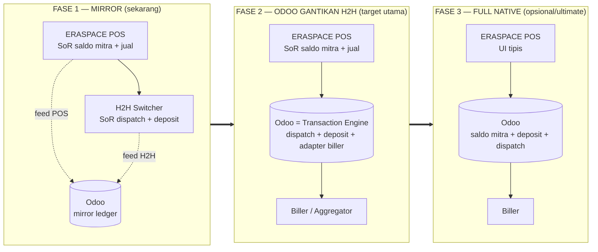
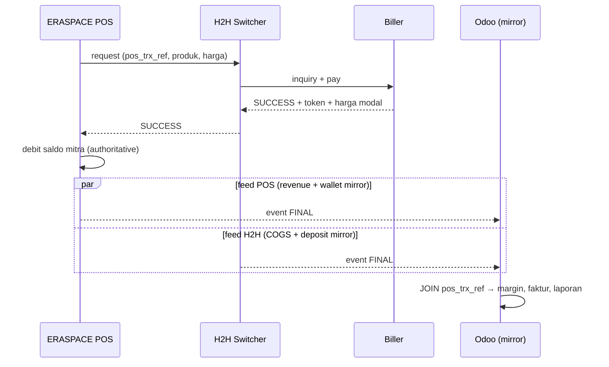
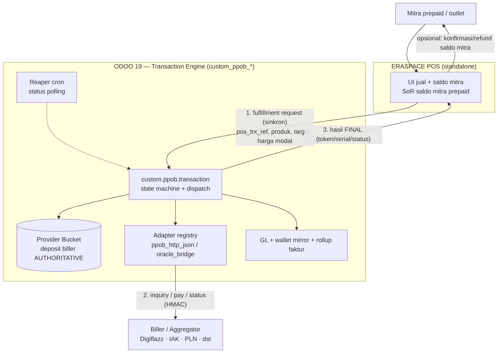
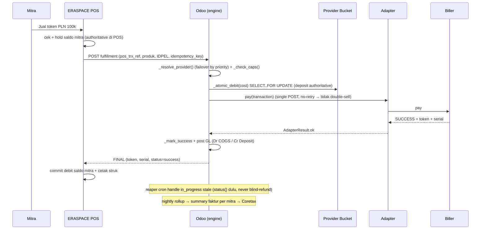
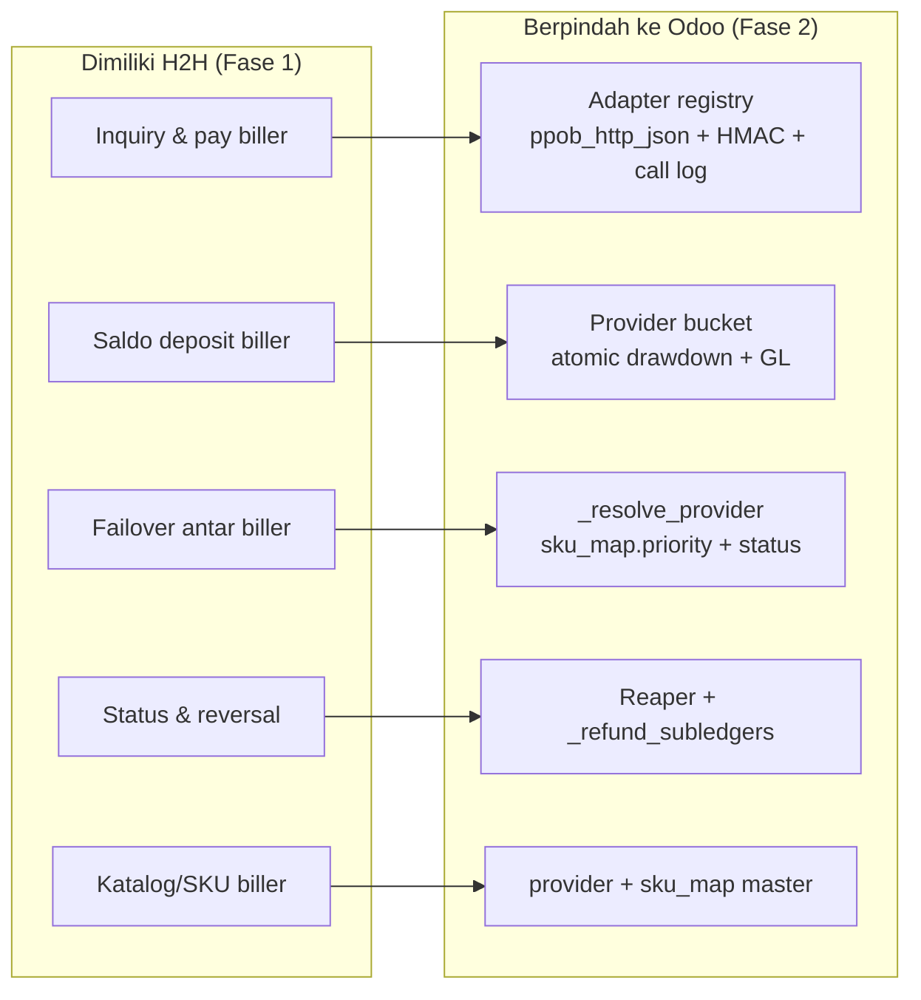
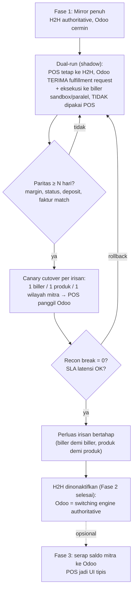

# Arsitektur PPOB — Migrasi H2H → Odoo (Odoo sebagai Transaction Engine)

**Konteks bisnis:** Erajaya Value-Added Services (VAS) — PPOB / bill-payment & top-up, model **mitra prepaid**
**Owner:** Product Owner VAS · Platform Team
**Status:** Design / target-state architecture (kelanjutan dari mirror baseline)
**Tanggal:** 2026-07-16
**Companion dari:** [`ppob-eraspace-h2h-architecture.md`](./ppob-eraspace-h2h-architecture.md) (current state / mirror)
**Terkait kode:** `addons/verticals/custom_ppob_*` (suite native, 8 modul, terverifikasi 51/51 test di Odoo 19)

---

## 0. Tujuan dokumen

Dokumen sebelumnya membekukan **current state**: ERASPACE POS + H2H switcher yang **own** transaksi, Odoo hanya *mirror ledger* (dua feed, di-join `pos_trx_ref`). Dokumen ini menggambarkan **arah evolusinya**: bagaimana **Odoo secara bertahap menggantikan H2H** sampai Odoo menjadi **transaction engine** (mesin switching biller) yang authoritative — memakai suite `custom_ppob_*` dalam **mode native** (bukan lagi mirror).

Dua pertanyaan yang dijawab:
1. **Alur integrasi data** Odoo ↔ ERASPACE POS ↔ H2H — sekarang & sesudah cutover.
2. **Apa yang berpindah** saat H2H di-*replace* Odoo, dan **bagaimana migrasinya** aman (strangler-fig, dual-run, reconcile-parity gate, rollback).

---

## 1. Tiga fase evolusi (peta besar)



| | Fase 1 — Mirror | **Fase 2 — Odoo gantikan H2H** | Fase 3 — Full native |
|---|---|---|---|
| Saldo mitra (otoritas) | ERASPACE POS | ERASPACE POS | **Odoo wallet** |
| Deposit biller (otoritas) | H2H | **Odoo bucket** | Odoo bucket |
| Dispatch / pay ke biller | H2H | **Odoo adapter** | Odoo adapter |
| Status polling | H2H | **Odoo reaper** | Odoo reaper |
| Peran Odoo | ledger hilir | **switching engine + ledger** | full engine + ledger |
| Modul kunci | `custom_ppob_eraspace_bridge` | `custom_ppob_sale/provider/wallet` (native) | seluruh suite native |

> **Fokus dokumen:** Fase 2 = "H2H di-replace Odoo". Fase 3 disertakan sebagai arah akhir; keputusan menyerap saldo mitra ke Odoo bersifat bisnis, bukan teknis (suite sudah mendukung keduanya).

---

## 2. Current state (Fase 1) — ringkas

Detail penuh di [dokumen mirror](./ppob-eraspace-h2h-architecture.md). Intinya: **arah data satu arah** (POS/H2H → Odoo), Odoo non-authoritative, dua feed HMAC di-join `pos_trx_ref`, GL diproyeksikan per feed (`_mirror_debit`/`_mirror_credit` + COGS/deposit `account.move`), rekonsiliasi 4-kontrol.



Batasan mirror: Odoo **tidak** mengeksekusi biller, **tidak** menahan saldo, **tidak** memutuskan refund. Latensi Odoo **tidak** di jalur kritis penjualan.

---

## 3. Target state (Fase 2) — Odoo menggantikan H2H

**Perubahan inti:** H2H switcher dinonaktifkan; **ERASPACE POS memanggil Odoo secara sinkron** untuk fulfillment. Odoo menjadi **mesin switching**: menahan **deposit biller (authoritative)**, memilih biller (failover), memanggil biller lewat **adapter**, mem-poll status, dan mengembalikan hasil ke POS. Saldo mitra **tetap** di ERASPACE POS (POS men-debit dulu sebelum memanggil Odoo).

### 3.1 Context diagram (target)



### 3.2 Sequence (target, happy path)



### 3.3 Yang berubah vs mirror

| Aspek | Mirror (Fase 1) | **Target (Fase 2)** |
|---|---|---|
| Pemanggil biller | H2H | **Odoo adapter** (`custom_ppob_provider`) |
| Deposit biller | H2H (Odoo cermin) | **Odoo bucket, authoritative** (atomic drawdown + FOR UPDATE) |
| Pemilihan biller / failover | H2H | **Odoo** (`_resolve_provider` by `sku_map.priority` + provider status) |
| Status transaksi | terima dari H2H | **Odoo reaper** poll `status()` (never blind-refund) |
| Refund sisi biller | H2H | **Odoo** `_refund_subledgers` (reversal deposit) |
| Feed ke Odoo | 2 feed async (POS + H2H) | **1 panggilan sinkron POS→Odoo** (H2H feed hilang) |
| Latensi Odoo | di luar jalur kritis | **di jalur kritis penjualan** (lihat §6 NFR) |
| GL penjualan | 2 jurnal dari 2 feed | Dr COGS/Cr Deposit (biller) langsung; wallet mitra tetap mirror dari POS |

---

## 4. Ownership flip — apa yang berpindah dari H2H ke Odoo



### 4.1 Matriks aktivasi modul (bypass → active)

| Modul suite | Peran di Mirror | **Peran saat H2H di-replace (Fase 2)** |
|---|---|---|
| `custom_ppob_provider` | master + SKU map + AP topup (bucket **bypass**) | **AKTIF penuh**: bucket authoritative + `_atomic_debit`/`_atomic_credit`, DP-100% topup deposit riil |
| `custom_ppob_sale` | model wadah mirror (engine **bypass**) | **AKTIF penuh**: `_dispatch_one`, `_resolve_provider`, `_refund_subledgers`, reaper cron |
| adapter (`ppob_http_json`) | tidak dipakai | **AKTIF**: panggil biller (single-POST no-retry, pay-safe), kredensial per tenant via `custom.adapter.config`, log ke `custom.adapter.call.log` |
| `custom_ppob_wallet` | mirror saldo mitra (`eraspace_mirror`) | tetap **mirror** dari POS (Fase 2) → **authoritative** (Fase 3) |
| `custom_ppob_core` | COA + product class + price tier + mapping | **REUSE penuh** (tak berubah) |
| `custom_ppob_rollup` | summary faktur per mitra → Coretax | **REUSE penuh** (tak berubah) |
| `custom_ppob_commission` | rebate + PPh 23 | opsional (tak berubah) |
| `custom_ppob_va` | top-up saldo mitra (bank VA) | **REUSE**: jalur langsung Odoo bila top-up pindah ke Odoo, atau tetap POS-feed |
| `custom_ppob_eraspace_bridge` | ingest 2-feed + join + mirror GL | **berkurang perannya**: feed H2H mati; feed POS bisa berubah jadi *fulfillment request* sinkron (bukan mirror). Dipertahankan untuk dual-run + rekonsiliasi paritas selama migrasi |
| `custom_ppob_oracle_bridge` | jalur legacy Oracle EVShop | tetap opsional (bila sebagian mitra masih via EVShop) |

**Konsekuensi:** engine native yang selama mirror di-*bypass* (wallet ceiling, bucket atomic-drawdown, dispatch/adapter/reaper) kini **diaktifkan** — persis yang sudah dibangun & lulus 51/51 test.

---

## 5. Strategi migrasi — strangler-fig, aman & reversible

Jangan *big-bang*. Alihkan trafik dari H2H ke Odoo **per irisan** dengan gerbang paritas rekonsiliasi.



**Irisan cutover yang aman (pilih dimensi):** per **biller** (mulai biller paling stabil/volume rendah), per **produk/kategori** (pulsa dulu, tagihan belakangan), per **wilayah/segmen mitra**. Idempotency key + `UNIQUE(mitra_id, idempotency_key)` menjamin request yang sama tak dieksekusi ganda saat POS retry di masa transisi.

**Gerbang paritas (parity gate) sebelum naik fase:**
- Margin per transaksi Odoo == margin dari join H2H (selisih 0).
- Status final Odoo == status H2H (tak ada mismatch).
- Snapshot deposit biller Odoo (bucket) == saldo riil biller/H2H.
- Summary faktur per mitra identik.
- p95 latensi fulfillment Odoo ≤ SLA yang disepakati.

**Rollback:** karena mirror bridge dipertahankan selama migrasi, cutover per irisan bisa dibalik ke H2H tanpa kehilangan data (Odoo kembali jadi cermin untuk irisan itu).

---

## 6. Perubahan Non-Functional saat H2H di-replace

| Aspek | Implikasi | Mitigasi (sudah tersedia di suite) |
|---|---|---|
| **Latensi kritis** | Panggilan biller kini di jalur penjualan POS (sebelumnya H2H yang menanggung) | Adapter timeout per `custom.adapter.config`; `_dispatch_one` sinkron tapi ringan; produk 2-langkah pakai `inquiry_required` |
| **Double-sell** | Retry di jalur pay bisa jual dua kali | `ppob_http_json` **single-POST tanpa retry** (pay-safe); idempotency key unik; reaper `status()` sebelum refund |
| **Deposit habis** | Odoo kini penjaga saldo deposit | `bucket._atomic_debit` (SELECT..FOR UPDATE) tolak saldo kurang; low-water-mark alert; DP-100% topup (PMK 131) |
| **Biller down** | Tak ada H2H sebagai buffer | Failover `_resolve_provider` by priority + provider `status=maintenance/disabled`; circuit-breaker via `custom_adapter_framework` |
| **Transaksi menggantung** | Butuh resolusi otomatis | Reaper per-provider `stale_threshold_minutes`, poll `status()`, **never blind-refund** |
| **Concurrency** | Debit paralel bucket/wallet | Row-lock atomic helpers (teruji); rekomendasi test konkura 2-cursor sebelum go-live |
| **Throughput** | Volume tinggi | Posting GL via queue-job (`_vendor/queue_job`); reaper fan-out per provider |
| **Keamanan biller** | Kredensial biller kini di Odoo | Per-tenant `custom.adapter.config` (base_url/secret via `ir.config_parameter`, Fernet); HMAC signing |

Semua kontrol di atas **sudah ada** di modul yang dibangun — cutover mengubah *konfigurasi & routing*, bukan menulis engine baru.

---

## 7. Kontrak antarmuka POS ↔ Odoo (target)

Saat H2H di-replace, kontrak berubah dari **2 feed async (mirror)** menjadi **1 request/response sinkron (fulfillment)** + tetap event untuk saldo/refund.

**Request (POS → Odoo) — fulfillment sinkron:**

| Field | Guna |
|---|---|
| `pos_trx_ref` | idempotency + korelasi (map → `idempotency_key`) |
| `mitra_ref` | map → partner mitra (untuk dimensi + faktur; POS sudah cek saldo) |
| `product_code` | map → `custom.ppob.product` + provider via SKU map |
| `target` (MSISDN/IDPEL, masked) | dikirim ke biller |
| `amount` / denom | validasi + harga |
| `inquiry_ref` (opsional) | untuk produk 2-langkah |
| `signature`, `timestamp`, `nonce` | HMAC (reuse secure-endpoint, `auth='public'` + `readonly=False`) |

**Response (Odoo → POS):** `status` (success/failed/pending), `provider_ref`, `serial/token`, `error_code`. POS meng-commit/rollback debit saldo mitra berdasarkan ini.

**Event yang tetap ada:** top-up saldo mitra (VA/POS feed), refund saldo mitra (bila POS yang berinisiatif), snapshot saldo untuk rekonsiliasi.

> Catatan implementasi: endpoint fulfillment mengikuti pola controller VA yang sudah diperbaiki untuk Odoo 19 — **`auth='public'` + `readonly=False`** (route yang menulis butuh transaksi read-write; `auth='none'` tak punya `env.user` sehingga `account.move._post` gagal). Lihat memory *odoo19-module-port-gotchas*.

---

## 8. Model GL — perbandingan

**Mirror (Fase 1):** dua jurnal terpisah dari dua feed (revenue dari POS, COGS/deposit dari H2H), margin dari join.

**Target (Fase 2):** POS masih membukukan saldo mitra (feed/mirror), Odoo membukukan sisi biller saat eksekusi:
```
  Dr  COGS PPOB                 cost      ← saat pay sukses (adapter)
        Cr  Deposit Biller (bucket)   cost      ← drawdown deposit authoritative
```
Revenue + drawdown saldo mitra tetap dari POS (mirror) sampai Fase 3. PPN tetap diakui di **summary faktur per mitra** (`custom_ppob_rollup` → Coretax), tidak per transaksi.

**Full native (Fase 3):** satu compound posting via atomic helpers (wallet debit → revenue, bucket debit → COGS/deposit), persis `custom_ppob_sale._dispatch_one`.

---

## 9. Keputusan terbuka (khusus replace-H2H)

1. **Batas replace.** Fase 2 saja (Odoo = biller switch, saldo mitra tetap di POS) atau lanjut Fase 3 (Odoo serap saldo mitra)? Menentukan apakah wallet Odoo tetap `mirror` atau jadi authoritative.
2. **Sinkron vs async fulfillment.** POS tunggu response Odoo (sinkron, UX lebih ketat SLA) atau POS async + callback? Rekomendasi: **sinkron dengan timeout + fallback ke pending + reaper**.
3. **Adapter biller riil.** Implementasi adapter konkret per biller (Digiflazz/IAK/dst) sebagai subclass `PPOBProviderAdapter` — belum ada; `ppob_http_json` generik jadi basis.
4. **Sumber saldo deposit awal.** Migrasi saldo deposit dari H2H ke bucket Odoo (opening balance + rekon) di titik cutover per biller.
5. **Idempotency saat dual-run.** Pastikan `pos_trx_ref` konsisten dipakai sebagai `idempotency_key` agar shadow-run tak bentrok dengan produksi.
6. **Window mundur.** Berapa lama mirror bridge dipertahankan pasca cutover untuk rollback & audit paritas.

---

## 10. Ringkasan satu kalimat

**Dari posisi Odoo sebagai *mirror ledger* (dua feed POS+H2H di-join), migrasi menonaktifkan H2H secara bertahap (strangler-fig, dual-run + gerbang paritas, cutover per biller/produk) sampai Odoo menjadi *transaction engine* yang authoritative — deposit biller di provider bucket, dispatch/pay/status via adapter + reaper, refund via `_refund_subledgers` — memakai suite `custom_ppob_*` mode native yang sudah dibangun & lulus 51/51 test, sementara ERASPACE POS tetap memegang saldo mitra (Fase 2) hingga opsi Fase 3 menyerapnya ke Odoo.**

---

*Referensi kode: `custom_ppob_sale` (`_dispatch_one`/`_resolve_provider`/reaper), `custom_ppob_provider` (bucket atomic + adapter registry + DP-100%), `custom_ppob_wallet` (atomic vs `_mirror_*`), `custom_ppob_rollup` (summary faktur), `custom_ppob_eraspace_bridge` (mirror ingest 2-feed). Companion: `docs/projects/ppob/ppob-eraspace-h2h-architecture.md`.*
