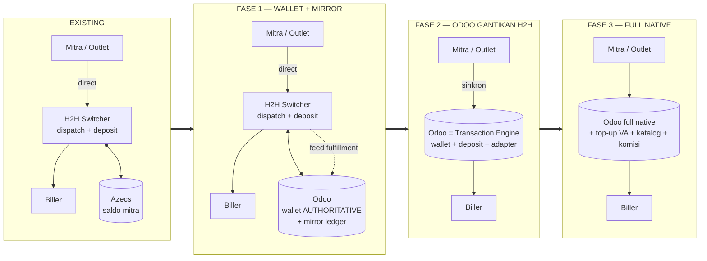
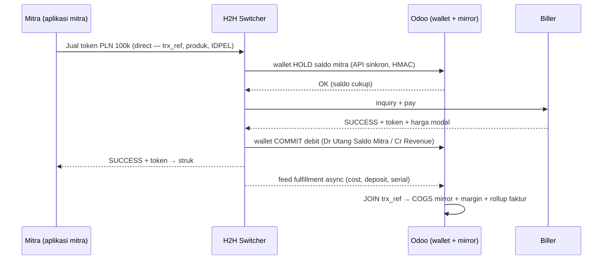
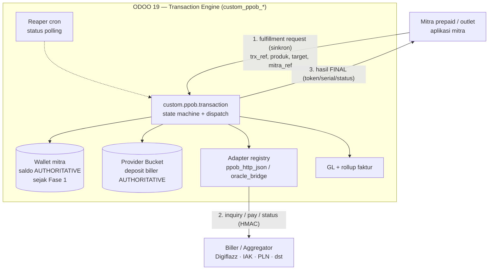
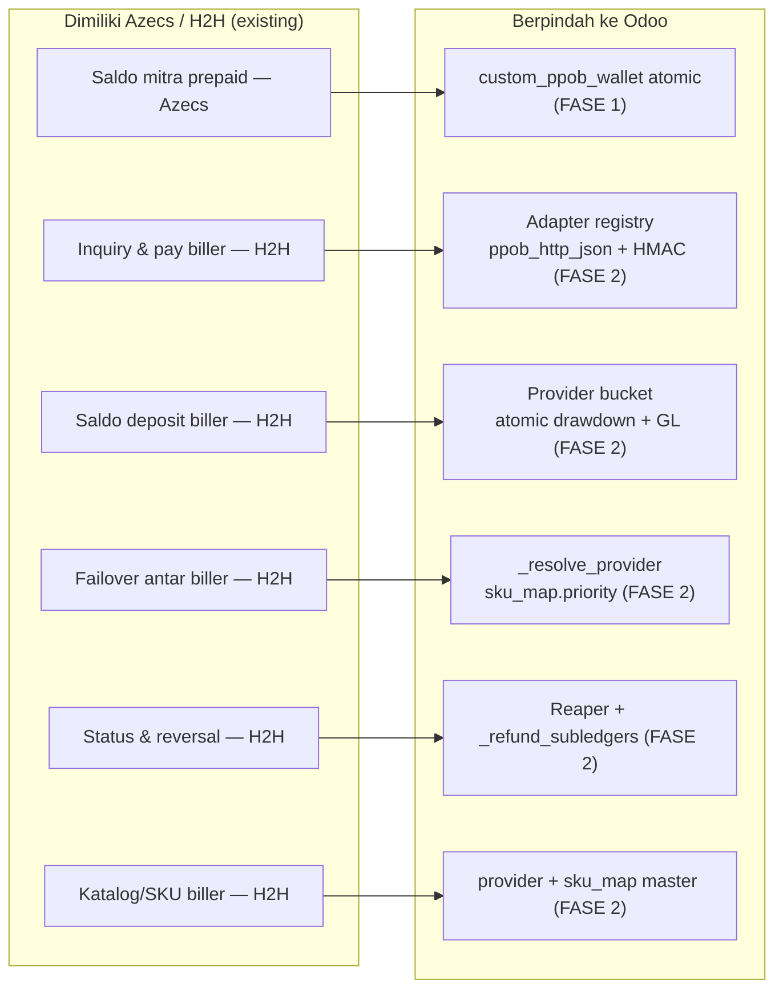
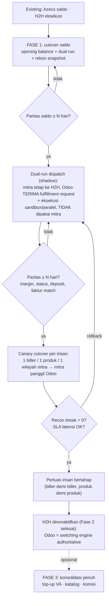

# Arsitektur PPOB — Migrasi ke Odoo (Azecs → Odoo Wallet, H2H → Odoo Engine)

**Konteks bisnis:** Erajaya Value-Added Services (VAS) — PPOB / bill-payment & top-up, model **mitra prepaid**
**Owner:** Product Owner VAS · Platform Team
**Status:** Design / target-state architecture (revisi konsep 2026-07-23: penjualan mitra **direct ke H2H**, saldo existing di **Azecs**)
**Tanggal:** 2026-07-23 (rev. dari 2026-07-16)
**Companion dari:** [`ppob-eraspace-h2h-architecture.md`](./ppob-eraspace-h2h-architecture.md) (existing state + baseline Fase 1)
**Terkait kode:** `addons/verticals/custom_ppob_*` (suite native, 8 modul, terverifikasi 51/51 test di Odoo 19)

---

## 0. Tujuan dokumen

**Kondisi existing (terkoreksi):** mitra prepaid (aplikasi mitra/outlet) bertransaksi **langsung ke H2H switcher** — **ERASPACE POS berada di luar jalur transaksi PPOB** (tidak meneruskan penjualan, tidak memproses saldo). Saldo mitra prepaid dikelola aplikasi existing **Azecs**; H2H memegang dispatch biller + deposit. Odoo belum ada di jalur.

Dokumen ini menggambarkan **arah evolusinya** dalam tiga fase:

1. **Fase 1 — Wallet + Mirror paralel:** Odoo **menggantikan Azecs** sebagai pemegang saldo mitra (wallet **authoritative**, atomic) **sekaligus** menjadi **mirror ledger** transaksi yang dieksekusi H2H.
2. **Fase 2 — Odoo menggantikan H2H:** Odoo menjadi **transaction engine** (mesin switching biller): dispatch, deposit biller, adapter, reaper.
3. **Fase 3 — Full native / konsolidasi:** seluruh jalur pendukung (top-up VA, katalog/SKU master, komisi/PPh) di Odoo.

Dua pertanyaan yang dijawab:
1. **Alur integrasi data** Odoo ↔ mitra ↔ H2H — per fase.
2. **Apa yang berpindah** di tiap fase, dan **bagaimana migrasinya** aman (cutover saldo, strangler-fig, dual-run, reconcile-parity gate, rollback).

---

## 1. Peta besar — empat kondisi



| Aspek | Existing | **Fase 1 — Wallet + Mirror** | **Fase 2 — Odoo gantikan H2H** | Fase 3 — Full native |
|---|---|---|---|---|
| Saldo mitra (otoritas) | **Azecs** | **Odoo wallet** | Odoo wallet | Odoo wallet |
| Deposit biller (otoritas) | H2H | H2H (Odoo cermin) | **Odoo bucket** | Odoo bucket |
| Dispatch / pay ke biller | H2H | H2H | **Odoo adapter** | Odoo adapter |
| Status polling | H2H | H2H | **Odoo reaper** | Odoo reaper |
| Jalur penjualan mitra | Mitra → H2H (direct) | Mitra → H2H (direct) | **Mitra → Odoo (direct)** | Mitra → Odoo (direct) |
| Integrasi Odoo | — | **API wallet sinkron + feed H2H (join)** | fulfillment sinkron (feed hilang) | internal penuh |
| Peran Odoo | — | wallet authoritative + mirror ledger | **switching engine + wallet + ledger** | full engine + ledger |
| Modul kunci | — | `custom_ppob_wallet` (native) + `custom_ppob_eraspace_bridge` | `custom_ppob_sale/provider` (native) | seluruh suite native |

> **Catatan penting:** ERASPACE POS **tidak berada di jalur transaksi PPOB** — penjualan mitra langsung menuju H2H (lalu Odoo di Fase 2). Sejak Fase 1 pun **debit saldo mitra sudah di jalur kritis Odoo** (H2H memanggil API wallet), berbeda dari desain mirror lama yang menempatkan Odoo sepenuhnya di hilir.

---

## 2. Existing & Fase 1 — ringkas

Detail penuh di [dokumen companion](./ppob-eraspace-h2h-architecture.md). Intinya:

**Existing:** Mitra → H2H → Biller (direct, tanpa perantara); H2H cek/debit saldo mitra ke **Azecs**; tidak ada Odoo.

**Fase 1:** otoritas saldo mitra **pindah dari Azecs ke Odoo wallet** (`custom_ppob_wallet` mode **native/atomic**, bukan mirror). Alur per transaksi:



- **Gagal di biller:** H2H memanggil wallet **RELEASE** (hold dilepas, tanpa jurnal).
- **GL:** revenue + drawdown wallet di-post **native** saat commit debit; COGS + deposit tetap **mirror** dari feed H2H; margin dari join.
- **Yang berubah dari desain mirror lama:** feed POS **tidak ada** (digantikan API wallet sinkron); Odoo tidak lagi non-authoritative untuk saldo.

---

## 3. Target state (Fase 2) — Odoo menggantikan H2H

**Perubahan inti:** H2H switcher dinonaktifkan; aplikasi mitra **memanggil Odoo langsung secara sinkron** untuk fulfillment (re-point endpoint dari H2H ke Odoo). Odoo menjadi **mesin switching**: men-debit wallet mitra (sudah authoritative sejak Fase 1), menahan **deposit biller (authoritative)**, memilih biller (failover), memanggil biller lewat **adapter**, mem-poll status, dan mengembalikan hasil ke mitra.

### 3.1 Context diagram (target)



### 3.2 Workflow per transaksi (target — happy path)

1. Aplikasi mitra POST fulfillment **langsung ke Odoo** (HMAC; `idempotency_key = trx_ref`).
3. Odoo `wallet._atomic_debit`/hold saldo mitra — **authoritative di Odoo** (SELECT..FOR UPDATE, ceiling).
4. Odoo `_resolve_provider()` memilih biller (failover by `sku_map.priority`) + `_check_caps()`.
5. Odoo `bucket._atomic_debit(cost)` — deposit biller authoritative.
6. Odoo `adapter.pay(transaction)` — single POST tanpa retry (pay-safe, cegah double-sell) → biller.
7. Biller membalas SUCCESS + token + serial.
8. Odoo `_mark_success` + posting GL compound (Dr Wallet/Cr Revenue + Dr COGS/Cr Deposit) — persis `_dispatch_one` native.
9. Odoo membalas FINAL ke mitra (token, serial, status) → struk.
10. Reaper cron menangani transaksi `in_progress` stale: `status()` dulu — **never blind-refund**; refund via `_refund_subledgers` (reversal wallet + bucket).
11. Rollup harian → summary faktur per mitra → Coretax.

### 3.3 Yang berubah vs Fase 1

| Aspek | Fase 1 | **Target (Fase 2)** |
|---|---|---|
| Pemanggil biller | H2H | **Odoo adapter** (`custom_ppob_provider`) |
| Deposit biller | H2H (Odoo cermin) | **Odoo bucket, authoritative** (atomic drawdown + FOR UPDATE) |
| Pemilihan biller / failover | H2H | **Odoo** (`_resolve_provider` by `sku_map.priority` + provider status) |
| Status transaksi | terima dari H2H | **Odoo reaper** poll `status()` (never blind-refund) |
| Refund | wallet release (API H2H) + reversal H2H | **Odoo** `_refund_subledgers` (wallet + deposit, satu tangan) |
| Integrasi masuk | API wallet (H2H) + feed H2H | **1 panggilan fulfillment sinkron kanal→Odoo** (feed & API wallet eksternal hilang) |
| Saldo mitra | Odoo wallet (sejak Fase 1) | Odoo wallet (tak berubah) |
| GL penjualan | revenue native + COGS mirror (join) | **compound posting native** di `_dispatch_one` |

---

## 4. Ownership flip — apa yang berpindah ke Odoo



### 4.1 Matriks aktivasi modul per fase

| Modul suite | Fase 1 (Wallet + Mirror) | **Fase 2 (H2H di-replace)** |
|---|---|---|
| `custom_ppob_wallet` | **AKTIF native**: saldo mitra authoritative, atomic debit/hold, API wallet untuk H2H | tetap AKTIF (dipanggil internal `_dispatch_one`) |
| `custom_ppob_provider` | master + SKU map + AP topup (bucket **bypass**) | **AKTIF penuh**: bucket authoritative + `_atomic_debit`/`_atomic_credit`, DP-100% topup deposit riil |
| `custom_ppob_sale` | model wadah mirror fulfillment (engine **bypass**) | **AKTIF penuh**: `_dispatch_one`, `_resolve_provider`, `_refund_subledgers`, reaper cron |
| adapter (`ppob_http_json`) | tidak dipakai | **AKTIF**: panggil biller (single-POST no-retry, pay-safe), kredensial per tenant via `custom.adapter.config` |
| `custom_ppob_core` | COA + product class + price tier + mapping | **REUSE penuh** (tak berubah) |
| `custom_ppob_rollup` | summary faktur per mitra → Coretax | **REUSE penuh** (tak berubah) |
| `custom_ppob_commission` | opsional | opsional (tak berubah) |
| `custom_ppob_va` | top-up saldo mitra (bank VA) — **jalur langsung Odoo** (wallet sudah di Odoo) | REUSE (tak berubah) |
| `custom_ppob_eraspace_bridge` | **API wallet sinkron (H2H) + ingest feed fulfillment H2H + join + mirror GL sisi biller** | **berkurang perannya**: feed H2H mati; dipertahankan untuk dual-run + rekonsiliasi paritas selama migrasi |
| `custom_ppob_oracle_bridge` | jalur legacy Oracle EVShop (opsional) | tetap opsional |

> **Dampak ke kode yang sudah dibangun:** bridge yang ada mengimplementasikan pola **2-feed (POS + H2H)** dari konsep lama. Koreksi ini mengubah surface Fase 1: **feed POS diganti API wallet sinkron** (hold/commit/release) dan wallet pindah dari mode `mirror` ke **native** — perlu penyesuaian `custom_ppob_eraspace_bridge` sebelum implementasi Fase 1.

---

## 5. Strategi migrasi — bertahap & reversible

### 5.1 Fase 1 — cutover saldo (Azecs → Odoo wallet)

1. **Opening balance:** snapshot saldo per mitra dari Azecs → seed wallet Odoo (jurnal Dr Migrasi / Cr Utang Saldo Mitra).
2. **Dual-run saldo:** H2H debit ke Azecs (tetap authoritative) + shadow call ke wallet Odoo; rekon **paritas snapshot saldo harian** per mitra.
3. **Gerbang paritas saldo:** selisih 0 selama ≥ N hari → switch: H2H menunjuk API wallet Odoo sebagai otoritas; Azecs read-only (window rollback).
4. Top-up mitra pindah ke jalur `custom_ppob_va` (VA bank → wallet Odoo langsung).

### 5.2 Fase 2 — strangler-fig (H2H → Odoo)

Jangan *big-bang*. Alihkan trafik dari H2H ke Odoo **per irisan** dengan gerbang paritas rekonsiliasi.



**Irisan cutover yang aman:** per **biller** (mulai paling stabil/volume rendah), per **produk/kategori** (pulsa dulu, tagihan belakangan), per **wilayah/segmen mitra**. Idempotency key + `UNIQUE(mitra_id, idempotency_key)` menjamin request sama tak dieksekusi ganda saat aplikasi mitra retry di masa transisi.

**Gerbang paritas (parity gate) sebelum perluasan:**
- Margin per transaksi Odoo == margin dari join H2H (selisih 0).
- Status final Odoo == status H2H (tak ada mismatch).
- Snapshot deposit biller Odoo (bucket) == saldo riil biller/H2H.
- Summary faktur per mitra identik.
- p95 latensi fulfillment Odoo ≤ SLA yang disepakati.

**Rollback:** wallet **tetap di Odoo** (sudah stabil sejak Fase 1); yang dibalik hanya rute dispatch — mitra kembali memanggil H2H untuk irisan itu, dan H2H tetap debit wallet via API Odoo. Mirror bridge dipertahankan selama migrasi sehingga tidak ada data hilang.

---

## 6. Perubahan Non-Functional per fase

| Aspek | Implikasi | Mitigasi (sudah tersedia di suite) |
|---|---|---|
| **Latensi kritis (Fase 1)** | Debit saldo mitra kini sinkron via API wallet Odoo di tengah alur H2H | Atomic helpers ringan (row-lock); SLA API wallet; hold/commit 2 langkah |
| **Latensi kritis (Fase 2)** | Panggilan biller ikut pindah ke jalur Odoo | Adapter timeout per `custom.adapter.config`; `_dispatch_one` sinkron ringan; produk 2-langkah pakai `inquiry_required` |
| **Double-sell** | Retry di jalur pay bisa jual dua kali | `ppob_http_json` **single-POST tanpa retry** (pay-safe); idempotency key unik; reaper `status()` sebelum refund |
| **Deposit habis** | Odoo penjaga saldo deposit (Fase 2) | `bucket._atomic_debit` (FOR UPDATE) tolak saldo kurang; low-water-mark alert; DP-100% topup (PMK 131) |
| **Biller down** | Tak ada H2H sebagai buffer (Fase 2) | Failover `_resolve_provider` by priority + provider `status`; circuit-breaker via `custom_adapter_framework` |
| **Transaksi menggantung** | Butuh resolusi otomatis | Reaper per-provider `stale_threshold_minutes`, poll `status()`, **never blind-refund** |
| **Concurrency** | Debit paralel wallet/bucket | Row-lock atomic helpers (teruji); test konkurensi 2-cursor sebelum go-live |
| **Throughput** | Volume tinggi | Posting GL via queue-job (`_vendor/queue_job`); reaper fan-out per provider |
| **Keamanan** | Kredensial biller + API wallet di Odoo | Per-tenant `custom.adapter.config` (secret via `ir.config_parameter`, Fernet); HMAC signing dua arah |

---

## 7. Kontrak antarmuka per fase

### 7.1 Fase 1 — API wallet (H2H → Odoo, sinkron)

| Endpoint | Guna |
|---|---|
| `POST /wallet/hold` | cek + tahan saldo mitra (trx_ref, mitra_ref, amount) |
| `POST /wallet/commit` | commit debit → jurnal Dr Utang Saldo Mitra / Cr Revenue |
| `POST /wallet/release` | lepas hold (transaksi gagal) — tanpa jurnal |
| `POST /wallet/credit` | refund/koreksi saldo mitra (jurnal balik) |
| `GET /wallet/balance` | snapshot saldo (rekonsiliasi) |

Semua HMAC-SHA256 (timestamp + nonce, reuse secure-endpoint `custom_core`), idempoten via `UNIQUE(trx_ref, step)`. Feed fulfillment H2H (async) tetap seperti kontrak lama untuk COGS/deposit/join.

### 7.2 Fase 2 — fulfillment sinkron (mitra → Odoo)

**Request (aplikasi mitra → Odoo):**

| Field | Guna |
|---|---|
| `trx_ref` | idempotency + korelasi (map → `idempotency_key`) |
| `mitra_ref` | map → partner mitra + **wallet Odoo (Odoo yang cek & debit saldo)** |
| `product_code` | map → `custom.ppob.product` + provider via SKU map |
| `target` (MSISDN/IDPEL, masked) | dikirim ke biller |
| `amount` / denom | validasi + harga |
| `inquiry_ref` (opsional) | untuk produk 2-langkah |
| `signature`, `timestamp`, `nonce` | HMAC (reuse secure-endpoint, `auth='public'` + `readonly=False`) |

**Response (Odoo → mitra):** `status` (success/failed/pending), `provider_ref`, `serial/token`, `error_code`. Aplikasi mitra menampilkan struk / pesan gagal — **tidak ada saldo yang dikelola di sisi mitra**. Opsi transisi: Odoo meng-expose **API drop-in kompatibel H2H/PPS** sehingga aplikasi mitra cukup re-point base URL (lihat `custom_ppob_pps_gateway`).

> Catatan implementasi: endpoint mengikuti pola controller VA Odoo 19 — **`auth='public'` + `readonly=False`** (route yang menulis butuh transaksi read-write; `auth='none'` tak punya `env.user` sehingga `account.move._post` gagal). Lihat memory *odoo19-module-port-gotchas*.

---

## 8. Model GL per fase

**Fase 1:** revenue + drawdown wallet **native** saat commit debit; sisi biller mirror dari feed H2H:
```
  Dr  Utang Saldo Mitra          sell     ← wallet commit (native, authoritative)
        Cr  Pendapatan PPOB (gross)   sell
  Dr  COGS PPOB                  cost     ← feed H2H (mirror)
        Cr  Deposit Biller (cermin)   cost
```
Margin dari join `trx_ref`. PPN tetap diakui di **summary faktur per mitra** (`custom_ppob_rollup` → Coretax), tidak per transaksi.

**Fase 2 / 3:** satu compound posting via atomic helpers (wallet debit → revenue, bucket debit → COGS/deposit), persis `custom_ppob_sale._dispatch_one`. Tidak ada lagi jurnal mirror.

---

## 9. Keputusan terbuka

1. **Migrasi saldo Azecs → Odoo.** Mekanisme opening balance + format snapshot Azecs + window dual-run saldo (N hari) + siapa yang memutus switch.
2. **Kemampuan H2H memanggil API wallet.** Konfirmasi H2H bisa diarahkan ke endpoint wallet Odoo (hold/commit/release) — prasyarat Fase 1.
3. **Sinkron vs async fulfillment (Fase 2).** Rekomendasi: **sinkron dengan timeout + fallback pending + reaper**.
4. **Adapter biller riil.** Subclass `PPOBProviderAdapter` per biller (Digiflazz sudah ada; IAK/dst menyusul); `ppob_http_json` generik jadi basis.
5. **Sumber saldo deposit awal (Fase 2).** Migrasi deposit dari H2H ke bucket Odoo (opening balance + rekon) di titik cutover per biller.
6. **Idempotency saat dual-run.** `trx_ref` konsisten dipakai sebagai `idempotency_key` agar shadow-run tak bentrok produksi.
7. **Window mundur.** Berapa lama mirror bridge + Azecs read-only dipertahankan pasca cutover untuk rollback & audit.
8. **Antarmuka mitra di Fase 2.** Odoo expose API baru vs **drop-in kompatibel H2H/PPS** (aplikasi mitra cukup re-point base URL, zero change — pola `custom_ppob_pps_gateway`).

---

## 10. Ringkasan satu kalimat

**Dari kondisi existing (mitra → H2H direct, saldo di Azecs, ERASPACE POS di luar jalur PPOB), migrasi berjalan dua gelombang: Fase 1 memindahkan otoritas saldo mitra ke wallet Odoo (atomic, API hold/commit/release untuk H2H) sambil Odoo mencerminkan sisi biller dari feed H2H; Fase 2 mengalihkan panggilan mitra langsung ke Odoo dan menonaktifkan H2H bertahap (strangler-fig, dual-run + gerbang paritas, cutover per biller/produk) sampai Odoo menjadi transaction engine penuh — deposit di provider bucket, dispatch/pay/status via adapter + reaper, refund via `_refund_subledgers` — dan Fase 3 mengkonsolidasikan seluruh jalur pendukung (top-up VA, katalog, komisi).**

---

*Referensi kode: `custom_ppob_wallet` (atomic hold/debit), `custom_ppob_sale` (`_dispatch_one`/`_resolve_provider`/reaper), `custom_ppob_provider` (bucket atomic + adapter registry + DP-100%), `custom_ppob_rollup` (summary faktur), `custom_ppob_eraspace_bridge` (perlu penyesuaian: feed POS → API wallet). Companion: `docs/projects/ppob/ppob-eraspace-h2h-architecture.md`.*
