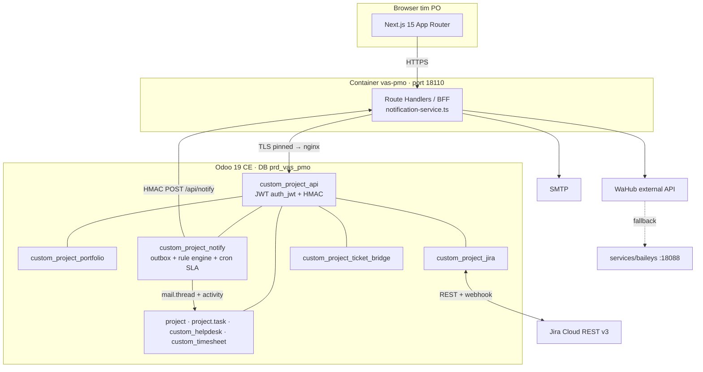

# VAS PMO — Development Plan

Aplikasi monitoring pekerjaan tim **Product Owner Value-Added Services**: Odoo 19 CE
sebagai *engine* project & task management, UI dibangun ulang sebagai Next.js headless
(pola gentlewoman), terintegrasi dua arah dengan **Jira Cloud** dan dengan aplikasi
**ticketing**, plus notifikasi **WhatsApp + email** meniru pola e-Telekomunikasi.

---

## 0. Keputusan yang sudah diambil

| # | Topik | Keputusan |
|---|-------|-----------|
| D1 | UI | Next.js 15 App Router + BFF di atas Odoo REST — persis pola `storefront/` gentlewoman. UI bawaan Odoo **tidak** dipakai untuk tim PO (tetap tersedia untuk admin/backoffice) |
| D2 | Jira | **Jira Cloud, sinkronisasi 2 arah** (REST v3 + API token, webhook Jira → Odoo) |
| D3 | Transport WA | **WaHub external API** sebagai primary (identik `wahub-client.ts` e-Telekomunikasi), **`services/baileys` platform** sebagai fallback, **dual-channel WA + email** |
| D4 | Deployment | **Tenant/DB baru** di platform: `rnd_vas_pmo` (build/UAT) → `prd_vas_pmo` (produksi) |
| D5 | Tier modul | Semua modul generic → `addons/ee_gap/` (bukan `_tenants/`), sesuai doktrin *Hub = Source of Truth* |

### Open decision (belum dijawab, tidak memblokir Fase 1–4)

**OD1 — Aplikasi ticketing mana yang jadi sumber tiket?** Plan ini mengasumsikan
**Odoo `custom_helpdesk`** sebagai ticketing internal (integrasi in-database, tanpa
API eksternal — paling murah), dengan `custom_project_ticket_bridge` menyediakan
*adapter slot* generic sehingga `ticket-service` e-Telekomunikasi, WhatsAppHub tickets,
atau SaaS pihak ketiga bisa dipasang belakangan tanpa mengubah model. Kalau targetnya
bukan `custom_helpdesk`, yang berubah hanya isi Fase 6 (±6 MD → ±10 MD) — sisa
arsitekturnya tetap.

---

## 1. Tujuan & ruang lingkup

### Tujuan
1. Satu tempat bagi Head of Product / PO lead untuk melihat **apa yang melambat** lintas
   seluruh portfolio VAS, tanpa membuka Jira per-board.
2. PO bisa membuat & mengubah project/task/tasklist di UI yang **cepat dan tidak kaku**.
3. Setiap penambahan/perubahan project & task **otomatis memberi tahu** orang yang tepat
   (WA + email + inbox Odoo), termasuk peringatan deadline H-3/H-1/overdue/eskalasi.
4. Pekerjaan yang lahir dari **tiket** dan dieksekusi di **Jira** tetap terlihat sebagai
   satu rantai: tiket → task → issue → selesai.

### In scope
- Modul Odoo: portfolio/program, task delta (tipe, poin, dependensi, sprint), API, notifikasi, konektor Jira, bridge ticketing.
- Frontend Next.js + BFF (6 layar, lihat mockup).
- Notifikasi WA/email/Odoo + cron SLA.
- Industry pack `vas_pmo` agar deploy tenant = 1 aksi.

### Out of scope (fase berikutnya)
- Timesheet approval & billing (modul `custom_timesheet` sudah ada, cukup dipasang).
- Mobile app native. UI responsive sudah cukup.
- Kapasitas/forecast otomatis berbasis ML.

---

## 2. Arsitektur



### Prinsip kunci: **satu choke point notifikasi**

Perubahan task bisa datang dari 4 arah: UI Next.js, backend Odoo, webhook Jira, dan
bridge ticketing. Kalau notifikasi dipasang di BFF saja (seperti e-Telekomunikasi yang
memang single-writer), 3 dari 4 jalur itu akan senyap.

Karena itu **event dilahirkan di Odoo**, bukan di BFF: `project.task.write()` /
`create()` menulis baris ke `custom.project.notify.outbox`, lalu satu cron
(`queue_job`) mem-POST outbox ke `POST /api/notify` di BFF dengan HMAC. BFF-lah yang
merender pesan dan menembak WA + email — jadi kode notifikasi tetap satu file
TypeScript yang persis mirror `notification-service.ts`, tapi cakupannya menyeluruh.

---

## 3. Modul Odoo (5 modul, tier `ee_gap`)

### 3.1 `custom_project_portfolio` — delta domain PO VAS
Menambal apa yang CE `project` tidak punya untuk kebutuhan monitoring PO.

| Model | Isi |
|-------|-----|
| `custom.project.portfolio` | Grup project per lini VAS (Digital Content, Bundling, PPOB, Messaging). `name, code, owner_id, objective, health` |
| `custom.project.sprint` | Iterasi: `name, date_start, date_end, goal, project_ids, state` |
| `project.project` (extend) | `custom_portfolio_id`, `custom_health` (on_track/at_risk/blocked), `custom_health_note`, `custom_po_id`, `custom_wip_limit`, compute `custom_progress`, `custom_task_overdue_count` |
| `project.task` (extend) | `custom_task_type` (feature/bug/change_request/spike), `custom_story_points`, `custom_sprint_id`, `custom_blocked_by_ids` (m2m self), `custom_source` (po/ticket/jira), `custom_due_sla_date`, `custom_effort_estimate` vs `effective_hours` |

Catatan Odoo 19: semua constraint pakai `models.Constraint` (bukan `_sql_constraints`);
view search tidak boleh pakai atribut `expand`/`string` pada `<group>`.

### 3.2 `custom_project_api` — permukaan REST untuk BFF
Mirror struktur `custom_storefront_api/controllers/`.

| Route | Auth | Isi |
|-------|------|-----|
| `POST /vaspmo/api/auth/login` `…/refresh` | public | Tukar kredensial `res.users` → JWT access (TTL 900s) + refresh hashed di `custom.vaspmo.token` |
| `GET /vaspmo/api/portfolios` `…/projects` `…/projects/<id>` | JWT | Data + agregat health/progress |
| `GET/POST/PATCH /vaspmo/api/tasks` `…/tasks/<id>` | JWT | CRUD task + tasklist/subtask + checklist |
| `POST /vaspmo/api/tasks/<id>/stage` `…/comment` `…/timesheet` | JWT | Aksi board |
| `GET /vaspmo/api/dashboard/{summary,throughput,workload}` | JWT | Agregat KPI (read-only, di-cache 60s) |
| `GET /vaspmo/api/notify/outbox` `POST …/ack` | HMAC | Dipakai BFF untuk menarik & meng-ACK outbox |

Auth memakai `addons/_vendor/auth_jwt` — validator bernama `vaspmo` (HS256,
`aud=vaspmo`, `iss=custom_project_api`), user diresolusi dari claim `sub`/`email`;
`user_id` di body **tidak** dipercaya. HMAC memakai skema platform yang sudah ada:
`X-Signature = HMAC-SHA256(secret, ascii(X-Timestamp) + raw_body)`, replay window
5 menit, secret di `ir.config_parameter custom_core.secure_endpoint.vaspmo.secret`.

### 3.3 `custom_project_notify` — outbox + rule engine + cron SLA
Ini padanan Odoo dari `notify-admin.ts`.

| Model | Isi |
|-------|-----|
| `custom.project.notify.rule` | `event` (task_created / stage_changed / assigned / blocked / due_h3 / due_h1 / overdue / escalation / project_created / health_degraded), `recipient_kind` (assignee/reporter/po/portfolio_owner/role/group), `role_group_id`, `channel_wa`, `channel_email`, `channel_odoo`, `active` |
| `custom.project.notify.outbox` | `res_model, res_id, event, payload_json, recipient_ids, state` (pending/sent/failed), `attempt, next_retry_at, error` |
| `custom.project.notify.log` | Audit per-kanal per-penerima: `channel` (wa/email/odoo), `recipient_*`, `subject, body, success, error_message, sent_at` — padanan `SlaNotificationLog` |

- `project.task._notify_event(event, extra)` dipanggil dari `create`/`write` override
  (hanya kalau field yang berubah ada di daftar `_NOTIFY_TRACKED`).
- Kanal Odoo langsung dikerjakan in-process: `message_post` di `mail.thread` +
  `activity_schedule` untuk task yang butuh aksi → muncul di inbox Discuss.
- Kanal WA/email didelegasikan ke BFF via outbox.
- Cron `cron_check_sla()` (tiap jam) melahirkan event `due_h3`, `due_h1`, `overdue`,
  dan `escalation` (overdue > 3 hari → naik ke `portfolio_owner`), idempoten lewat
  unique key `(res_id, event)` di log agar tidak spam tiap jam.
- Retry: exponential backoff 5 attempt, lalu `state=failed` + baris merah di layar
  Notifikasi supaya operator bisa `Kirim ulang`.

### 3.4 `custom_project_jira` — sinkronisasi 2 arah
Dibangun di atas `addons/core/custom_adapter_framework` (`adapter_base`,
`adapter_config`, `adapter_call_log`, `adapter_registry`) supaya kredensial, retry, dan
log panggilan seragam dengan adapter lain di platform.

| Model | Isi |
|-------|-----|
| `custom.jira.instance` | `base_url, email, api_token` (group-gated), `webhook_secret`, `sandbox_mode` |
| `custom.jira.project.map` | `project_id ↔ jira_project_key`, `default_issue_type`, `sync_direction` (both/in/out), `active` |
| `custom.jira.status.map` | `project_type_id (stage) ↔ jira_status_id/name`, dua arah |
| `custom.jira.field.map` | mapping opsional custom field (story points, epic link) |
| `project.task` (extend) | `custom_jira_key`, `custom_jira_id`, `custom_jira_url`, `custom_jira_sync_state`, `custom_jira_last_sync`, `custom_jira_payload_hash` |

**Loop guard** (wajib, ini sumber bug paling umum di sync 2 arah):
1. Sebelum menulis ke Jira, hitung `hash(payload)`; kalau sama dengan
   `custom_jira_payload_hash` → skip.
2. Perubahan yang masuk dari webhook ditulis dengan
   `self.with_context(jira_sync=True)`; override `write` men-skip pembuatan outbox
   *outbound* kalau `jira_sync` aktif (notifikasi internal tetap jalan).
3. Webhook mengabaikan event yang `actor.accountId`-nya sama dengan akun integrasi.

**Konflik:** kebijakan default *last-writer-wins per field* dengan Jira menang untuk
`status`/`assignee` (Jira adalah tempat kerja engineer), Odoo menang untuk
`due_date`/`priority`/`portfolio` (itu domain PO). Setiap konflik dicatat di
`adapter.call.log` dengan `level=warning` supaya bisa diaudit.

Route webhook: `POST /custom_project_jira/webhook/<instance_id>` — `auth='public'`,
`csrf=False`, verifikasi HMAC dari header Jira, selalu balas 200 (Jira retry agresif
kalau melihat 5xx), pekerjaan nyata di-`with_delay(channel='root.jira')`.

Outbound: `queue_job` per-task, bukan sinkron — supaya klik `Selesai` di UI tidak
menunggu Jira.

### 3.5 `custom_project_ticket_bridge` — tiket → task
Asumsi OD1: sumber = `custom_helpdesk`.

- Tombol **Eskalasi ke task** di `helpdesk.ticket` → membuat `project.task` dengan
  `custom_source='ticket'`, `custom_ticket_id` terisi, dan back-link di tiket.
- Stage task mencapai `Done` → tiket otomatis pindah ke stage yang dipetakan di
  `custom.ticket.stage.map` + `message_post` ke pelapor.
- SLA tiket (`helpdesk.sla` yang sudah ada) dipinjam sebagai `custom_due_sla_date` task.
- `custom.ticket.source` (Selection extensible) + method `_fetch_external_tickets()`
  kosong = *adapter slot* untuk ticketing eksternal nanti.

---

## 4. Frontend Next.js

Direktori baru `vas-pmo/` di root platform (sejajar `storefront/`, `hub-portal/`),
Next.js 15 App Router + TypeScript + Tailwind, `output: standalone`, image read-only.

```
vas-pmo/
  src/app/
    (app)/portfolio/page.tsx        # Layar 1 — Portfolio & KPI
    (app)/board/page.tsx            # Layar 2 — Board Kanban
    (app)/tasks/[id]/page.tsx       # Layar 3 — Detail task + tasklist
    (app)/timeline/page.tsx         # Layar 4 — Timeline / milestone
    (app)/notifications/page.tsx    # Layar 5 — Aturan + log kirim
    (app)/integrations/page.tsx     # Layar 6 — Kesehatan Jira/tiket/WA
    api/notify/route.ts             # dipanggil outbox Odoo (HMAC)
    api/cron/sla/route.ts           # opsional, kalau cron di sisi app
    api/health/route.ts
  src/lib/
    odoo.ts                         # klien REST + TLS pinning (mirror storefront)
    services/notification-service.ts  # orchestrator email+WA (mirror e-Telekomunikasi)
    services/whatsapp-service.ts      # WaHub primary → baileys fallback
    services/wahub-client.ts          # JWT client-credentials + mutex + retry 401
    services/email-service.ts
    templates/                        # builder pesan WA & HTML email
```

Auth: login form → `POST /vaspmo/api/auth/login` → access token disimpan di
**httpOnly cookie** (bukan localStorage), refresh via route handler. Middleware
`middleware.ts` melindungi seluruh grup `(app)`.

Realtime: SWR polling 30s untuk board & KPI (cukup untuk tim ~15 orang; hindari
kompleksitas websocket di fase 1).

Container di `docker-compose.yml`, port **18110** (`VAS_PMO_PORT`), BFF→Odoo lewat
`https://nginx` dengan CA di-pin (`./nginx/certs/server.crt:/etc/ssl/odoo-internal.crt:ro`),
`ODOO_TENANT_DB=prd_vas_pmo`, healthcheck `/api/health`.

---

## 5. Notifikasi — replikasi pola e-Telekomunikasi

Yang di-port 1:1 dari `E:\Projects\e-telekomunikasi-js`:

| Sumber | Diadaptasi menjadi |
|--------|--------------------|
| `notify-admin.ts` peta `DOC_NEXT_REVIEWER` (status → role) | `custom.project.notify.rule` — tapi jadi **data**, bisa diubah PO lead tanpa deploy |
| `notification-service.ts` `Promise.all([email, wa])` + `.catch()` per kanal | `notification-service.ts` di `vas-pmo/`, identik: satu kanal gagal, yang lain tetap jalan, tidak pernah throw |
| `whatsapp-service.ts` WaHub → Fonnte fallback, normalisasi 08xx→628xx, `NOTIFICATION_TEST_MODE` | WaHub → **baileys** fallback (D3), normalisasi & test-mode dibawa apa adanya |
| `wahub-client.ts` JWT client-credentials, refresh −300s, mutex, retry 401 | dipakai apa adanya |
| `sla-notification-service.ts` `WARNING_H3/H1/OVERDUE/ESCALATION` + log per kanal | `cron_check_sla()` di Odoo + `custom.project.notify.log` |
| Format pesan WA (`*Judul*` + `━━━` + field + deep link) | Template `vas_pmo` dengan deep link ke `/tasks/<id>` |

Contoh pesan WA (event `stage_changed`):

```
*VAS PMO — Product Owner VAS*
━━━━━━━━━━━━━━━━━━
Task Berpindah Stage

Yth. *Dimas P.*,

Task: *VAS-142 — Integrasi biller Digiflazz prepaid*
Project: *PPOB Biller Rollout*
Stage: *Development → UAT*
Jira: *VAS-142* · Due: *02 Agu 2026*

Buka task:
https://vas-pmo.internal/tasks/142

━━━━━━━━━━━━━━━━━━
_Pesan ini dikirim otomatis oleh sistem._
```

Matriks event × penerima default (bisa diubah di layar Notifikasi):

| Event | Assignee | Reporter | PO project | Owner portfolio |
|-------|:--------:|:--------:|:----------:|:---------------:|
| `task_created` | ✅ | — | ✅ | — |
| `assigned` | ✅ | — | — | — |
| `stage_changed` | ✅ | ✅ | ✅ | — |
| `blocked` | ✅ | — | ✅ | — |
| `due_h3` / `due_h1` | ✅ | — | — | — |
| `overdue` | ✅ | — | ✅ | — |
| `escalation` | ✅ | — | ✅ | ✅ |
| `health_degraded` | — | — | ✅ | ✅ |

---

## 6. Keamanan

- JWT `auth_jwt` HS256 audience `vaspmo`; access 900s, refresh hashed di DB.
- HMAC + timestamp 5 menit untuk jalur Odoo↔BFF dan webhook Jira.
- Semua secret via env → `ir.config_parameter`; token Jira `groups='...group_manager'`.
- BFF→Odoo selalu TLS dengan cert pinning; tidak ada hop cleartext yang membawa JWT.
- Nomor WA & email anggota tim = PII → catat purpose di `custom_pdp_audit` (modul
  sudah ada), dan log notifikasi menyimpan nomor ter-mask.
- Route `auth='public'` (webhook) bersifat readonly-context di Odoo 19 dan tidak punya
  `env.user` — semua tulis harus lewat `with_user(SUPERUSER_ID)` eksplisit + `sudo()`
  terbatas.

---

## 7. Deployment

1. Provision DB `rnd_vas_pmo` lewat `tenant-orchestrator`.
2. Install 2 langkah (pola PPOB): `l10n_id` CoA dulu, lalu industry pack.
3. Daftarkan industry pack **`vas_pmo`** di `custom_hub_console` →
   `custom.hub.industry.pack` berisi: `project`, `custom_project_portfolio`,
   `custom_project_api`, `custom_project_notify`, `custom_project_jira`,
   `custom_project_ticket_bridge`, `custom_helpdesk`, `custom_timesheet`,
   `custom_dashboards`.
4. `docker-compose.yml`: service `vas-pmo` port 18110.
5. Env baru: `VAS_PMO_PORT`, `VAS_PMO_TENANT_DB`, `VAS_PMO_HMAC_SECRET`,
   `WAHUB_API_URL/APP_ID/APP_SECRET`, `WA_PROVIDER`, `BAILEYS_URL`,
   `JIRA_BASE_URL/EMAIL/API_TOKEN`, `SMTP_*`, `NOTIFICATION_TEST_MODE`.
6. Ingat: perubahan Python butuh **restart container** Odoo, `make update` saja tidak
   cukup (reload ORM metadata ≠ re-import modul).

---

## 8. Fase & estimasi effort — baseline

> **Digantikan oleh §19** setelah revisi 2 (8 poin tambahan). Tabel di bawah adalah
> baseline sebelum revisi, disimpan sebagai pembanding.

Estimasi *effort only* (mandays developer), lean karena AI-agentic + reuse platform.

| Fase | Isi | MD |
|------|-----|---:|
| F0 | Tenant `rnd_vas_pmo`, industry pack, skeleton 5 modul, CI | 3 |
| F1 | `custom_project_portfolio` + view Odoo backoffice + tests | 12 |
| F2 | `custom_project_api` (JWT, HMAC, endpoint, agregat, tests) | 10 |
| F3 | Next.js: chrome + 6 layar + BFF + auth + compose | 24 |
| F4 | `custom_project_notify` + BFF notification-service + WA/email + cron SLA | 12 |
| F5 | `custom_project_jira` 2 arah (mapping, webhook, loop guard, konflik) | 16 |
| F6 | `custom_project_ticket_bridge` (asumsi `custom_helpdesk`) | 6 |
| F7 | UAT, hardening, MODULE_KNOWLEDGE, runbook | 10 |
| | **Subtotal developer** | **93** |
| P0 | PMO / koordinasi (lean) | 6 |
| | **Total** | **99** |

Urutan kritis: F0 → F1 → F2 → F3 (F4 boleh paralel dengan F3 setelah F2 selesai;
F5 dan F6 independen setelah F1).

Dengan 2 developer paralel: ± **7–8 minggu** sampai UAT.

---

## 9. Risiko

| Risiko | Dampak | Mitigasi |
|--------|--------|----------|
| Sync Jira 2 arah bikin loop update | Board Jira berisik, WA spam | 3 lapis loop guard (§3.4); `sandbox_mode` wajib saat build; smoke test khusus loop |
| WaHub down / nomor kena rate-limit | Notifikasi hilang senyap | Fallback baileys + email selalu jalan + outbox retry + layar log kirim yang menampilkan kegagalan |
| Field Jira custom (story points, epic) beda per project | Mapping salah | `custom.jira.field.map` per project, bukan global |
| PO menuntut realtime penuh | Scope creep websocket | Fase 1 polling 30s; websocket masuk backlog dengan justifikasi terukur |
| OD1 belum diputuskan | Rework Fase 6 | Adapter slot generic sejak awal; Fase 6 ditaruh paling belakang |

## 10. Definition of Done

- 33+ modul platform tetap install bersih; 5 modul baru punya test dan lolos.
- Buat/ubah task dari UI, dari Odoo backend, dan dari webhook Jira → ketiganya
  melahirkan notifikasi WA + email + entri Odoo (dibuktikan di `custom.project.notify.log`).
- Task Odoo ↔ issue Jira konsisten setelah 20 perubahan bolak-balik tanpa loop.
- Tiket → task → tiket tertutup otomatis.
- `MODULE_KNOWLEDGE.md` per modul + runbook operasional.
---

# REVISI 2 — 8 poin tambahan (30 Jul 2026)

Bagian ini menambah dan **mengoreksi sebagian** bagian di atas. Kalau ada konflik,
Revisi 2 yang menang. Estimasi effort baru di §19.

---

## 11. Riset pembanding — aplikasi PM modern di luar

### 11.1 Lanskap 2026

| Aplikasi | Kekuatan UI/UX yang relevan | Yang bisa dicuri |
|---|---|---|
| **Linear** | Pelopor *keyboard-first*: command palette Cmd+K, navigasi J/K, aksi tanpa mouse; UI paling cepat & opinionated di kelasnya; manajemen sprint otomatis | Command palette, shortcut inline, kecepatan yang terasa (optimistic UI) |
| **Plane** (open source, self-host) | Paling dekat ke Linear tapi bisa on-prem. **5 layout**: List, Board, Calendar, Gantt, Spreadsheet. Cycles (burn-down + velocity), Modules, Initiatives, **Intake** (triage permintaan masuk dengan satu state review), Estimates, Pages. 180+ endpoint REST, webhook HMAC, SDK Node/Python | Pola *view switcher* per-layar, Cycles→sprint mingguan kita, **Intake→Change Request kita** |
| **Huly** | All-in-one: issue tracking + dokumen + chat + video dalam satu tempat; kuat di visualisasi timeline & dependensi | Timeline dengan dependensi eksplisit, dokumen menempel di task |
| **Height** | Cepat, mirip spreadsheet, sistem atribut fleksibel tanpa jadi berlebihan; view List/Board/Timeline/Form | Tabel yang bisa di-edit langsung (inline edit), atribut kustom |
| **Asana** | **AI Teammates** — agen AI yang bisa di-*assign* ke task, hidup di dalam project (21+ siap pakai), AI Studio untuk workflow no-code | Auto-draft laporan & routing permintaan — kita pakai untuk Weekly Progress (§14) |
| **Motion / Reclaim** | Auto-scheduling: AI menyusun kalender dari deadline & prioritas dan menjadwalkan ulang otomatis saat rencana berubah; rutinitas berulang (standup harian / review mingguan) dijaga otomatis | Reminder mingguan yang dijadwalkan sistem, bukan diingat manusia |

### 11.2 Tren UI 2026 yang relevan

Arah 2026 adalah **animasi minimalis dan fungsional**, menjauh dari efek mencolok:
micro-interaction memberi umpan balik jelas sehingga pengguna tidak perlu menebak apakah
aksinya berhasil, dan *easing* organik terasa manusiawi sementara gerak linear terasa
robotik. Sisi lain yang wajib: kesadaran atas sensitivitas gerak (gangguan vestibular)
sehingga animasi harus bisa dimatikan (`prefers-reduced-motion`).

Artinya untuk VAS PMO: **gerakan dipakai untuk menjelaskan, bukan menghibur.** Kartu
yang pindah stage menganimasikan perpindahannya supaya mata mengikuti, toast konfirmasi
muncul halus, panel geser saat dibuka. Tidak ada hero animasi, tidak ada parallax.

### 11.3 Pola yang diadopsi

| # | Pola | Kenapa penting di sini | MD |
|---|---|---|---:|
| A1 | **Command palette Cmd+K** — cari project/CR/task/vertical + jalankan aksi (pindah stage, assign, hold) tanpa mouse | PO membuka 40–60 task/hari; ini yang paling terasa "tidak kaku" dibanding Odoo | 3 |
| A2 | **Optimistic UI + rollback** — klik langsung terlihat, sinkron ke Odoo di belakang, mundur kalau gagal | Odoo REST ±200–400 ms; tanpa ini UI terasa lambat walau sudah headless | 4 |
| A3 | **View switcher per layar** — List / Board / Timeline (3 dari 5 layout Plane) + *saved views* per pengguna | PO Lead butuh List, PO butuh Board, manajemen butuh Timeline — data sama | 6 |
| A4 | **Motion fungsional** — transisi stage, panel geser, toast; `prefers-reduced-motion` dihormati | Tren 2026 + aksesibilitas | 2 |
| A5 | **Shortcut inline** J/K navigasi, `X` pilih, `A` assign, `H` hold | Melengkapi A1 untuk kerja beruntun | 2 |
| A6 | **Burn-down + velocity per sprint mingguan** (pola Cycles Plane) | Menyambung langsung ke Weekly Progress §14 | 3 |
| A7 | **Intake/triage satu state review** (pola Plane Intake) | Persis kebutuhan Change Request masuk dari vertical §15 | tercakup §15 |
| A8 | **Auto-draft laporan dari aktivitas** (pola Asana AI Teammates / Reclaim recurring review) | BA tidak menulis weekly dari nol | tercakup §14 |

### 11.4 Build vs adopt — penilaian jujur

**Plane CE self-hosted sudah sangat dekat** dengan yang diminta: gratis, on-prem,
Cycles, Intake, 5 layout, 180+ REST endpoint, webhook HMAC. Kalau tujuannya semata
"punya tool PM yang bagus", memasang Plane jauh lebih cepat daripada membangun.

Tiga alasan tetap membangun di atas Odoo:
1. **Engine harus Odoo.** Timesheet, helpdesk, approval engine, akuntansi, dan data
   tenant sudah di Odoo. Weekly report yang menarik jam kerja dan CR yang menarik
   approval hanya murah kalau satu database.
2. **Domainnya kustom.** Vertical per brand Erajaya, CR dengan approval berjenjang,
   format weekly internal, dan status *Waiting User Verification* dengan semantik SLA
   khusus — di Plane semuanya jadi custom field setengah jadi.
3. **Governance ada di edisi komersial Plane** (workflow, approval, audit trail, SSO).
   Di platform kita, audit trail ber-hash-chain sudah tersedia tanpa biaya (§18).

**Rekomendasi:** tetap bangun, tapi **jangan bangun rasa UI-nya dari nol** — adopsi
A1–A6. Opsi antara: pasang Plane CE sebagai tool sementara selama 3 bulan pertama
pembangunan supaya tim tidak menunggu, lalu migrasi data lewat REST-nya.

---

## 12. Status Hold & Waiting User Verification

### 12.1 Set stage baru

| # | Stage | Sifat | Jam SLA |
|---|-------|-------|---------|
| 1 | Backlog | urutan normal | jalan |
| 2 | Analisis (BA) | urutan normal | jalan |
| 3 | Development | urutan normal | jalan |
| 4 | UAT | urutan normal | jalan |
| 5 | **Waiting User Verification** | urutan normal | **pindah ke sisi user** |
| 6 | Selesai | penutup | berhenti |
| — | **Hold** | **stage samping**, bukan urutan | **dijeda** |

### 12.2 Kenapa dua-duanya bukan sekadar label

Ini inti perubahannya: **jam SLA diperlakukan berbeda per stage**, dan itulah yang
membuat metrik tim jujur.

- **Hold** → jam SLA **dijeda**. Wajib `hold_reason`, `hold_by_id`, `hold_since`, dan
  `hold_until` (perkiraan). Lama hold disimpan di `hold_duration_hours` dan
  **dikurangkan** dari cycle time. Event `on_hold` ke PO project; kalau hold melewati
  `hold_until`, event `hold_expired` ke PO + owner vertical.
- **Waiting User Verification** → jam **berpindah pemilik**, bukan berhenti. Tim dev
  sudah selesai; yang lambat adalah verifikasi user. Field `verification_due`,
  `verification_owner_id` (PIC di vertical), `user_wait_hours`. Reminder WA H+2 dan H+5
  ke PIC vertical; setelah `auto_close_days` (default 5 hari kerja) tanpa respons,
  otomatis pindah ke Selesai dengan `auto_closed=True` + notifikasi.
- Dua angka dilaporkan terpisah di Weekly: **cycle time tim** (tanpa hold & tanpa
  user-wait) dan **lead time total** (yang dirasakan user). Tanpa pemisahan ini, tim
  terlihat lambat padahal sedang menunggu orang lain.

### 12.3 Model

`custom.project.stage.config` — dikelola dari CMS (§17), bukan hard-code:

| Field | Isi |
|---|---|
| `name`, `code`, `sequence`, `color` | tampilan & urutan kolom board |
| `applies_to` | task / cr / keduanya |
| `sla_clock` | `running` / `paused` / `user_side` / `stopped` |
| `is_hold`, `is_waiting_user`, `is_closed`, `fold` | perilaku |
| `auto_close_days` | hanya untuk `is_waiting_user` |
| `require_reason` | Hold wajib beralasan |
| `next_stage_ids` | transisi yang diizinkan (mencegah lompat stage) |

`project.task` / `custom.change.request` menambah: `custom_hold_reason`,
`custom_hold_by_id`, `custom_hold_since`, `custom_hold_until`,
`custom_hold_duration_hours`, `custom_verification_due`,
`custom_verification_owner_id`, `custom_user_wait_hours`, `custom_auto_closed`.

---

## 13. Vertical Erajaya per brand

### 13.1 Model `custom.project.vertical`

| Field | Isi |
|---|---|
| `code` | LEVIS, ARKAAIM, ERASPACE, … (unik, dipakai di prefix nomor & badge) |
| `name` | nama brand yang dikenal orang |
| `legal_entity` | badan hukum / PT |
| `brand_group` | Retail Fashion / Retail Gadget / Digital / Shared Services |
| `vertical_po_id` | PO penanggung jawab |
| `ba_ids` | Business Analyst yang memegang vertical ini (m2m `res.users`) |
| `pic_partner_ids` | PIC dari sisi brand — penerima notifikasi *Waiting User Verification* |
| `color`, `active`, `sequence` | tampilan |

### 13.2 Seed awal (mohon dikoreksi)

| Code | Brand | Badan hukum | Grup |
|---|---|---|---|
| `LEVIS` | Levi's | Era Busana Retailindo | Retail Fashion |
| `GTW` | Gentlewoman | — | Retail Fashion |
| `ARKAAIM` | ARKA AIM | — | Digital / Services |
| `ERASPACE` | Eraspace (termasuk PPOB) | Erajaya Swasembada | Digital |
| `ERAFONE` | Erafone | — | Retail Gadget |
| `URBAN` | Urban Republic | — | Retail Gadget |
| `JDS` | JDS (Warehouse) | — | Supply Chain |
| `CORP` | Erajaya Group / Shared Services | Erajaya Swasembada | Shared Services |

> Kolom badan hukum selain Levi's masih kosong karena belum dikonfirmasi — jangan
> dianggap fakta. Seed final menunggu daftar resmi dari tim.

Daftar ini sengaja sejalan dengan registry project platform supaya satu brand punya
satu nama di semua tempat.

### 13.3 Vertical muncul di mana

- **Wajib** di Project dan Change Request. Task **mewarisi** dari induknya, boleh
  ditimpa hanya untuk task lintas-brand (`custom_vertical_override=True` + alasan).
- **Badge warna** di kartu board, kolom di semua tabel, chip filter di top bar
  (multi-pilih, tersimpan sebagai *saved view*).
- Ikut ke dalam **pesan WA & email**: baris `Vertical: *Levi's (Era Busana Retailindo)*`.
- Ikut ke **record rule**: PIC vertical hanya melihat pekerjaan vertical-nya, PO Lead
  melihat semua. Ini yang membuat portal verifikasi user aman dibuka ke sisi brand.
- Semua agregat (Portfolio, Weekly, BA summary) bisa dipecah per vertical.

---

## 14. Weekly Progress Update & sprint mingguan

### 14.1 Sprint = satu minggu

`custom.project.sprint` dipertegas jadi mingguan: `week_code` (ISO, mis. `2026-W31`),
`date_start` (Senin), `date_end` (Jumat), `goal`, `state` (planned/active/closed),
`capacity_points` per anggota. Cron menutup sprint Jumat 18:00 dan membuka sprint
berikutnya otomatis — tidak ada ritual manual.

Task & CR wajib punya `custom_sprint_id` begitu masuk stage Development.

### 14.2 `custom.weekly.progress` — satu baris per (minggu × project/CR)

| Field | Isi | Sumber |
|---|---|---|
| `sprint_id`, `vertical_id`, `project_id` / `cr_id` | konteks | — |
| `author_id` | BA penulis | — |
| `progress_pct`, `health` | angka & RAG | otomatis, bisa ditimpa |
| `done_this_week` | task selesai minggu ini | **otomatis** dari log stage |
| `plan_this_week` | rencana yang disepakati Senin | manual (dikunci setelah Senin 12:00) |
| `carry_over` | task tidak selesai & pindah sprint | **otomatis** |
| `blocker` | penghambat + siapa yang harus bertindak | manual |
| `next_week` | rencana minggu depan | manual |
| `hours_spent` | jam timesheet minggu ini | **otomatis** |
| `cycle_time_team`, `lead_time_total` | dua angka §12.2 | **otomatis** |
| `state` | draft / submitted / reviewed | — |

### 14.3 Alur otomatis (pola auto-draft)

1. **Jumat 15:00** — cron membuat **draft** untuk setiap project/CR aktif, sudah terisi
   bagian otomatis (task selesai, carry-over, jam, burn-down, cycle time). BA hanya
   menulis narasi blocker & rencana minggu depan. Opsional: ringkasan naratif diusulkan
   `custom_ai_bridge` dan bisa diedit — tanpa AI pun tetap jalan.
2. **Jumat 15:00** — reminder WA ke BA yang drafnya masih kosong.
3. **Jumat 17:30** — reminder kedua ke BA yang belum submit + tembusan PO Lead.
4. **Senin 08:00** — rekap mingguan per vertical dikirim ke PO Lead, PO vertical, dan
   owner portfolio (email HTML + ringkasan WA + tautan ke layar Weekly).
5. Sprint ditutup Jumat 18:00; carry-over otomatis pindah ke sprint baru dengan jejak.

### 14.4 Layar Weekly

Pemilih minggu (`2026-W31 ◂ ▸`), matriks **vertical × project** berisi kartu
plan/done/blocker/next, indikator siapa yang belum submit, burn-down sprint, dan tombol
**Export** (XLSX/PDF) untuk dipakai di rapat mingguan.

---

## 15. Pemisahan Project / Change Request / Task

### 15.1 Tiga tipe record, tiga siklus hidup

| | **Project** | **Change Request** | **Task** |
|---|---|---|---|
| Model | `project.project` | `custom.change.request` **(baru)** | `project.task` |
| Nomor | `PRJ-2026-014` | `CR-2026-0142` | `VAS-1042` |
| Arti | inisiatif berdurasi, ada scope & milestone | permintaan perubahan atas sistem/produk yang **sudah live** | unit kerja yang dieksekusi |
| Pemilik | PO | BA (analisis) → PO (approval) | PIC teknis |
| Gerbang | milestone | **impact analysis + approval** | stage board |
| Induk | portfolio + vertical | vertical (+ project opsional) | project **atau** CR |

### 15.2 Kenapa CR dipisah, bukan cuma `task_type = change_request`

Tiga hal yang tidak dimiliki task dan akan mengotori model kalau digabung:
1. **Gerbang approval berjenjang** (BA → PO → owner vertical untuk CR ber-impact
   tinggi) beserta jejak keputusannya.
2. **Impact analysis** — modul/sistem terdampak, risiko, estimasi effort & biaya,
   kebutuhan downtime, rencana rollback.
3. **SLA respons sendiri** yang dihitung sejak permintaan masuk, bukan sejak pekerjaan
   dimulai — plus penomoran resmi yang dirujuk brand dalam korespondensi.

Kalau dijadikan satu field, setiap task ikut membawa 12 field kosong dan filter board
jadi kotor. Yang tetap **satu** adalah stage config (§12) dan log (§18) — dipakai
bersama supaya perilakunya konsisten.

### 15.3 `custom.change.request`

`name`, `code` (auto `CR-YYYY-NNNN`), `vertical_id` (wajib), `project_id` (opsional),
`requester_partner_id`, `request_date`, `cr_type` (enhancement / bug / config /
data-fix / new-feature), `priority`, `impact` (low/medium/high/critical),
`impact_analysis` (Html), `affected_modules`, `effort_estimate_days`, `risk_note`,
`rollback_plan`, `need_downtime`, `ba_id`, `approver_ids`, `approval_state`
(draft/analysis/waiting_approval/approved/rejected), `stage_id` (memakai
`custom.project.stage.config`), `sla_response_due`, `task_ids`, `weekly_ids`.

Alur: **Intake** (pola Plane: satu antrean triage) → BA analisis → estimasi → approval
→ melahirkan task (`task_ids`) → semua task selesai → CR ke *Waiting User Verification*
→ verifikasi brand → Selesai.

Approval memakai `ee_gap/custom_approval_engine` yang sudah ada, bukan bikin baru.

---

## 16. Summary pekerjaan per Business Analyst

Layar **Tim & BA**. Per BA menampilkan:

- Vertical yang dipegang (badge), kapasitas poin sprint aktif vs terpakai.
- Hitungan: CR aktif · CR menunggu analisis · task aktif · selesai minggu ini · carry-over.
- **Cycle time rata-rata** (versi tim, hold & user-wait dikeluarkan) + tren 6 minggu.
- Status weekly report: submitted / terlambat / belum.
- SLA terlampaui yang ada di tangannya, dan berapa yang sudah dieskalasi.
- Distribusi effort per vertical (bar bertumpuk) — untuk melihat BA yang tersebar ke
  terlalu banyak brand.
- Throughput 30 hari (sparkline) + jam timesheet vs jam tercatat.

Sumber: `read_group` di atas `project.task`, `custom.change.request`,
`account.analytic.line`, `custom.weekly.progress` — **tanpa tabel baru**, diekspos lewat
`GET /vaspmo/api/dashboard/ba-summary`. Bisa dipecah per minggu/bulan/kuartal dan per
vertical.

---

## 17. CMS master data

Layar **Pengaturan**, hanya untuk group `vaspmo_admin`. Tujuh tab, semuanya CRUD nyata
di atas model Odoo — bukan halaman statis:

| Tab | Model | Isi |
|---|---|---|
| Pengguna & peran | `res.users`, `res.groups` | akun, peran (PO Lead / PO / BA / Dev / QA / PIC Vertical / Admin), vertical yang dipegang, **nomor WA & email** (dipakai notifikasi), aktif/nonaktif, reset password |
| Vertical / brand | `custom.project.vertical` | §13 — termasuk PIC brand & warna |
| Status / stage | `custom.project.stage.config` | §12 — urutan, warna, flag hold/waiting-user/closed, perilaku jam SLA, transisi yang diizinkan, auto-close |
| Tipe & prioritas | `custom.task.type`, `custom.cr.type`, `custom.priority.sla` | tipe task & CR, prioritas + target SLA per prioritas |
| Aturan notifikasi | `custom.project.notify.rule` | matriks event × penerima × kanal (§5) |
| Integrasi | `custom.jira.*`, `custom.ticket.stage.map` | pemetaan Jira & ticketing (§3.4, §3.5) |
| Kalender kerja | `resource.calendar`, `custom.holiday` | hari kerja & libur nasional — dasar semua hitungan SLA "hari kerja" |

Prinsipnya: **apa pun yang berpotensi berubah tanpa deploy, taruh di sini.** Yang sudah
terbukti mahal kalau di-hard-code: daftar status, aturan notifikasi, target SLA, dan
hari libur.

Setiap perubahan di CMS otomatis tercatat di log (§18) — master data adalah tempat
paling berbahaya untuk perubahan tak terlacak.

---

## 18. Log di setiap transaksi

### 18.1 Jangan bangun model log baru

Platform **sudah punya** audit trail append-only ber-*hash-chain* di Postgres:
`pdp.audit_log_v` (kolom `prev_hash_hex` / `hash_hex` merangkai tiap baris), diekspos
read-only sebagai model `pdp.audit.log`, dengan mixin `pdp.audited.mixin` di
`addons/compliance/custom_pdp_audit/` yang sudah otomatis mencatat `create` / `write` /
`unlink` beserta delta field yang tersanitasi, plus hook publik
`_pdp_audit_write(action, res_id, field_changes, reason)` untuk aksi domain.

Maka poin ini **bukan** pekerjaan membuat tabel log, melainkan:
1. `_inherit = ["pdp.audited.mixin", ...]` di `project.project`, `project.task`,
   `custom.change.request`, `custom.weekly.progress`, `custom.project.vertical`,
   `custom.project.stage.config`, `custom.project.notify.rule`.
2. Pancarkan **action domain** lewat hook: `stage_change`, `assign`, `hold`, `resume`,
   `verify_request`, `verify_done`, `auto_close`, `cr_submit`, `cr_approve`, `cr_reject`,
   `sprint_close`, `weekly_submit`, `jira_sync_in`, `jira_sync_out`, `notify_sent`,
   `master_data_change`. Kolom `action` memang `Char` bebas, jadi tidak perlu migrasi enum.
3. Isi `reason` untuk aksi yang wajib beralasan (hold, reject, auto-close).

Keuntungan gratis: log **tamper-evident** — kalau ada baris diubah atau dihapus langsung
di DB, rantai hash-nya pecah dan itu bisa dibuktikan.

### 18.2 Tiga log, jangan digabung

| Log | Isi | Untuk menjawab |
|---|---|---|
| `pdp.audit.log` | perubahan record & aksi domain | "siapa mengubah apa, kapan, dari nilai berapa" |
| `custom.project.notify.log` | tiap pengiriman per kanal per penerima (§3.3) | "apakah orangnya benar-benar diberi tahu" |
| `adapter.call.log` | panggilan HTTP keluar/masuk (Jira, WaHub) | "apakah pihak luar merespons, dan payload-nya apa" |

### 18.3 Tampilan

- **Tab "Log"** di detail Task / CR / Project / Weekly — timeline `waktu · aktor · aksi ·
  field: lama → baru · sumber`.
- **Layar Log transaksi** global: filter model, aktor, aksi, sumber
  (`ui` / `odoo` / `jira` / `ticket` / `cron` / `api`), rentang tanggal; export CSV;
  indikator integritas rantai hash.
- `field_changes` sudah berbentuk JSON, jadi diff lama→baru bisa dirender langsung.

---

## 19. Estimasi effort setelah revisi 2

| Kode | Tambahan | MD |
|---|---|---:|
| R1 | Pola UI modern: command palette, optimistic UI, view switcher, motion, shortcut, burn-down (§11.3 A1–A6) | 20 |
| R2 | Hold + Waiting User Verification + `stage.config` + semantik jam SLA + auto-close (§12) | 5 |
| R3 | Vertical per brand: model, seed, badge, filter, record rule, masuk template notifikasi (§13) | 6 |
| R4 | Weekly Progress + sprint mingguan + auto-draft + reminder + layar + export (§14) | 10 |
| R5 | Pemisahan Project/CR/Task: model CR, impact analysis, approval, intake, penomoran, layar (§15) | 14 |
| R6 | Summary per BA: agregat + layar (§16) | 5 |
| R7 | CMS master data 7 tab + RBAC (§17) | 12 |
| R8 | Log: pasang mixin + action domain + tab log + layar log + export (§18) | 4 |
| | **Subtotal revisi 2** | **76** |
| | Baseline §8 | 99 |
| | PMO tambahan | 4 |
| | **Total** | **179** |

### Pembagian rilis yang disarankan

**Rilis 1 — struktur data & monitoring inti (138 MD).** Baseline + R2, R3, R4, R5, R8.
Alasannya: kelimanya mengubah **bentuk data**. Menambahkannya belakangan berarti migrasi
record yang sudah dipakai — jauh lebih mahal daripada mengerjakannya sekarang.

**Rilis 2 — pengalaman & administrasi (+41 MD).** R1, R6, R7. Ketiganya menempel di atas
data yang sudah stabil dan tidak memaksa migrasi. Sementara R7 belum jadi, master data
dikelola dari UI backend Odoo (jelek tapi berfungsi, dan hanya dipakai admin).

Dengan 2 developer: Rilis 1 ± **10–11 minggu**, Rilis 2 ± **4 minggu** berikutnya.

### Yang berubah dari rencana awal

- §8 digantikan tabel di atas.
- `project.task.custom_task_type` di §3.1 **tetap** ada, tapi nilai `change_request`
  **dihapus** — CR sekarang model sendiri (§15).
- `custom.project.sprint` di §3.1 dipertegas jadi mingguan (§14.1).
- Daftar stage diganti set 7 stage (§12.1), dan stage jadi **data** di
  `custom.project.stage.config`, bukan `project.task.type` statis.
- Rencana model log baru dibatalkan — pakai `pdp.audited.mixin` yang sudah ada (§18.1).
- Modul bertambah satu: `custom_project_cr` (CR + intake + approval) supaya
  `custom_project_portfolio` tidak jadi modul gemuk. Total **6 modul**.

### Sumber riset §11

- [Top 6 open source project management tools in 2026 — Plane](https://plane.so/blog/top-6-open-source-project-management-software-in-2026)
- [Plane vs Huly vs Taiga: Best Self-Hosted Project Management Platforms 2026 — Pi Stack](https://www.pistack.xyz/posts/plane-vs-huly-vs-taiga-self-hosted-project-management-guide-2026/)
- [Plane Developer Documentation — API & self-hosting](https://developers.plane.so/)
- [Self-hosted Plane](https://plane.so/self-hosted)
- [20 Best Linear Alternatives in 2026 — The Digital Project Manager](https://thedigitalprojectmanager.com/tools/best-linear-alternatives/)
- [9 Best Project Management Software (2026) — Efficient App](https://efficient.app/best/project-management)
- [Best AI Project Management Tools of 2026 — TechnologyAdvice](https://technologyadvice.com/ai-project-management-software/)
- [Top 10 AI Project Management Tools 2026 — Productive](https://productive.io/blog/ai-project-management-tools/)
- [UI/UX Evolution 2026: Why Micro-Interactions and Motion Matter — Primotech](https://primotech.com/ui-ux-evolution-2026-why-micro-interactions-and-motion-matter-more-than-ever/)
- [How Micro-Interactions & Motion Design Improve UX in 2026 — Acodez](https://acodez.in/micro-interactions-motion-design/)
- [Command Palette Pattern — UX Patterns for Developers](https://uxpatterns.dev/patterns/advanced/command-palette)
- [Command Palette UI Design — Mobbin](https://mobbin.com/glossary/command-palette)
